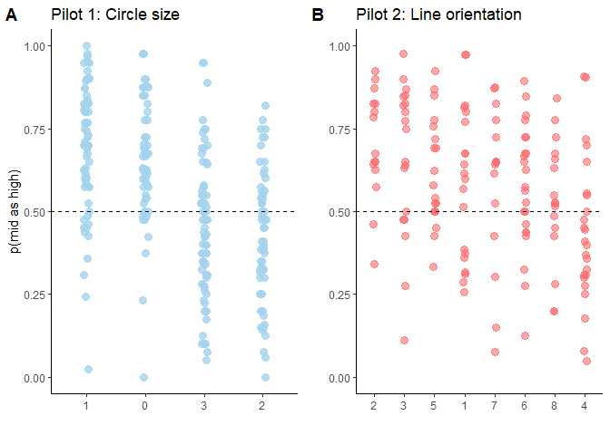
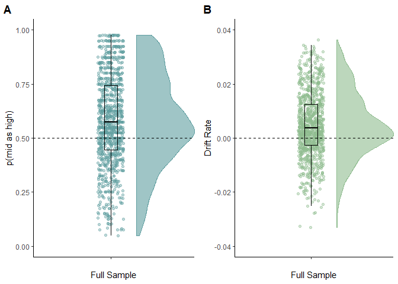
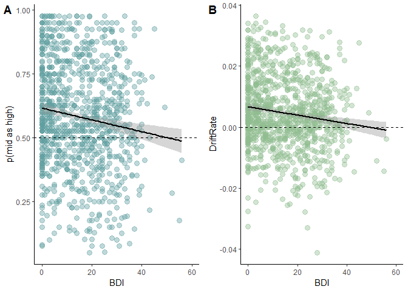
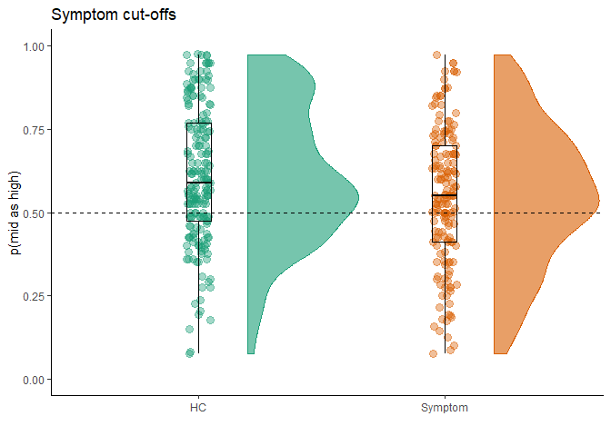
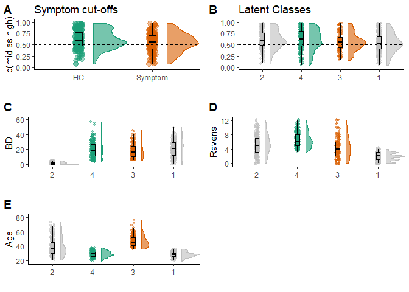
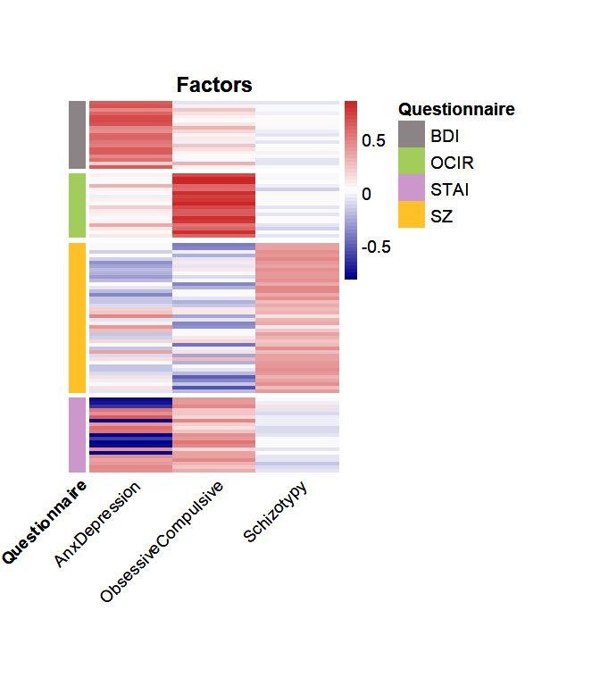
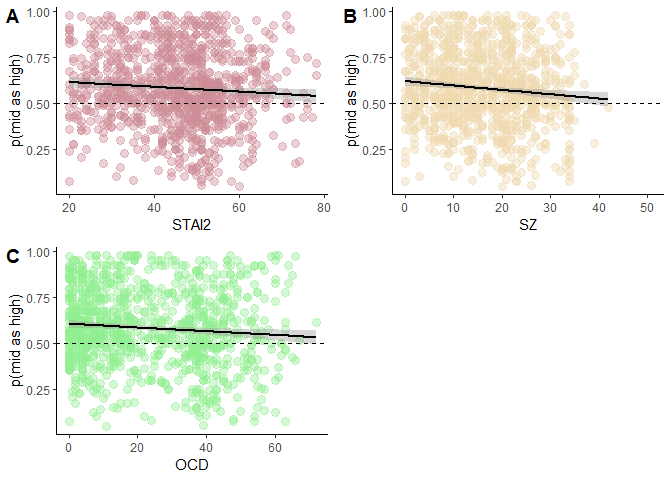

\#Background

This study builds on prior work developing a measure of negative
affective bias as indexed by proportion of mid tones interpreted as high
reward (‘p(mid as high)’) in A) a rat pharmacological model of mood and
anxiety disorders (Hales et al., 2016) and B) humans with mood and
anxiety disorders relative to healthy controls (Aylward et al., 2019).

\#\#\#\#Task details In both cases, the 2-alternative-forced-choice task
involved training participants to press a button/lever (left or right)
when they heard a tone (high or low) to receive a reward (1 or 3 ?/rat
pellets). The stimulus-response-outcome contingencies were 100% (but
counterbalanced across individuals). Following training, participants
were then also played tones of a frequency exactly equidistant between
the high and low tones. The primary outcome of interest is the
proportion of times the participant pressed the button/lever associated
with the high reward outcome for the ambiguous mid tone (referred to as
‘p(mid as high)’). Of note, the rat study is a within-subject
anxiogenic manipulation, whereas the human study is a case control
design. Both A) symptomatic (‘Symptom’) rats and B) humans both
demonstrate significantly increased negative affective bias
(i.e. reduced prediction that ambiguous outcomes will lead to higher
rewards: ‘p(mid as high)’) relative to non-symptomatic controls (‘HC’).

\#\#\#\#Next steps This prior work suggests that this cognitive measure
is sensitive to pathological symptoms. We have three objectives for the
present study. Firstly we wanted to explore and remove sources of
between-subject bias within the task so as to maximise our chances of
measuring individual differences in task performance. Secondly, we
wanted to explore factors which contribute to individual differences in
task performance in a large cross-sectional sample. Specifically, we are
interested in which specific psychiatric-relevant symptoms/traits
contribute to task performance. Finally, once we identify relevant
traits, can we re-capitulate the effect of clinical screening in a large
unscreened online sample?

\#1: Piloting to explore sources of between-subject bias To speed up
data collection and facilitate the collection of larger samples we
adapted the task for online use. To this end, we decided to switch the
task from the auditory domain (which would require us to check/trust
that remote participants could hear the stimuli) to the visual domain.
In the first pilot A) we tested N=264 participants in a version of the
task which substituted high and low frequency tones of large and small
area circles. This lead to four counterbalancing versions (labelled 1-4
below; sorted by level of bias). Following discovery of clear
between-subject bias we next tested B) N=158 individuals on a task that
involved orientation of a line. Instead of high/low we had
vertical/horizontal. The intermediate stimuli were either 45 or 135
degrees, which lead to 8 counterbalancing versions (labelled 1-8 below;
sorted by level of bias).

<!-- -->

    ##              Df Sum Sq Mean Sq F value Pr(>F)    
    ## group         3  3.964  1.3215   35.28 <2e-16 ***
    ## Residuals   260  9.739  0.0375                   
    ## ---
    ## Signif. codes:  0 '***' 0.001 '**' 0.01 '*' 0.05 '.' 0.1 ' ' 1

    ##          eta.sq eta.sq.part
    ## group 0.2893019   0.2893019

    ##              Df Sum Sq Mean Sq F value  Pr(>F)   
    ## group         7  0.929 0.13267   3.077 0.00475 **
    ## Residuals   143  6.165 0.04311                   
    ## ---
    ## Signif. codes:  0 '***' 0.001 '**' 0.01 '*' 0.05 '.' 0.1 ' ' 1

    ##          eta.sq eta.sq.part
    ## group 0.1309089   0.1309089

    ##   Tukey multiple comparisons of means
    ##     95% family-wise confidence level
    ## 
    ## Fit: aov(formula = Pmid ~ group, data = pilot1cb)
    ## 
    ## $group
    ##            diff         lwr        upr     p adj
    ## 1-0  0.03319086 -0.05510565  0.1214874 0.7655217
    ## 2-0 -0.24185068 -0.33400241 -0.1496990 0.0000000
    ## 3-0 -0.21067170 -0.29843425 -0.1229092 0.0000000
    ## 2-1 -0.27504154 -0.36251921 -0.1875639 0.0000000
    ## 3-1 -0.24386256 -0.32670376 -0.1610213 0.0000000
    ## 3-2  0.03117898 -0.05575969  0.1181177 0.7902342

    ##   Tukey multiple comparisons of means
    ##     95% family-wise confidence level
    ## 
    ## Fit: aov(formula = Pmid ~ group, data = pilot2cb)
    ## 
    ## $group
    ##             diff         lwr         upr     p adj
    ## 2-1  0.116847213 -0.10133355  0.33502797 0.7205659
    ## 3-1  0.076216643 -0.12842007  0.28085336 0.9453463
    ## 4-1 -0.150419157 -0.34381573  0.04297742 0.2529895
    ## 5-1  0.033392280 -0.17124444  0.23802900 0.9996371
    ## 6-1 -0.012709407 -0.20800766  0.18258885 0.9999993
    ## 7-1 -0.002821500 -0.22100226  0.21535926 1.0000000
    ## 8-1 -0.057236747 -0.27148600  0.15701251 0.9916272
    ## 3-2 -0.040630570 -0.26125829  0.17999715 0.9991964
    ## 4-2 -0.267266370 -0.47751061 -0.05702213 0.0034682
    ## 5-2 -0.083454933 -0.30408266  0.13717279 0.9407917
    ## 6-2 -0.129556620 -0.34155147  0.08243823 0.5668175
    ## 7-2 -0.119668713 -0.35291376  0.11357633 0.7624254
    ## 8-2 -0.174083960 -0.40365562  0.05548770 0.2834033
    ## 4-3 -0.226635800 -0.42278876 -0.03048284 0.0117584
    ## 5-3 -0.042824363 -0.25006802  0.16441930 0.9983082
    ## 6-3 -0.088926050 -0.28695422  0.10910212 0.8642912
    ## 7-3 -0.079038143 -0.29966587  0.14158958 0.9554490
    ## 8-3 -0.133453390 -0.35019400  0.08328722 0.5571819
    ## 5-4  0.183811438 -0.01234152  0.37996440 0.0838114
    ## 6-4  0.137709750 -0.04868018  0.32409968 0.3158952
    ## 7-4  0.147597657 -0.06264658  0.35784190 0.3824994
    ## 8-4  0.093182411 -0.11297903  0.29934385 0.8602737
    ## 6-5 -0.046101687 -0.24412986  0.15192649 0.9964027
    ## 7-5 -0.036213780 -0.25684150  0.18441394 0.9996228
    ## 8-5 -0.090629027 -0.30736963  0.12611158 0.9025639
    ## 7-6  0.009887907 -0.20210694  0.22188275 0.9999999
    ## 8-6 -0.044527340 -0.25247376  0.16341908 0.9978766
    ## 8-7 -0.054415247 -0.28398691  0.17515642 0.9959758

\#\#\#\#Interpretation Both tasks demonstrate clear sources of
between-subject bias. In short, individuals demonstrated ‘higher’ bias
when large (or vertical) stimuli were paired with large rewards on the
right hand side. These reflect pre-potent biases (e.g. bigger things
usually cost more and in latinate languages we read from left to right
etc.). Smaller biases were observed when the stimulus-response-outcome
contingencies were incongruent with these pre-potent biases. These
biases add to the noise in within-subject or case-control designs, but
effects can still be observed over and above these effects.
Unfortunately if we care about within-subject differences in a
cross-sectional design we have to remove this. We decided to restrict
further testing to the intermediate bias scores on pilot 2
(counterbalancing 1 and 7). Thus we would need to control for
counterbalancing but would only have two groups (rather than 8). Of
note, we chose pilot 2 design rather than pilot 1 because a circle has
both area and diameter that a participant may attend to, whereas there
is only one interpretation of line orientation.

\#2: Exploring contributors to bias in cross-sectional data We next
collected data from N=1066 using counterbalancing 1 and 7 from pilot 2.
As in the pilot the full sample demonstrate a) affective bias (p(mid) as
high) and d) drift rate that are significantly biased towards highest
reward (see results of one sample t-tests below figure). Drift rate is a
parameter from a ‘drift diffusion model’ of decision making that we
discussed in Aylward et al. 2019. The effects are strongly correlated
with p(mid as high), but presented for completeness. Since the internal
reliability of a measure puts an upper limit on relationship between
that measure and other measures we also determined the split-half
reliability (for 100000 random splits) of individual’s responses to the
40 ambigous trials.

<!-- -->

    ## 
    ##  One Sample t-test
    ## 
    ## data:  combineditemdata$propmedhigh
    ## t = 12.087, df = 989, p-value < 2.2e-16
    ## alternative hypothesis: true mean is not equal to 0.5
    ## 95 percent confidence interval:
    ##  0.5673667 0.5934807
    ## sample estimates:
    ## mean of x 
    ## 0.5804237

    ## 
    ##  One Sample t-test
    ## 
    ## data:  combineditemdata$driftrate
    ## t = 12.122, df = 989, p-value < 2.2e-16
    ## alternative hypothesis: true mean is not equal to 0
    ## 95 percent confidence interval:
    ##  0.003860173 0.005351423
    ## sample estimates:
    ##   mean of x 
    ## 0.004605798

|        | mean | std | lower range | upper range |
| ------ | ---: | --: | ----------: | ----------: |
| Age    |   34 |  10 |          18 |          76 |
| Ravens |    4 |   3 |           0 |          12 |
| OCIR   |   24 |  18 |           0 |          72 |
| SZ     |   16 |   9 |           0 |          51 |
| BDI    |   15 |  12 |           0 |          56 |
| STAI   |   45 |  12 |          20 |          78 |

    ## Split half reliabilities  
    ## Call: splitHalf(r = dataforsh, raw = T, brute = FALSE, n.sample = 1e+05, 
    ##     covar = FALSE, check.keys = TRUE, key = NULL, ci = 0.05, 
    ##     use = "pairwise")
    ## 
    ## Maximum split half reliability (lambda 4) =  0.94
    ## Guttman lambda 6                          =  0.93
    ## Average split half reliability            =  0.91
    ## Guttman lambda 3 (alpha)                  =  0.91
    ## Guttman lambda 2                          =  0.92
    ## Minimum split half reliability  (beta)    =  0.87
    ## Average interitem r =  0.21  with median =  0.21
    ##                                              2.5% 50% 97.5%
    ##  Quantiles of split half reliability      =  0.9 0.92 0.93

\#\#\#Simple Linear Regression of measures To explore the impact of
trait/demographic measures on task performance we next ran a linear
regression (using Robust ML estimator for consistency with SEM below) to
predict p(mid as high)(‘propmedhigh’ variable) and drift rate. The
variables we included are:

  - Spreadsheet (categorical): represents the counterbalancing condition
  - Ravens (continuous): IQ measure (visual matrices)
  - Age (continuous): years old
  - BDI (continuous): Beck depression inventory (suicide question
    removed)
  - STAI2 (continuous): Spielberger Trait Anxiety
  - OCIR (continuous): Obsessive-Compulsive Inventory (Revised)
  - SZ (continuous): Schizotypal short scale
  - GenderMF (categorical): Self-reported gender

Below we provide estimates where missing data is listwise deleted
(N=990) or where missing data is estimated using maximum likelihood
(N=1066). The more conservative listwise deleted version is resported in
the manuscript, but as can be seen the inference remains the same
(albeit with slightly larger effect sizes in the estimated N=1066
version)

``` r
NegBiasmodel.1 <- 'propmedhigh ~ GenderMF + Age + Ravens + spreadsheet +BDI + STAI2 + SZ + OCIR'
NegBiasmodel.2 <- 'driftrate ~ GenderMF + Age + Ravens + spreadsheet +BDI + STAI2 + SZ + OCIR'


fit1 <- sem(NegBiasmodel.1, data=combineditemdata, meanstructure=TRUE,  estimator = "MLR")
fit2 <- sem(NegBiasmodel.2, data=combineditemdata, meanstructure=TRUE,  estimator = "MLR")
fit1miss <- sem(NegBiasmodel.1, data=combineditemdata, meanstructure=TRUE,  estimator = "MLR", missing = "ML")
fit2miss <- sem(NegBiasmodel.2, data=combineditemdata, meanstructure=TRUE,  estimator = "MLR", missing = "ML")


summary(fit1, standardized=TRUE, rsquare=T, fit.measures=F) #p(mid as high) listwise delete missing
```

    ## lavaan 0.6-5 ended normally after 57 iterations
    ## 
    ##   Estimator                                         ML
    ##   Optimization method                           NLMINB
    ##   Number of free parameters                         10
    ##                                                       
    ##                                                   Used       Total
    ##   Number of observations                           986        1060
    ##                                                                   
    ## Model Test User Model:
    ##                                               Standard      Robust
    ##   Test Statistic                                 0.000       0.000
    ##   Degrees of freedom                                 0           0
    ## 
    ## Parameter Estimates:
    ## 
    ##   Information                                      Observed
    ##   Observed information based on                     Hessian
    ##   Standard errors                        Robust.huber.white
    ## 
    ## Regressions:
    ##                    Estimate  Std.Err  z-value  P(>|z|)   Std.lv  Std.all
    ##   propmedhigh ~                                                         
    ##     GenderMF          0.017    0.014    1.265    0.206    0.017    0.041
    ##     Age              -0.002    0.001   -3.471    0.001   -0.002   -0.110
    ##     Ravens            0.010    0.002    4.328    0.000    0.010    0.144
    ##     spreadsheet       0.006    0.002    2.682    0.007    0.006    0.084
    ##     BDI              -0.002    0.001   -2.427    0.015   -0.002   -0.124
    ##     STAI2             0.001    0.001    0.890    0.373    0.001    0.041
    ##     SZ               -0.001    0.001   -1.038    0.299   -0.001   -0.052
    ##     OCIR             -0.000    0.001   -0.021    0.984   -0.000   -0.001
    ## 
    ## Intercepts:
    ##                    Estimate  Std.Err  z-value  P(>|z|)   Std.lv  Std.all
    ##    .propmedhigh       0.642    0.043   14.807    0.000    0.642    3.065
    ## 
    ## Variances:
    ##                    Estimate  Std.Err  z-value  P(>|z|)   Std.lv  Std.all
    ##    .propmedhigh       0.041    0.002   24.734    0.000    0.041    0.943
    ## 
    ## R-Square:
    ##                    Estimate
    ##     propmedhigh       0.057

``` r
summary(fit2, standardized=TRUE, rsquare=T, fit.measures=F) #driftrate listwise delete missing
```

    ## lavaan 0.6-5 ended normally after 112 iterations
    ## 
    ##   Estimator                                         ML
    ##   Optimization method                           NLMINB
    ##   Number of free parameters                         10
    ##                                                       
    ##                                                   Used       Total
    ##   Number of observations                           986        1060
    ##                                                                   
    ## Model Test User Model:
    ##                                               Standard      Robust
    ##   Test Statistic                                 0.000       0.000
    ##   Degrees of freedom                                 0           0
    ## 
    ## Parameter Estimates:
    ## 
    ##   Information                                      Observed
    ##   Observed information based on                     Hessian
    ##   Standard errors                        Robust.huber.white
    ## 
    ## Regressions:
    ##                    Estimate  Std.Err  z-value  P(>|z|)   Std.lv  Std.all
    ##   driftrate ~                                                           
    ##     GenderMF          0.001    0.001    1.081    0.280    0.001    0.035
    ##     Age              -0.000    0.000   -3.272    0.001   -0.000   -0.104
    ##     Ravens            0.001    0.000    4.343    0.000    0.001    0.146
    ##     spreadsheet       0.000    0.000    2.704    0.007    0.000    0.084
    ##     BDI              -0.000    0.000   -2.590    0.010   -0.000   -0.130
    ##     STAI2             0.000    0.000    0.945    0.345    0.000    0.044
    ##     SZ               -0.000    0.000   -1.236    0.216   -0.000   -0.062
    ##     OCIR              0.000    0.000    0.297    0.767    0.000    0.014
    ## 
    ## Intercepts:
    ##                    Estimate  Std.Err  z-value  P(>|z|)   Std.lv  Std.all
    ##    .driftrate         0.008    0.002    3.146    0.002    0.008    0.653
    ## 
    ## Variances:
    ##                    Estimate  Std.Err  z-value  P(>|z|)   Std.lv  Std.all
    ##    .driftrate         0.000    0.000   21.305    0.000    0.000    0.943
    ## 
    ## R-Square:
    ##                    Estimate
    ##     driftrate         0.057

``` r
summary(fit1miss, standardized=TRUE, rsquare=T, fit.measures=F) #p(mid as high) estimate missing
```

    ## lavaan 0.6-5 ended normally after 57 iterations
    ## 
    ##   Estimator                                         ML
    ##   Optimization method                           NLMINB
    ##   Number of free parameters                         10
    ##                                                       
    ##                                                   Used       Total
    ##   Number of observations                           986        1060
    ##   Number of missing patterns                         1            
    ##                                                                   
    ## Model Test User Model:
    ##                                               Standard      Robust
    ##   Test Statistic                                 0.000       0.000
    ##   Degrees of freedom                                 0           0
    ## 
    ## Parameter Estimates:
    ## 
    ##   Information                                      Observed
    ##   Observed information based on                     Hessian
    ##   Standard errors                        Robust.huber.white
    ## 
    ## Regressions:
    ##                    Estimate  Std.Err  z-value  P(>|z|)   Std.lv  Std.all
    ##   propmedhigh ~                                                         
    ##     GenderMF          0.017    0.014    1.265    0.206    0.017    0.041
    ##     Age              -0.002    0.001   -3.471    0.001   -0.002   -0.110
    ##     Ravens            0.010    0.002    4.328    0.000    0.010    0.144
    ##     spreadsheet       0.006    0.002    2.682    0.007    0.006    0.084
    ##     BDI              -0.002    0.001   -2.427    0.015   -0.002   -0.124
    ##     STAI2             0.001    0.001    0.890    0.373    0.001    0.041
    ##     SZ               -0.001    0.001   -1.038    0.299   -0.001   -0.052
    ##     OCIR             -0.000    0.001   -0.021    0.984   -0.000   -0.001
    ## 
    ## Intercepts:
    ##                    Estimate  Std.Err  z-value  P(>|z|)   Std.lv  Std.all
    ##    .propmedhigh       0.642    0.043   14.807    0.000    0.642    3.065
    ## 
    ## Variances:
    ##                    Estimate  Std.Err  z-value  P(>|z|)   Std.lv  Std.all
    ##    .propmedhigh       0.041    0.002   24.734    0.000    0.041    0.943
    ## 
    ## R-Square:
    ##                    Estimate
    ##     propmedhigh       0.057

``` r
summary(fit2miss, standardized=TRUE, rsquare=T, fit.measures=F) #drift rate estimate missing
```

    ## lavaan 0.6-5 ended normally after 112 iterations
    ## 
    ##   Estimator                                         ML
    ##   Optimization method                           NLMINB
    ##   Number of free parameters                         10
    ##                                                       
    ##                                                   Used       Total
    ##   Number of observations                           986        1060
    ##   Number of missing patterns                         1            
    ##                                                                   
    ## Model Test User Model:
    ##                                               Standard      Robust
    ##   Test Statistic                                 0.000       0.000
    ##   Degrees of freedom                                 0           0
    ## 
    ## Parameter Estimates:
    ## 
    ##   Information                                      Observed
    ##   Observed information based on                     Hessian
    ##   Standard errors                        Robust.huber.white
    ## 
    ## Regressions:
    ##                    Estimate  Std.Err  z-value  P(>|z|)   Std.lv  Std.all
    ##   driftrate ~                                                           
    ##     GenderMF          0.001    0.001    1.081    0.280    0.001    0.035
    ##     Age              -0.000    0.000   -3.272    0.001   -0.000   -0.104
    ##     Ravens            0.001    0.000    4.343    0.000    0.001    0.146
    ##     spreadsheet       0.000    0.000    2.704    0.007    0.000    0.084
    ##     BDI              -0.000    0.000   -2.590    0.010   -0.000   -0.130
    ##     STAI2             0.000    0.000    0.945    0.345    0.000    0.044
    ##     SZ               -0.000    0.000   -1.236    0.216   -0.000   -0.062
    ##     OCIR              0.000    0.000    0.297    0.767    0.000    0.014
    ## 
    ## Intercepts:
    ##                    Estimate  Std.Err  z-value  P(>|z|)   Std.lv  Std.all
    ##    .driftrate         0.008    0.002    3.146    0.002    0.008    0.653
    ## 
    ## Variances:
    ##                    Estimate  Std.Err  z-value  P(>|z|)   Std.lv  Std.all
    ##    .driftrate         0.000    0.000   21.305    0.000    0.000    0.943
    ## 
    ## R-Square:
    ##                    Estimate
    ##     driftrate         0.057

\#\#\#\#Interpretation Affective bias and drift rate are both
significantly influenced by IQ, Age, BDI and counterbalancing only. Thus
of mental health relevant symptoms, task performance appears to be more
driven by depresson than anxiety, OCD, or psychosis related traits.

\#\#\#Correlation between task performance and depression symptoms To
illustrate the effect of depression in the regression we plot the
correlation between BDI and pmidhigh/drift rate in raw scores.
Consistent with our prior work, increased depression is associated with
reduced p(mid as high)(i.e. increased negative bias).

<!-- -->

    ## 
    ##  Pearson's product-moment correlation
    ## 
    ## data:  combineditemdata$BDI and combineditemdata$propmedhigh
    ## t = -4.1597, df = 988, p-value = 3.464e-05
    ## alternative hypothesis: true correlation is not equal to 0
    ## 95 percent confidence interval:
    ##  -0.19192938 -0.06945488
    ## sample estimates:
    ##        cor 
    ## -0.1311927

    ## 
    ##  Pearson's product-moment correlation
    ## 
    ## data:  combineditemdata$BDI and combineditemdata$driftrate
    ## t = -4.3094, df = 988, p-value = 1.801e-05
    ## alternative hypothesis: true correlation is not equal to 0
    ## 95 percent confidence interval:
    ##  -0.19647238 -0.07415159
    ## sample estimates:
    ##        cor 
    ## -0.1358296

\#\#\#Exploring latent variable structure of the Questionnaires The
linear regression assumes that the summary scores of the questionnaires
represent discrete categories. However, it is possible that effects are
driven by a generic ‘mental ill health’ factor (sometimes referred to as
a P factor model). Or, some questionnaires (e.g. BDI and trait anxiety,
which are usually highly correlated) actually meausure a single latent
‘negative affect’ factor. To test for these possibilities we explore
four confirmatory factor analyses feeding the individual items from the
questionnaires into 1-4 latent factors. The 4 latent factor CFA
represents the items feeding into the original questionnaires.

``` r
###Testing different measurement models

pFactor1<-'#specifying measurement model

P   =~ BDI_Appetite_quantised   + 
       BDI_Attractive_quantised + 
       BDI_Blame_quantised  + 
       BDI_Cry_quantised    +   
       BDI_Decisions_quantised  +   
       BDI_Disappointment_quantised +   
       BDI_Failure_quantised    +   
       BDI_Future_quantised +   
       BDI_Guilty_quantised +   
       BDI_Health_quantised +   
       BDI_Interest_In_People_quantised +   
       BDI_Irritated_quantised  +   
       BDI_Libido_quantised +   
       BDI_Punished_quantised   +   
       BDI_Sad_quantised + 
       BDI_Satisfaction_quantised   +   
       BDI_Sleep_quantised  +   
       BDI_Tired_quantised  +   
       BDI_weight_quantised +   
       BDI_Work_quantised   +
        STAI2_Calm_quantised +
        STAI2_Content_quantised +
        STAI2_Desicions_quantised +
        STAI2_Difficulties_quantised +
        STAI2_DisappointmentsSelf_quantised +
        STAI2_Failure_quantised +
        STAI2_Happy_quantised +
        STAI2_HappyOthers_quantised +
        STAI2_Inadequate_quantised +
        STAI2_Nervous_quantised +
        STAI2_Pleasant_quantised +
        STAI2_Rested_quantised +
        STAI2_SatisfiedSelf_quantised +
        STAI2_Secure_quantised +
        STAI2_SelfConfidence_quantised +
        STAI2_Steady_quantised +
        STAI2_Tension_quantised +
        STAI2_Thoughts_quantised +
        STAI2_UnimportantThought_quantised +
        STAI2_Worry_quantised +
       OCIR_14_quantised    +   
       OCIR_15_quantised    +   
       OCIR_16_quantised    +   
       OCIR_17_quantised    +   
       OCIR_18_quantised    +   
       OCIR_2_quantised +   
       OCIR_3_quantised +   
       OCIR_4_quantised +   
       OCIR_5_quantised +   
       OCIR_6_quantised +   
       OCIR_7_quantised +   
       OCIR_8_quantised +   
       OCIR_9_quantised +   
       OCIR_1_quantised +   
       OCIR_10_quantised    +   
       OCIR_11_quantised    +   
       OCIR_12_quantised    +   
       OCIR_13_quantised  +
      SZ_1_quantised    +
      SZ_10_quantised   +   
      SZ_11_quantised + 
      SZ_12_quantised + 
      SZ_13_quantised + 
      SZ_14_quantised + 
      SZ_15_quantised + 
      SZ_16_quantised + 
      SZ_17_quantised + 
      SZ_18_quantised + 
      SZ_19_quantised + 
      SZ_2_quantised + 
      SZ_20_quantised + 
      SZ_21_quantised + 
      SZ_22_quantised + 
      SZ_23_quantised + 
      SZ_24_quantised + 
      SZ_25_quantised + 
      SZ_26_quantised + 
      SZ_27_quantised + 
      SZ_28_quantised + 
      SZ_29_quantised + 
      SZ_3_quantised + 
      SZ_30_quantised + 
      SZ_31_quantised + 
      SZ_32_quantised + 
      SZ_33_quantised + 
      SZ_34_quantised + 
      SZ_35_quantised + 
      SZ_36_quantised + 
      SZ_37_quantised + 
      SZ_38_quantised + 
      SZ_39_quantised + 
      SZ_4_quantised + 
      SZ_40_quantised + 
      SZ_41_quantised + 
      SZ_42_quantised + 
      SZ_5_quantised + 
      SZ_6_quantised + 
      SZ_7_quantised + 
      SZ_8_quantised + 
      SZ_9_quantised
'

BiFactor2<-'#specifying measurement model

ANXDEP =~ BDI_Appetite_quantised    + 
       BDI_Attractive_quantised + 
       BDI_Blame_quantised  + 
       BDI_Cry_quantised    +   
       BDI_Decisions_quantised  +   
       BDI_Disappointment_quantised +   
       BDI_Failure_quantised    +   
       BDI_Future_quantised +   
       BDI_Guilty_quantised +   
       BDI_Health_quantised +   
       BDI_Interest_In_People_quantised +   
       BDI_Irritated_quantised  +   
       BDI_Libido_quantised +   
       BDI_Punished_quantised   +   
       BDI_Sad_quantised + 
       BDI_Satisfaction_quantised   +   
       BDI_Sleep_quantised  +   
       BDI_Tired_quantised  +   
       BDI_weight_quantised +   
       BDI_Work_quantised   +
        STAI2_Calm_quantised +
        STAI2_Content_quantised +
        STAI2_Desicions_quantised +
        STAI2_Difficulties_quantised +
        STAI2_DisappointmentsSelf_quantised +
        STAI2_Failure_quantised +
        STAI2_Happy_quantised +
        STAI2_HappyOthers_quantised +
        STAI2_Inadequate_quantised +
        STAI2_Nervous_quantised +
        STAI2_Pleasant_quantised +
        STAI2_Rested_quantised +
        STAI2_SatisfiedSelf_quantised +
        STAI2_Secure_quantised +
        STAI2_SelfConfidence_quantised +
        STAI2_Steady_quantised +
        STAI2_Tension_quantised +
        STAI2_Thoughts_quantised +
        STAI2_UnimportantThought_quantised +
        STAI2_Worry_quantised

OTH =~ OCIR_14_quantised    +   
       OCIR_15_quantised    +   
       OCIR_16_quantised    +   
       OCIR_17_quantised    +   
       OCIR_18_quantised    +   
       OCIR_2_quantised +   
       OCIR_3_quantised +   
       OCIR_4_quantised +   
       OCIR_5_quantised +   
       OCIR_6_quantised +   
       OCIR_7_quantised +   
       OCIR_8_quantised +   
       OCIR_9_quantised +   
       OCIR_1_quantised +   
       OCIR_10_quantised    +   
       OCIR_11_quantised    +   
       OCIR_12_quantised    +   
       OCIR_13_quantised  +
      SZ_1_quantised    +
      SZ_10_quantised   +   
      SZ_11_quantised + 
      SZ_12_quantised + 
      SZ_13_quantised + 
      SZ_14_quantised + 
      SZ_15_quantised + 
      SZ_16_quantised + 
      SZ_17_quantised + 
      SZ_18_quantised + 
      SZ_19_quantised + 
      SZ_2_quantised + 
      SZ_20_quantised + 
      SZ_21_quantised + 
      SZ_22_quantised + 
      SZ_23_quantised + 
      SZ_24_quantised + 
      SZ_25_quantised + 
      SZ_26_quantised + 
      SZ_27_quantised + 
      SZ_28_quantised + 
      SZ_29_quantised + 
      SZ_3_quantised + 
      SZ_30_quantised + 
      SZ_31_quantised + 
      SZ_32_quantised + 
      SZ_33_quantised + 
      SZ_34_quantised + 
      SZ_35_quantised + 
      SZ_36_quantised + 
      SZ_37_quantised + 
      SZ_38_quantised + 
      SZ_39_quantised + 
      SZ_4_quantised + 
      SZ_40_quantised + 
      SZ_41_quantised + 
      SZ_42_quantised + 
      SZ_5_quantised + 
      SZ_6_quantised + 
      SZ_7_quantised + 
      SZ_8_quantised + 
      SZ_9_quantised
'

TriFactor3<-'#specifying measurement model

ANXDEP =~ BDI_Appetite_quantised    + 
       BDI_Attractive_quantised + 
       BDI_Blame_quantised  + 
       BDI_Cry_quantised    +   
       BDI_Decisions_quantised  +   
       BDI_Disappointment_quantised +   
       BDI_Failure_quantised    +   
       BDI_Future_quantised +   
       BDI_Guilty_quantised +   
       BDI_Health_quantised +   
       BDI_Interest_In_People_quantised +   
       BDI_Irritated_quantised  +   
       BDI_Libido_quantised +   
       BDI_Punished_quantised   +   
       BDI_Sad_quantised + 
       BDI_Satisfaction_quantised   +   
       BDI_Sleep_quantised  +   
       BDI_Tired_quantised  +   
       BDI_weight_quantised +   
       BDI_Work_quantised   +
        STAI2_Calm_quantised +
        STAI2_Content_quantised +
        STAI2_Desicions_quantised +
        STAI2_Difficulties_quantised +
        STAI2_DisappointmentsSelf_quantised +
        STAI2_Failure_quantised +
        STAI2_Happy_quantised +
        STAI2_HappyOthers_quantised +
        STAI2_Inadequate_quantised +
        STAI2_Nervous_quantised +
        STAI2_Pleasant_quantised +
        STAI2_Rested_quantised +
        STAI2_SatisfiedSelf_quantised +
        STAI2_Secure_quantised +
        STAI2_SelfConfidence_quantised +
        STAI2_Steady_quantised +
        STAI2_Tension_quantised +
        STAI2_Thoughts_quantised +
        STAI2_UnimportantThought_quantised +
        STAI2_Worry_quantised

OCD =~ OCIR_14_quantised    +   
       OCIR_15_quantised    +   
       OCIR_16_quantised    +   
       OCIR_17_quantised    +   
       OCIR_18_quantised    +   
       OCIR_2_quantised +   
       OCIR_3_quantised +   
       OCIR_4_quantised +   
       OCIR_5_quantised +   
       OCIR_6_quantised +   
       OCIR_7_quantised +   
       OCIR_8_quantised +   
       OCIR_9_quantised +   
       OCIR_1_quantised +   
       OCIR_10_quantised    +   
       OCIR_11_quantised    +   
       OCIR_12_quantised    +   
       OCIR_13_quantised

SZ =~ SZ_1_quantised    +
      SZ_10_quantised   +   
      SZ_11_quantised + 
      SZ_12_quantised + 
      SZ_13_quantised + 
      SZ_14_quantised + 
      SZ_15_quantised + 
      SZ_16_quantised + 
      SZ_17_quantised + 
      SZ_18_quantised + 
      SZ_19_quantised + 
      SZ_2_quantised + 
      SZ_20_quantised + 
      SZ_21_quantised + 
      SZ_22_quantised + 
      SZ_23_quantised + 
      SZ_24_quantised + 
      SZ_25_quantised + 
      SZ_26_quantised + 
      SZ_27_quantised + 
      SZ_28_quantised + 
      SZ_29_quantised + 
      SZ_3_quantised + 
      SZ_30_quantised + 
      SZ_31_quantised + 
      SZ_32_quantised + 
      SZ_33_quantised + 
      SZ_34_quantised + 
      SZ_35_quantised + 
      SZ_36_quantised + 
      SZ_37_quantised + 
      SZ_38_quantised + 
      SZ_39_quantised + 
      SZ_4_quantised + 
      SZ_40_quantised + 
      SZ_41_quantised + 
      SZ_42_quantised + 
      SZ_5_quantised + 
      SZ_6_quantised + 
      SZ_7_quantised + 
      SZ_8_quantised + 
      SZ_9_quantised
'
Quaires4 <-'#specifying measurement model

BDI =~ BDI_Appetite_quantised   + 
       BDI_Attractive_quantised + 
       BDI_Blame_quantised  + 
       BDI_Cry_quantised    +   
       BDI_Decisions_quantised  +   
       BDI_Disappointment_quantised +   
       BDI_Failure_quantised    +   
       BDI_Future_quantised +   
       BDI_Guilty_quantised +   
       BDI_Health_quantised +   
       BDI_Interest_In_People_quantised +   
       BDI_Irritated_quantised  +   
       BDI_Libido_quantised +   
       BDI_Punished_quantised   +   
       BDI_Sad_quantised + 
       BDI_Satisfaction_quantised   +   
       BDI_Sleep_quantised  +   
       BDI_Tired_quantised  +   
       BDI_weight_quantised +   
       BDI_Work_quantised   

OCD =~ OCIR_14_quantised    +   
       OCIR_15_quantised    +   
       OCIR_16_quantised    +   
       OCIR_17_quantised    +   
       OCIR_18_quantised    +   
       OCIR_2_quantised +   
       OCIR_3_quantised +   
       OCIR_4_quantised +   
       OCIR_5_quantised +   
       OCIR_6_quantised +   
       OCIR_7_quantised +   
       OCIR_8_quantised +   
       OCIR_9_quantised +   
       OCIR_1_quantised +   
       OCIR_10_quantised    +   
       OCIR_11_quantised    +   
       OCIR_12_quantised    +   
       OCIR_13_quantised

SZ =~ SZ_1_quantised    +
      SZ_10_quantised   +   
      SZ_11_quantised + 
      SZ_12_quantised + 
      SZ_13_quantised + 
      SZ_14_quantised + 
      SZ_15_quantised + 
      SZ_16_quantised + 
      SZ_17_quantised + 
      SZ_18_quantised + 
      SZ_19_quantised + 
      SZ_2_quantised + 
      SZ_20_quantised + 
      SZ_21_quantised + 
      SZ_22_quantised + 
      SZ_23_quantised + 
      SZ_24_quantised + 
      SZ_25_quantised + 
      SZ_26_quantised + 
      SZ_27_quantised + 
      SZ_28_quantised + 
      SZ_29_quantised + 
      SZ_3_quantised + 
      SZ_30_quantised + 
      SZ_31_quantised + 
      SZ_32_quantised + 
      SZ_33_quantised + 
      SZ_34_quantised + 
      SZ_35_quantised + 
      SZ_36_quantised + 
      SZ_37_quantised + 
      SZ_38_quantised + 
      SZ_39_quantised + 
      SZ_4_quantised + 
      SZ_40_quantised + 
      SZ_41_quantised + 
      SZ_42_quantised + 
      SZ_5_quantised + 
      SZ_6_quantised + 
      SZ_7_quantised + 
      SZ_8_quantised + 
      SZ_9_quantised

STAI =~ STAI2_Calm_quantised +
        STAI2_Content_quantised +
        STAI2_Desicions_quantised +
        STAI2_Difficulties_quantised +
        STAI2_DisappointmentsSelf_quantised +
        STAI2_Failure_quantised +
        STAI2_Happy_quantised +
        STAI2_HappyOthers_quantised +
        STAI2_Inadequate_quantised +
        STAI2_Nervous_quantised +
        STAI2_Pleasant_quantised +
        STAI2_Rested_quantised +
        STAI2_SatisfiedSelf_quantised +
        STAI2_Secure_quantised +
        STAI2_SelfConfidence_quantised +
        STAI2_Steady_quantised +
        STAI2_Tension_quantised +
        STAI2_Thoughts_quantised +
        STAI2_UnimportantThought_quantised +
        STAI2_Worry_quantised
'

FitpFactor1<- cfa(pFactor1, data = combineditemdata, estimator = "MLR", se='robust.huber.white')
FitBiFactor2<- cfa(BiFactor2, data = combineditemdata, estimator = "MLR", se='robust.huber.white')
FitTriFactor3<- cfa(TriFactor3, data = combineditemdata, estimator = "MLR", se='robust.huber.white')
FitQuaires4<- cfa(Quaires4, data = combineditemdata, estimator = "MLR", se='robust.huber.white')

FitpFactor1vars <-data.frame(fitMeasures(FitpFactor1, c("bic","aic","rmsea","rmsea.ci.lower", "rmsea.ci.upper")))
names(FitpFactor1vars) <- "P Factor"
FitBiFactor2vars<- data.frame(fitMeasures(FitBiFactor2, c("bic","aic","rmsea","rmsea.ci.lower", "rmsea.ci.upper")))
names(FitBiFactor2vars) <- "Bi Factor (AnxDep vs. not)"
FitTriFactor3vars<- data.frame(fitMeasures(FitTriFactor3, c("bic","aic","rmsea","rmsea.ci.lower", "rmsea.ci.upper")))
names(FitTriFactor3vars) <- "Tri Factor (AnxDep vs. SZ or OCD)"
FitQuaires4vars<- data.frame(fitMeasures(FitQuaires4, c("bic","aic","rmsea","rmsea.ci.lower", "rmsea.ci.upper")))
names(FitQuaires4vars) <- "Four Factor (All questionnaires)"
Allfits <- cbind.data.frame(FitpFactor1vars, FitBiFactor2vars, FitTriFactor3vars, FitQuaires4vars)
rownames(Allfits) <- c("BIC", "AIC", "RMSEA", "RMSEA CI-", "RMSEA CI+")

kable(t(Allfits), digits = 3)
```

|                                   |      BIC |      AIC | RMSEA | RMSEA CI- | RMSEA CI+ |
| --------------------------------- | -------: | -------: | ----: | --------: | --------: |
| P Factor                          | 205648.7 | 204655.5 | 0.071 |     0.070 |     0.072 |
| Bi Factor (AnxDep vs. not)        | 198747.6 | 197749.4 | 0.061 |     0.060 |     0.062 |
| Tri Factor (AnxDep vs. SZ or OCD) | 195884.3 | 194876.2 | 0.056 |     0.056 |     0.057 |
| Four Factor (All questionnaires)  | 194571.7 | 193548.7 | 0.054 |     0.053 |     0.055 |

\#\#\#\#Interpretation As demonstrated by the lowest BIC/AIC the 4
factor (orignal questionnaire structure) solution is the best
description of the data. This also has the lowest RMSEA, which is in
turn below 0.08 and hence a good fit to the data.

\#\#\#Structural Equation Model of the factor structure with regression
We can now feed this factor structure into a structural equation model
with the original regression analysis (on p(mid as high) and drift rate)
in it. This is similar to the linear regression, although it allows the
different items of the questionnaire to have varying influence over the
summary questionnaire ‘factors’. As above we provide estimates where
missing data is listwise deleted (N=990) or where missing data is
estimated using maximum likelihood (N=1066). The more conservative
listwise deleted version is resported in the manuscript, but as can be
seen the inference remains the same (albeit with slightly larger effect
sizes in the estimated N=1066 version)

``` r
###SEM

QuaireSEMpmid <- '#specifying measurement model

BDI =~ BDI_Appetite_quantised   + 
       BDI_Attractive_quantised + 
       BDI_Blame_quantised  + 
       BDI_Cry_quantised    +   
       BDI_Decisions_quantised  +   
       BDI_Disappointment_quantised +   
       BDI_Failure_quantised    +   
       BDI_Future_quantised +   
       BDI_Guilty_quantised +   
       BDI_Health_quantised +   
       BDI_Interest_In_People_quantised +   
       BDI_Irritated_quantised  +   
       BDI_Libido_quantised +   
       BDI_Punished_quantised   +   
       BDI_Sad_quantised + 
       BDI_Satisfaction_quantised   +   
       BDI_Sleep_quantised  +   
       BDI_Tired_quantised  +   
       BDI_weight_quantised +   
       BDI_Work_quantised   

OCD =~ OCIR_14_quantised    +   
       OCIR_15_quantised    +   
       OCIR_16_quantised    +   
       OCIR_17_quantised    +   
       OCIR_18_quantised    +   
       OCIR_2_quantised +   
       OCIR_3_quantised +   
       OCIR_4_quantised +   
       OCIR_5_quantised +   
       OCIR_6_quantised +   
       OCIR_7_quantised +   
       OCIR_8_quantised +   
       OCIR_9_quantised +   
       OCIR_1_quantised +   
       OCIR_10_quantised    +   
       OCIR_11_quantised    +   
       OCIR_12_quantised    +   
       OCIR_13_quantised

SZ =~ SZ_1_quantised    +
      SZ_10_quantised   +   
      SZ_11_quantised + 
      SZ_12_quantised + 
      SZ_13_quantised + 
      SZ_14_quantised + 
      SZ_15_quantised + 
      SZ_16_quantised + 
      SZ_17_quantised + 
      SZ_18_quantised + 
      SZ_19_quantised + 
      SZ_2_quantised + 
      SZ_20_quantised + 
      SZ_21_quantised + 
      SZ_22_quantised + 
      SZ_23_quantised + 
      SZ_24_quantised + 
      SZ_25_quantised + 
      SZ_26_quantised + 
      SZ_27_quantised + 
      SZ_28_quantised + 
      SZ_29_quantised + 
      SZ_3_quantised + 
      SZ_30_quantised + 
      SZ_31_quantised + 
      SZ_32_quantised + 
      SZ_33_quantised + 
      SZ_34_quantised + 
      SZ_35_quantised + 
      SZ_36_quantised + 
      SZ_37_quantised + 
      SZ_38_quantised + 
      SZ_39_quantised + 
      SZ_4_quantised + 
      SZ_40_quantised + 
      SZ_41_quantised + 
      SZ_42_quantised + 
      SZ_5_quantised + 
      SZ_6_quantised + 
      SZ_7_quantised + 
      SZ_8_quantised + 
      SZ_9_quantised

STAI =~ STAI2_Calm_quantised +
        STAI2_Content_quantised +
        STAI2_Desicions_quantised +
        STAI2_Difficulties_quantised +
        STAI2_DisappointmentsSelf_quantised +
        STAI2_Failure_quantised +
        STAI2_Happy_quantised +
        STAI2_HappyOthers_quantised +
        STAI2_Inadequate_quantised +
        STAI2_Nervous_quantised +
        STAI2_Pleasant_quantised +
        STAI2_Rested_quantised +
        STAI2_SatisfiedSelf_quantised +
        STAI2_Secure_quantised +
        STAI2_SelfConfidence_quantised +
        STAI2_Steady_quantised +
        STAI2_Tension_quantised +
        STAI2_Thoughts_quantised +
        STAI2_UnimportantThought_quantised +
        STAI2_Worry_quantised


#Regressions
propmedhigh ~ spreadsheet + Ravens + Age + GenderMF + BDI + OCD + SZ + STAI

#residual correlations
spreadsheet ~~ Ravens + Age + GenderMF + BDI + OCD + SZ + STAI
Ravens ~~ Age  + GenderMF + BDI + OCD + SZ + STAI
Age ~~  GenderMF + BDI + OCD + SZ + STAI
GenderMF ~~ BDI + OCD + SZ + STAI
BDI ~~ OCD + SZ + STAI
OCD ~~ SZ + STAI
SZ ~~ STAI
'

QuaireSEMdrift <- '#specifying measurement model

BDI =~ BDI_Appetite_quantised   + 
       BDI_Attractive_quantised + 
       BDI_Blame_quantised  + 
       BDI_Cry_quantised    +   
       BDI_Decisions_quantised  +   
       BDI_Disappointment_quantised +   
       BDI_Failure_quantised    +   
       BDI_Future_quantised +   
       BDI_Guilty_quantised +   
       BDI_Health_quantised +   
       BDI_Interest_In_People_quantised +   
       BDI_Irritated_quantised  +   
       BDI_Libido_quantised +   
       BDI_Punished_quantised   +   
       BDI_Sad_quantised + 
       BDI_Satisfaction_quantised   +   
       BDI_Sleep_quantised  +   
       BDI_Tired_quantised  +   
       BDI_weight_quantised +   
       BDI_Work_quantised   

OCD =~ OCIR_14_quantised    +   
       OCIR_15_quantised    +   
       OCIR_16_quantised    +   
       OCIR_17_quantised    +   
       OCIR_18_quantised    +   
       OCIR_2_quantised +   
       OCIR_3_quantised +   
       OCIR_4_quantised +   
       OCIR_5_quantised +   
       OCIR_6_quantised +   
       OCIR_7_quantised +   
       OCIR_8_quantised +   
       OCIR_9_quantised +   
       OCIR_1_quantised +   
       OCIR_10_quantised    +   
       OCIR_11_quantised    +   
       OCIR_12_quantised    +   
       OCIR_13_quantised

SZ =~ SZ_1_quantised    +
      SZ_10_quantised   +   
      SZ_11_quantised + 
      SZ_12_quantised + 
      SZ_13_quantised + 
      SZ_14_quantised + 
      SZ_15_quantised + 
      SZ_16_quantised + 
      SZ_17_quantised + 
      SZ_18_quantised + 
      SZ_19_quantised + 
      SZ_2_quantised + 
      SZ_20_quantised + 
      SZ_21_quantised + 
      SZ_22_quantised + 
      SZ_23_quantised + 
      SZ_24_quantised + 
      SZ_25_quantised + 
      SZ_26_quantised + 
      SZ_27_quantised + 
      SZ_28_quantised + 
      SZ_29_quantised + 
      SZ_3_quantised + 
      SZ_30_quantised + 
      SZ_31_quantised + 
      SZ_32_quantised + 
      SZ_33_quantised + 
      SZ_34_quantised + 
      SZ_35_quantised + 
      SZ_36_quantised + 
      SZ_37_quantised + 
      SZ_38_quantised + 
      SZ_39_quantised + 
      SZ_4_quantised + 
      SZ_40_quantised + 
      SZ_41_quantised + 
      SZ_42_quantised + 
      SZ_5_quantised + 
      SZ_6_quantised + 
      SZ_7_quantised + 
      SZ_8_quantised + 
      SZ_9_quantised

STAI =~ STAI2_Calm_quantised +
        STAI2_Content_quantised +
        STAI2_Desicions_quantised +
        STAI2_Difficulties_quantised +
        STAI2_DisappointmentsSelf_quantised +
        STAI2_Failure_quantised +
        STAI2_Happy_quantised +
        STAI2_HappyOthers_quantised +
        STAI2_Inadequate_quantised +
        STAI2_Nervous_quantised +
        STAI2_Pleasant_quantised +
        STAI2_Rested_quantised +
        STAI2_SatisfiedSelf_quantised +
        STAI2_Secure_quantised +
        STAI2_SelfConfidence_quantised +
        STAI2_Steady_quantised +
        STAI2_Tension_quantised +
        STAI2_Thoughts_quantised +
        STAI2_UnimportantThought_quantised +
        STAI2_Worry_quantised


#Regressions
driftrate ~ spreadsheet + Ravens + Age + GenderMF + BDI + OCD + SZ + STAI

#residual correlations
spreadsheet ~~ Ravens + Age + GenderMF + BDI + OCD + SZ + STAI
Ravens ~~ Age  + GenderMF + BDI + OCD + SZ + STAI
Age ~~  GenderMF + BDI + OCD + SZ + STAI
GenderMF ~~ BDI + OCD + SZ + STAI
BDI ~~ OCD + SZ + STAI
OCD ~~ SZ + STAI
SZ ~~ STAI
'

FitQuaireSEMpmid <- sem(QuaireSEMpmid, data = combineditemdata, estimator = "MLR", se='robust.huber.white')
FitQuaireSEMdrift <- sem(QuaireSEMdrift, data = combineditemdata, estimator = "MLR", se='robust.huber.white')

FitQuaireSEMpmidmiss <- sem(QuaireSEMpmid, data = combineditemdata, estimator = "MLR", se='robust.huber.white', missing = "ML")
FitQuaireSEMdriftmiss <- sem(QuaireSEMdrift, data = combineditemdata, estimator = "MLR", se='robust.huber.white', missing = "ML")

summary(FitQuaireSEMpmid, standardized=TRUE, rsquare=T, fit.measures=F) #p(mid as high) listwise delete missing
```

    ## lavaan 0.6-5 ended normally after 223 iterations
    ## 
    ##   Estimator                                         ML
    ##   Optimization method                           NLMINB
    ##   Number of free parameters                        241
    ##                                                       
    ##                                                   Used       Total
    ##   Number of observations                           986        1060
    ##                                                                   
    ## Model Test User Model:
    ##                                                Standard      Robust
    ##   Test Statistic                              19702.424   17281.220
    ##   Degrees of freedom                               5324        5324
    ##   P-value (Chi-square)                            0.000       0.000
    ##   Scaling correction factor                                   1.140
    ##     for the Yuan-Bentler correction (Mplus variant) 
    ## 
    ## Parameter Estimates:
    ## 
    ##   Information                                      Observed
    ##   Observed information based on                     Hessian
    ##   Standard errors                        Robust.huber.white
    ## 
    ## Latent Variables:
    ##                    Estimate  Std.Err  z-value  P(>|z|)   Std.lv  Std.all
    ##   BDI =~                                                                
    ##     BDI_Apptt_qnts    1.000                               0.584    0.650
    ##     BDI_Attrctv_qn    1.051    0.058   18.155    0.000    0.614    0.649
    ##     BDI_Blam_qntsd    1.143    0.057   19.888    0.000    0.667    0.760
    ##     BDI_Cry_quntsd    1.008    0.050   20.100    0.000    0.589    0.669
    ##     BDI_Dcsns_qnts    1.103    0.056   19.750    0.000    0.645    0.729
    ##     BDI_Dsppntmnt_    1.129    0.062   18.251    0.000    0.659    0.746
    ##     BDI_Falr_qntsd    1.147    0.061   18.672    0.000    0.670    0.732
    ##     BDI_Futr_qntsd    1.136    0.059   19.198    0.000    0.663    0.743
    ##     BDI_Glty_qntsd    1.008    0.054   18.827    0.000    0.589    0.689
    ##     BDI_Hlth_qntsd    0.773    0.045   17.000    0.000    0.452    0.583
    ##     BDI_Intrs_I_P_    1.080    0.056   19.404    0.000    0.631    0.695
    ##     BDI_Irrttd_qnt    1.067    0.051   20.775    0.000    0.623    0.705
    ##     BDI_Libd_qntsd    0.872    0.048   18.227    0.000    0.509    0.574
    ##     BDI_Pnshd_qnts    1.060    0.055   19.286    0.000    0.619    0.664
    ##     BDI_Sad_quntsd    0.947    0.048   19.639    0.000    0.553    0.714
    ##     BDI_Stsfctn_qn    1.102    0.060   18.454    0.000    0.644    0.689
    ##     BDI_Slep_qntsd    0.891    0.050   17.679    0.000    0.521    0.580
    ##     BDI_Tird_qntsd    0.977    0.052   18.767    0.000    0.571    0.666
    ##     BDI_wght_qntsd    0.558    0.043   12.860    0.000    0.326    0.456
    ##     BDI_Work_qntsd    1.068    0.053   20.118    0.000    0.624    0.722
    ##   OCD =~                                                                
    ##     OCIR_14_quntsd    1.000                               1.107    0.825
    ##     OCIR_15_quntsd    0.833    0.029   28.805    0.000    0.923    0.709
    ##     OCIR_16_quntsd    0.931    0.029   31.979    0.000    1.031    0.787
    ##     OCIR_17_quntsd    1.018    0.028   36.668    0.000    1.128    0.842
    ##     OCIR_18_quntsd    0.981    0.028   34.450    0.000    1.086    0.819
    ##     OCIR_2_quantsd    0.830    0.028   29.747    0.000    0.919    0.708
    ##     OCIR_3_quantsd    0.812    0.029   28.347    0.000    0.899    0.710
    ##     OCIR_4_quantsd    0.936    0.027   34.965    0.000    1.036    0.804
    ##     OCIR_5_quantsd    0.900    0.030   29.601    0.000    0.997    0.769
    ##     OCIR_6_quantsd    0.848    0.031   27.683    0.000    0.939    0.733
    ##     OCIR_7_quantsd    0.800    0.029   27.453    0.000    0.886    0.719
    ##     OCIR_8_quantsd    0.983    0.025   39.123    0.000    1.088    0.815
    ##     OCIR_9_quantsd    0.819    0.028   29.005    0.000    0.907    0.715
    ##     OCIR_1_quantsd    0.859    0.027   31.905    0.000    0.951    0.743
    ##     OCIR_10_quntsd    0.977    0.026   38.086    0.000    1.081    0.846
    ##     OCIR_11_quntsd    0.978    0.027   35.733    0.000    1.083    0.831
    ##     OCIR_12_quntsd    0.899    0.031   29.450    0.000    0.995    0.768
    ##     OCIR_13_quntsd    0.784    0.028   27.654    0.000    0.868    0.687
    ##   SZ =~                                                                 
    ##     SZ_1_quantised    1.000                               0.305    0.627
    ##     SZ_10_quantisd    0.829    0.042   19.734    0.000    0.253    0.599
    ##     SZ_11_quantisd    0.805    0.044   18.246    0.000    0.246    0.497
    ##     SZ_12_quantisd    0.789    0.045   17.633    0.000    0.241    0.503
    ##     SZ_13_quantisd    0.896    0.048   18.700    0.000    0.273    0.554
    ##     SZ_14_quantisd    0.862    0.053   16.362    0.000    0.263    0.527
    ##     SZ_15_quantisd    0.921    0.051   18.128    0.000    0.281    0.564
    ##     SZ_16_quantisd    0.716    0.051   14.074    0.000    0.218    0.437
    ##     SZ_17_quantisd    0.833    0.048   17.207    0.000    0.254    0.512
    ##     SZ_18_quantisd    0.970    0.049   19.792    0.000    0.296    0.599
    ##     SZ_19_quantisd    0.834    0.048   17.302    0.000    0.255    0.512
    ##     SZ_2_quantised    0.944    0.044   21.584    0.000    0.288    0.591
    ##     SZ_20_quantisd    0.943    0.044   21.674    0.000    0.288    0.635
    ##     SZ_21_quantisd    0.886    0.049   17.930    0.000    0.270    0.546
    ##     SZ_22_quantisd    0.867    0.052   16.826    0.000    0.265    0.532
    ##     SZ_23_quantisd    0.883    0.049   18.111    0.000    0.269    0.549
    ##     SZ_24_quantisd    0.883    0.046   19.019    0.000    0.269    0.549
    ##     SZ_25_quantisd    0.801    0.046   17.495    0.000    0.244    0.493
    ##     SZ_26_quantisd   -0.010    0.047   -0.218    0.828   -0.003   -0.007
    ##     SZ_27_quantisd    0.060    0.047    1.275    0.202    0.018    0.040
    ##     SZ_28_quantisd   -0.042    0.054   -0.781    0.435   -0.013   -0.027
    ##     SZ_29_quantisd    0.602    0.049   12.311    0.000    0.184    0.373
    ##     SZ_3_quantised    0.791    0.043   18.262    0.000    0.241    0.551
    ##     SZ_30_quantisd    0.116    0.055    2.121    0.034    0.035    0.072
    ##     SZ_31_quantisd    0.029    0.046    0.634    0.526    0.009    0.020
    ##     SZ_32_quantisd    0.698    0.050   14.054    0.000    0.213    0.431
    ##     SZ_33_quantisd    0.447    0.050    8.936    0.000    0.137    0.283
    ##     SZ_34_quantisd   -0.056    0.046   -1.208    0.227   -0.017   -0.038
    ##     SZ_35_quantisd    0.781    0.042   18.476    0.000    0.238    0.569
    ##     SZ_36_quantisd    0.835    0.047   17.635    0.000    0.255    0.512
    ##     SZ_37_quantisd   -0.199    0.050   -3.966    0.000   -0.061   -0.132
    ##     SZ_38_quantisd    0.900    0.043   21.086    0.000    0.274    0.595
    ##     SZ_39_quantisd   -0.016    0.048   -0.330    0.741   -0.005   -0.011
    ##     SZ_4_quantised    0.836    0.041   20.539    0.000    0.255    0.552
    ##     SZ_40_quantisd    0.702    0.048   14.515    0.000    0.214    0.433
    ##     SZ_41_quantisd    0.842    0.045   18.575    0.000    0.257    0.519
    ##     SZ_42_quantisd    0.944    0.045   21.177    0.000    0.288    0.580
    ##     SZ_5_quantised    0.878    0.043   20.200    0.000    0.268    0.600
    ##     SZ_6_quantised    0.895    0.044   20.552    0.000    0.273    0.606
    ##     SZ_7_quantised    0.862    0.044   19.531    0.000    0.263    0.533
    ##     SZ_8_quantised    0.843    0.042   20.211    0.000    0.257    0.570
    ##     SZ_9_quantised    0.901    0.045   19.938    0.000    0.275    0.567
    ##   STAI =~                                                               
    ##     STAI2_Clm_qnts    1.000                               0.556    0.604
    ##     STAI2_Cntnt_qn    0.923    0.041   22.694    0.000    0.513    0.561
    ##     STAI2_Dscns_qn    0.835    0.044   19.177    0.000    0.464    0.512
    ##     STAI2_Dffclts_   -1.227    0.171   -7.171    0.000   -0.682   -0.709
    ##     STAI2_DsppntS_   -1.088    0.175   -6.224    0.000   -0.605   -0.641
    ##     STAI2_Flr_qnts   -1.292    0.160   -8.101    0.000   -0.718   -0.750
    ##     STAI2_Hppy_qnt    0.974    0.043   22.539    0.000    0.541    0.584
    ##     STAI2_HppyOth_   -1.025    0.157   -6.532    0.000   -0.570   -0.569
    ##     STAI2_Indqt_qn   -1.281    0.173   -7.418    0.000   -0.712   -0.727
    ##     STAI2_Nrvs_qnt   -1.202    0.165   -7.266    0.000   -0.668   -0.715
    ##     STAI2_Plsnt_qn    0.923    0.038   24.353    0.000    0.513    0.599
    ##     STAI2_Rstd_qnt    0.687    0.051   13.595    0.000    0.382    0.428
    ##     STAI2_StsfdSl_    1.049    0.043   24.413    0.000    0.583    0.600
    ##     STAI2_Scr_qnts    0.999    0.044   22.449    0.000    0.555    0.580
    ##     STAI2_SlfCnfd_   -1.096    0.161   -6.786    0.000   -0.609   -0.592
    ##     STAI2_Stdy_qnt    1.056    0.042   24.952    0.000    0.587    0.653
    ##     STAI2_Tnsn_qnt   -1.159    0.194   -5.984    0.000   -0.644   -0.672
    ##     STAI2_Thghts_q   -0.968    0.172   -5.618    0.000   -0.538   -0.597
    ##     STAI2_UnmprtT_   -1.092    0.182   -5.987    0.000   -0.607   -0.636
    ##     STAI2_Wrry_qnt   -1.137    0.177   -6.419    0.000   -0.632   -0.645
    ## 
    ## Regressions:
    ##                    Estimate  Std.Err  z-value  P(>|z|)   Std.lv  Std.all
    ##   propmedhigh ~                                                         
    ##     spreadsheet       0.006    0.002    2.673    0.008    0.006    0.083
    ##     Ravens            0.010    0.002    4.257    0.000    0.010    0.143
    ##     Age              -0.002    0.001   -3.414    0.001   -0.002   -0.109
    ##     GenderMF          0.018    0.014    1.320    0.187    0.018    0.043
    ##     BDI              -0.058    0.024   -2.379    0.017   -0.034   -0.161
    ##     OCD              -0.002    0.010   -0.155    0.877   -0.002   -0.008
    ##     SZ                0.025    0.042    0.602    0.547    0.008    0.037
    ##     STAI             -0.027    0.024   -1.107    0.268   -0.015   -0.072
    ## 
    ## Covariances:
    ##                    Estimate  Std.Err  z-value  P(>|z|)   Std.lv  Std.all
    ##   spreadsheet ~~                                                        
    ##     Ravens           -0.430    0.281   -1.531    0.126   -0.430   -0.049
    ##     Age               1.450    0.976    1.487    0.137    1.450    0.047
    ##     GenderMF         -0.010    0.047   -0.203    0.839   -0.010   -0.006
    ##   BDI ~~                                                                
    ##     spreadsheet      -0.006    0.057   -0.103    0.918   -0.010   -0.003
    ##   OCD ~~                                                                
    ##     spreadsheet       0.130    0.108    1.204    0.229    0.117    0.039
    ##   SZ ~~                                                                 
    ##     spreadsheet      -0.021    0.030   -0.683    0.495   -0.068   -0.023
    ##   STAI ~~                                                               
    ##     spreadsheet       0.001    0.056    0.014    0.989    0.001    0.000
    ##   Ravens ~~                                                             
    ##     Age               2.597    0.988    2.630    0.009    2.597    0.086
    ##     GenderMF         -0.095    0.046   -2.063    0.039   -0.095   -0.065
    ##   BDI ~~                                                                
    ##     Ravens           -0.323    0.059   -5.463    0.000   -0.553   -0.188
    ##   OCD ~~                                                                
    ##     Ravens           -1.101    0.100  -11.044    0.000   -0.994   -0.337
    ##   SZ ~~                                                                 
    ##     Ravens            0.204    0.030    6.878    0.000    0.669    0.227
    ##   STAI ~~                                                               
    ##     Ravens            0.205    0.056    3.647    0.000    0.369    0.125
    ##   Age ~~                                                                
    ##     GenderMF         -0.766    0.163   -4.697    0.000   -0.766   -0.152
    ##   BDI ~~                                                                
    ##     Age              -1.298    0.201   -6.452    0.000   -2.223   -0.217
    ##   OCD ~~                                                                
    ##     Age              -3.750    0.341  -11.011    0.000   -3.387   -0.331
    ##   SZ ~~                                                                 
    ##     Age               0.833    0.107    7.755    0.000    2.732    0.267
    ##   STAI ~~                                                               
    ##     Age               1.283    0.212    6.055    0.000    2.308    0.226
    ##   BDI ~~                                                                
    ##     GenderMF          0.003    0.010    0.267    0.790    0.004    0.009
    ##   OCD ~~                                                                
    ##     GenderMF          0.078    0.017    4.498    0.000    0.071    0.143
    ##   SZ ~~                                                                 
    ##     GenderMF         -0.007    0.005   -1.490    0.136   -0.024   -0.050
    ##   STAI ~~                                                               
    ##     GenderMF          0.015    0.011    1.434    0.151    0.027    0.055
    ##   BDI ~~                                                                
    ##     OCD               0.337    0.027   12.583    0.000    0.522    0.522
    ##     SZ               -0.117    0.008  -14.082    0.000   -0.656   -0.656
    ##     STAI             -0.266    0.028   -9.613    0.000   -0.819   -0.819
    ##   OCD ~~                                                                
    ##     SZ               -0.250    0.015  -17.217    0.000   -0.740   -0.740
    ##     STAI             -0.278    0.027  -10.363    0.000   -0.452   -0.452
    ##   SZ ~~                                                                 
    ##     STAI              0.105    0.007   14.872    0.000    0.622    0.622
    ## 
    ## Variances:
    ##                    Estimate  Std.Err  z-value  P(>|z|)   Std.lv  Std.all
    ##    .BDI_Apptt_qnts    0.465    0.028   16.506    0.000    0.465    0.577
    ##    .BDI_Attrctv_qn    0.518    0.028   18.666    0.000    0.518    0.579
    ##    .BDI_Blam_qntsd    0.326    0.019   16.978    0.000    0.326    0.423
    ##    .BDI_Cry_quntsd    0.427    0.029   14.904    0.000    0.427    0.552
    ##    .BDI_Dcsns_qnts    0.366    0.022   16.706    0.000    0.366    0.469
    ##    .BDI_Dsppntmnt_    0.347    0.022   15.966    0.000    0.347    0.444
    ##    .BDI_Falr_qntsd    0.389    0.023   17.045    0.000    0.389    0.464
    ##    .BDI_Futr_qntsd    0.358    0.022   16.528    0.000    0.358    0.449
    ##    .BDI_Glty_qntsd    0.383    0.023   16.528    0.000    0.383    0.525
    ##    .BDI_Hlth_qntsd    0.395    0.022   18.311    0.000    0.395    0.660
    ##    .BDI_Intrs_I_P_    0.426    0.024   17.801    0.000    0.426    0.517
    ##    .BDI_Irrttd_qnt    0.393    0.021   18.294    0.000    0.393    0.503
    ##    .BDI_Libd_qntsd    0.526    0.031   17.087    0.000    0.526    0.670
    ##    .BDI_Pnshd_qnts    0.486    0.031   15.811    0.000    0.486    0.559
    ##    .BDI_Sad_quntsd    0.294    0.020   14.545    0.000    0.294    0.490
    ##    .BDI_Stsfctn_qn    0.457    0.027   17.176    0.000    0.457    0.525
    ##    .BDI_Slep_qntsd    0.535    0.027   19.723    0.000    0.535    0.664
    ##    .BDI_Tird_qntsd    0.408    0.022   18.474    0.000    0.408    0.556
    ##    .BDI_wght_qntsd    0.405    0.030   13.683    0.000    0.405    0.792
    ##    .BDI_Work_qntsd    0.358    0.020   17.784    0.000    0.358    0.479
    ##    .OCIR_14_quntsd    0.575    0.039   14.891    0.000    0.575    0.319
    ##    .OCIR_15_quntsd    0.841    0.049   17.055    0.000    0.841    0.497
    ##    .OCIR_16_quntsd    0.653    0.043   15.256    0.000    0.653    0.380
    ##    .OCIR_17_quntsd    0.524    0.036   14.580    0.000    0.524    0.292
    ##    .OCIR_18_quntsd    0.577    0.042   13.904    0.000    0.577    0.329
    ##    .OCIR_2_quantsd    0.840    0.041   20.614    0.000    0.840    0.498
    ##    .OCIR_3_quantsd    0.792    0.045   17.453    0.000    0.792    0.495
    ##    .OCIR_4_quantsd    0.586    0.036   16.273    0.000    0.586    0.353
    ##    .OCIR_5_quantsd    0.689    0.045   15.223    0.000    0.689    0.409
    ##    .OCIR_6_quantsd    0.757    0.043   17.648    0.000    0.757    0.462
    ##    .OCIR_7_quantsd    0.733    0.041   17.722    0.000    0.733    0.483
    ##    .OCIR_8_quantsd    0.598    0.039   15.245    0.000    0.598    0.336
    ##    .OCIR_9_quantsd    0.787    0.044   18.003    0.000    0.787    0.489
    ##    .OCIR_1_quantsd    0.734    0.041   18.105    0.000    0.734    0.448
    ##    .OCIR_10_quntsd    0.464    0.030   15.589    0.000    0.464    0.284
    ##    .OCIR_11_quntsd    0.526    0.032   16.196    0.000    0.526    0.310
    ##    .OCIR_12_quntsd    0.687    0.042   16.362    0.000    0.687    0.410
    ##    .OCIR_13_quntsd    0.841    0.045   18.865    0.000    0.841    0.527
    ##    .SZ_1_quantised    0.144    0.006   22.253    0.000    0.144    0.607
    ##    .SZ_10_quantisd    0.114    0.005   21.649    0.000    0.114    0.641
    ##    .SZ_11_quantisd    0.184    0.006   29.455    0.000    0.184    0.753
    ##    .SZ_12_quantisd    0.171    0.006   26.657    0.000    0.171    0.747
    ##    .SZ_13_quantisd    0.168    0.006   26.503    0.000    0.168    0.693
    ##    .SZ_14_quantisd    0.180    0.007   27.097    0.000    0.180    0.723
    ##    .SZ_15_quantisd    0.170    0.006   26.146    0.000    0.170    0.682
    ##    .SZ_16_quantisd    0.202    0.006   33.911    0.000    0.202    0.809
    ##    .SZ_17_quantisd    0.182    0.006   28.743    0.000    0.182    0.738
    ##    .SZ_18_quantisd    0.156    0.006   24.283    0.000    0.156    0.641
    ##    .SZ_19_quantisd    0.182    0.006   28.765    0.000    0.182    0.738
    ##    .SZ_2_quantised    0.154    0.006   24.133    0.000    0.154    0.650
    ##    .SZ_20_quantisd    0.123    0.006   22.124    0.000    0.123    0.597
    ##    .SZ_21_quantisd    0.172    0.007   26.318    0.000    0.172    0.701
    ##    .SZ_22_quantisd    0.177    0.007   26.773    0.000    0.177    0.717
    ##    .SZ_23_quantisd    0.168    0.006   26.072    0.000    0.168    0.698
    ##    .SZ_24_quantisd    0.168    0.006   26.392    0.000    0.168    0.699
    ##    .SZ_25_quantisd    0.186    0.006   29.736    0.000    0.186    0.757
    ##    .SZ_26_quantisd    0.212    0.006   36.897    0.000    0.212    1.000
    ##    .SZ_27_quantisd    0.207    0.006   34.704    0.000    0.207    0.998
    ##    .SZ_28_quantisd    0.236    0.004   65.637    0.000    0.236    0.999
    ##    .SZ_29_quantisd    0.209    0.006   36.587    0.000    0.209    0.861
    ##    .SZ_3_quantised    0.134    0.006   21.691    0.000    0.134    0.697
    ##    .SZ_30_quantisd    0.242    0.003   87.455    0.000    0.242    0.995
    ##    .SZ_31_quantisd    0.204    0.006   33.155    0.000    0.204    1.000
    ##    .SZ_32_quantisd    0.199    0.006   32.802    0.000    0.199    0.814
    ##    .SZ_33_quantisd    0.214    0.005   41.455    0.000    0.214    0.920
    ##    .SZ_34_quantisd    0.204    0.006   33.280    0.000    0.204    0.999
    ##    .SZ_35_quantisd    0.118    0.006   21.115    0.000    0.118    0.676
    ##    .SZ_36_quantisd    0.183    0.006   28.735    0.000    0.183    0.738
    ##    .SZ_37_quantisd    0.206    0.006   34.963    0.000    0.206    0.982
    ##    .SZ_38_quantisd    0.137    0.006   23.211    0.000    0.137    0.645
    ##    .SZ_39_quantisd    0.205    0.006   33.721    0.000    0.205    1.000
    ##    .SZ_4_quantised    0.149    0.006   23.793    0.000    0.149    0.696
    ##    .SZ_40_quantisd    0.198    0.006   32.915    0.000    0.198    0.812
    ##    .SZ_41_quantisd    0.179    0.006   28.213    0.000    0.179    0.731
    ##    .SZ_42_quantisd    0.164    0.006   25.273    0.000    0.164    0.664
    ##    .SZ_5_quantised    0.127    0.006   21.663    0.000    0.127    0.639
    ##    .SZ_6_quantised    0.128    0.006   22.840    0.000    0.128    0.632
    ##    .SZ_7_quantised    0.174    0.006   26.921    0.000    0.174    0.716
    ##    .SZ_8_quantised    0.138    0.006   22.207    0.000    0.138    0.675
    ##    .SZ_9_quantised    0.160    0.006   25.824    0.000    0.160    0.678
    ##    .STAI2_Clm_qnts    0.538    0.059    9.126    0.000    0.538    0.635
    ##    .STAI2_Cntnt_qn    0.572    0.059    9.778    0.000    0.572    0.685
    ##    .STAI2_Dscns_qn    0.607    0.049   12.396    0.000    0.607    0.738
    ##    .STAI2_Dffclts_    0.461    0.040   11.671    0.000    0.461    0.498
    ##    .STAI2_DsppntS_    0.525    0.046   11.306    0.000    0.525    0.590
    ##    .STAI2_Flr_qnts    0.402    0.029   13.734    0.000    0.402    0.438
    ##    .STAI2_Hppy_qnt    0.567    0.063    8.962    0.000    0.567    0.659
    ##    .STAI2_HppyOth_    0.678    0.046   14.888    0.000    0.678    0.676
    ##    .STAI2_Indqt_qn    0.452    0.042   10.649    0.000    0.452    0.471
    ##    .STAI2_Nrvs_qnt    0.427    0.035   12.273    0.000    0.427    0.489
    ##    .STAI2_Plsnt_qn    0.469    0.055    8.521    0.000    0.469    0.641
    ##    .STAI2_Rstd_qnt    0.651    0.047   13.790    0.000    0.651    0.817
    ##    .STAI2_StsfdSl_    0.603    0.070    8.605    0.000    0.603    0.640
    ##    .STAI2_Scr_qnts    0.607    0.067    9.078    0.000    0.607    0.663
    ##    .STAI2_SlfCnfd_    0.688    0.048   14.453    0.000    0.688    0.650
    ##    .STAI2_Stdy_qnt    0.465    0.055    8.458    0.000    0.465    0.574
    ##    .STAI2_Tnsn_qnt    0.504    0.054    9.285    0.000    0.504    0.548
    ##    .STAI2_Thghts_q    0.524    0.045   11.732    0.000    0.524    0.644
    ##    .STAI2_UnmprtT_    0.543    0.048   11.214    0.000    0.543    0.596
    ##    .STAI2_Wrry_qnt    0.560    0.047   12.013    0.000    0.560    0.584
    ##    .propmedhigh       0.041    0.002   24.623    0.000    0.041    0.942
    ##     spreadsheet       8.999    0.006 1547.972    0.000    8.999    1.000
    ##     Ravens            8.675    0.336   25.847    0.000    8.675    1.000
    ##     Age             104.447    6.170   16.927    0.000  104.447    1.000
    ##     GenderMF          0.243    0.003   90.799    0.000    0.243    1.000
    ##     BDI               0.341    0.030   11.241    0.000    1.000    1.000
    ##     OCD               1.226    0.060   20.504    0.000    1.000    1.000
    ##     SZ                0.093    0.007   14.127    0.000    1.000    1.000
    ##     STAI              0.309    0.065    4.735    0.000    1.000    1.000
    ## 
    ## R-Square:
    ##                    Estimate
    ##     BDI_Apptt_qnts    0.423
    ##     BDI_Attrctv_qn    0.421
    ##     BDI_Blam_qntsd    0.577
    ##     BDI_Cry_quntsd    0.448
    ##     BDI_Dcsns_qnts    0.531
    ##     BDI_Dsppntmnt_    0.556
    ##     BDI_Falr_qntsd    0.536
    ##     BDI_Futr_qntsd    0.551
    ##     BDI_Glty_qntsd    0.475
    ##     BDI_Hlth_qntsd    0.340
    ##     BDI_Intrs_I_P_    0.483
    ##     BDI_Irrttd_qnt    0.497
    ##     BDI_Libd_qntsd    0.330
    ##     BDI_Pnshd_qnts    0.441
    ##     BDI_Sad_quntsd    0.510
    ##     BDI_Stsfctn_qn    0.475
    ##     BDI_Slep_qntsd    0.336
    ##     BDI_Tird_qntsd    0.444
    ##     BDI_wght_qntsd    0.208
    ##     BDI_Work_qntsd    0.521
    ##     OCIR_14_quntsd    0.681
    ##     OCIR_15_quntsd    0.503
    ##     OCIR_16_quntsd    0.620
    ##     OCIR_17_quntsd    0.708
    ##     OCIR_18_quntsd    0.671
    ##     OCIR_2_quantsd    0.502
    ##     OCIR_3_quantsd    0.505
    ##     OCIR_4_quantsd    0.647
    ##     OCIR_5_quantsd    0.591
    ##     OCIR_6_quantsd    0.538
    ##     OCIR_7_quantsd    0.517
    ##     OCIR_8_quantsd    0.664
    ##     OCIR_9_quantsd    0.511
    ##     OCIR_1_quantsd    0.552
    ##     OCIR_10_quntsd    0.716
    ##     OCIR_11_quntsd    0.690
    ##     OCIR_12_quntsd    0.590
    ##     OCIR_13_quntsd    0.473
    ##     SZ_1_quantised    0.393
    ##     SZ_10_quantisd    0.359
    ##     SZ_11_quantisd    0.247
    ##     SZ_12_quantisd    0.253
    ##     SZ_13_quantisd    0.307
    ##     SZ_14_quantisd    0.277
    ##     SZ_15_quantisd    0.318
    ##     SZ_16_quantisd    0.191
    ##     SZ_17_quantisd    0.262
    ##     SZ_18_quantisd    0.359
    ##     SZ_19_quantisd    0.262
    ##     SZ_2_quantised    0.350
    ##     SZ_20_quantisd    0.403
    ##     SZ_21_quantisd    0.299
    ##     SZ_22_quantisd    0.283
    ##     SZ_23_quantisd    0.302
    ##     SZ_24_quantisd    0.301
    ##     SZ_25_quantisd    0.243
    ##     SZ_26_quantisd    0.000
    ##     SZ_27_quantisd    0.002
    ##     SZ_28_quantisd    0.001
    ##     SZ_29_quantisd    0.139
    ##     SZ_3_quantised    0.303
    ##     SZ_30_quantisd    0.005
    ##     SZ_31_quantisd    0.000
    ##     SZ_32_quantisd    0.186
    ##     SZ_33_quantisd    0.080
    ##     SZ_34_quantisd    0.001
    ##     SZ_35_quantisd    0.324
    ##     SZ_36_quantisd    0.262
    ##     SZ_37_quantisd    0.018
    ##     SZ_38_quantisd    0.355
    ##     SZ_39_quantisd    0.000
    ##     SZ_4_quantised    0.304
    ##     SZ_40_quantisd    0.188
    ##     SZ_41_quantisd    0.269
    ##     SZ_42_quantisd    0.336
    ##     SZ_5_quantised    0.361
    ##     SZ_6_quantised    0.368
    ##     SZ_7_quantised    0.284
    ##     SZ_8_quantised    0.325
    ##     SZ_9_quantised    0.322
    ##     STAI2_Clm_qnts    0.365
    ##     STAI2_Cntnt_qn    0.315
    ##     STAI2_Dscns_qn    0.262
    ##     STAI2_Dffclts_    0.502
    ##     STAI2_DsppntS_    0.410
    ##     STAI2_Flr_qnts    0.562
    ##     STAI2_Hppy_qnt    0.341
    ##     STAI2_HppyOth_    0.324
    ##     STAI2_Indqt_qn    0.529
    ##     STAI2_Nrvs_qnt    0.511
    ##     STAI2_Plsnt_qn    0.359
    ##     STAI2_Rstd_qnt    0.183
    ##     STAI2_StsfdSl_    0.360
    ##     STAI2_Scr_qnts    0.337
    ##     STAI2_SlfCnfd_    0.350
    ##     STAI2_Stdy_qnt    0.426
    ##     STAI2_Tnsn_qnt    0.452
    ##     STAI2_Thghts_q    0.356
    ##     STAI2_UnmprtT_    0.404
    ##     STAI2_Wrry_qnt    0.416
    ##     propmedhigh       0.058

``` r
summary(FitQuaireSEMdrift, standardized=TRUE, rsquare=T, fit.measures=F) #drift rate listwise delete missing
```

    ## lavaan 0.6-5 ended normally after 275 iterations
    ## 
    ##   Estimator                                         ML
    ##   Optimization method                           NLMINB
    ##   Number of free parameters                        241
    ##                                                       
    ##                                                   Used       Total
    ##   Number of observations                           986        1060
    ##                                                                   
    ## Model Test User Model:
    ##                                                Standard      Robust
    ##   Test Statistic                              19703.002   17284.740
    ##   Degrees of freedom                               5324        5324
    ##   P-value (Chi-square)                            0.000       0.000
    ##   Scaling correction factor                                   1.140
    ##     for the Yuan-Bentler correction (Mplus variant) 
    ## 
    ## Parameter Estimates:
    ## 
    ##   Information                                      Observed
    ##   Observed information based on                     Hessian
    ##   Standard errors                        Robust.huber.white
    ## 
    ## Latent Variables:
    ##                    Estimate  Std.Err  z-value  P(>|z|)   Std.lv  Std.all
    ##   BDI =~                                                                
    ##     BDI_Apptt_qnts    1.000                               0.584    0.650
    ##     BDI_Attrctv_qn    1.051    0.058   18.155    0.000    0.614    0.649
    ##     BDI_Blam_qntsd    1.142    0.057   19.887    0.000    0.667    0.760
    ##     BDI_Cry_quntsd    1.008    0.050   20.097    0.000    0.589    0.669
    ##     BDI_Dcsns_qnts    1.103    0.056   19.750    0.000    0.645    0.729
    ##     BDI_Dsppntmnt_    1.129    0.062   18.250    0.000    0.659    0.746
    ##     BDI_Falr_qntsd    1.147    0.061   18.673    0.000    0.670    0.732
    ##     BDI_Futr_qntsd    1.136    0.059   19.197    0.000    0.663    0.743
    ##     BDI_Glty_qntsd    1.008    0.054   18.826    0.000    0.589    0.689
    ##     BDI_Hlth_qntsd    0.773    0.045   17.001    0.000    0.452    0.583
    ##     BDI_Intrs_I_P_    1.080    0.056   19.404    0.000    0.631    0.695
    ##     BDI_Irrttd_qnt    1.067    0.051   20.777    0.000    0.623    0.705
    ##     BDI_Libd_qntsd    0.872    0.048   18.225    0.000    0.509    0.574
    ##     BDI_Pnshd_qnts    1.061    0.055   19.288    0.000    0.619    0.664
    ##     BDI_Sad_quntsd    0.947    0.048   19.640    0.000    0.553    0.714
    ##     BDI_Stsfctn_qn    1.102    0.060   18.456    0.000    0.644    0.689
    ##     BDI_Slep_qntsd    0.891    0.050   17.680    0.000    0.521    0.580
    ##     BDI_Tird_qntsd    0.977    0.052   18.766    0.000    0.571    0.666
    ##     BDI_wght_qntsd    0.558    0.043   12.861    0.000    0.326    0.456
    ##     BDI_Work_qntsd    1.068    0.053   20.118    0.000    0.624    0.722
    ##   OCD =~                                                                
    ##     OCIR_14_quntsd    1.000                               1.107    0.825
    ##     OCIR_15_quntsd    0.833    0.029   28.806    0.000    0.923    0.709
    ##     OCIR_16_quntsd    0.931    0.029   31.980    0.000    1.031    0.787
    ##     OCIR_17_quntsd    1.018    0.028   36.668    0.000    1.127    0.842
    ##     OCIR_18_quntsd    0.981    0.028   34.450    0.000    1.086    0.819
    ##     OCIR_2_quantsd    0.830    0.028   29.747    0.000    0.919    0.708
    ##     OCIR_3_quantsd    0.812    0.029   28.347    0.000    0.899    0.710
    ##     OCIR_4_quantsd    0.936    0.027   34.965    0.000    1.036    0.804
    ##     OCIR_5_quantsd    0.900    0.030   29.602    0.000    0.997    0.769
    ##     OCIR_6_quantsd    0.848    0.031   27.684    0.000    0.939    0.733
    ##     OCIR_7_quantsd    0.800    0.029   27.453    0.000    0.886    0.719
    ##     OCIR_8_quantsd    0.983    0.025   39.125    0.000    1.088    0.815
    ##     OCIR_9_quantsd    0.819    0.028   29.006    0.000    0.907    0.715
    ##     OCIR_1_quantsd    0.859    0.027   31.907    0.000    0.951    0.743
    ##     OCIR_10_quntsd    0.977    0.026   38.087    0.000    1.081    0.846
    ##     OCIR_11_quntsd    0.978    0.027   35.732    0.000    1.083    0.831
    ##     OCIR_12_quntsd    0.899    0.031   29.451    0.000    0.995    0.768
    ##     OCIR_13_quntsd    0.784    0.028   27.656    0.000    0.868    0.687
    ##   SZ =~                                                                 
    ##     SZ_1_quantised    1.000                               0.305    0.627
    ##     SZ_10_quantisd    0.829    0.042   19.733    0.000    0.253    0.599
    ##     SZ_11_quantisd    0.805    0.044   18.246    0.000    0.246    0.497
    ##     SZ_12_quantisd    0.789    0.045   17.633    0.000    0.241    0.503
    ##     SZ_13_quantisd    0.896    0.048   18.699    0.000    0.273    0.554
    ##     SZ_14_quantisd    0.862    0.053   16.362    0.000    0.263    0.527
    ##     SZ_15_quantisd    0.921    0.051   18.126    0.000    0.281    0.564
    ##     SZ_16_quantisd    0.716    0.051   14.073    0.000    0.218    0.437
    ##     SZ_17_quantisd    0.833    0.048   17.206    0.000    0.254    0.512
    ##     SZ_18_quantisd    0.969    0.049   19.790    0.000    0.296    0.599
    ##     SZ_19_quantisd    0.834    0.048   17.301    0.000    0.255    0.512
    ##     SZ_2_quantised    0.944    0.044   21.583    0.000    0.288    0.591
    ##     SZ_20_quantisd    0.943    0.044   21.672    0.000    0.288    0.635
    ##     SZ_21_quantisd    0.886    0.049   17.929    0.000    0.270    0.546
    ##     SZ_22_quantisd    0.867    0.052   16.826    0.000    0.265    0.532
    ##     SZ_23_quantisd    0.883    0.049   18.110    0.000    0.269    0.549
    ##     SZ_24_quantisd    0.883    0.046   19.018    0.000    0.269    0.549
    ##     SZ_25_quantisd    0.801    0.046   17.495    0.000    0.244    0.493
    ##     SZ_26_quantisd   -0.010    0.047   -0.219    0.827   -0.003   -0.007
    ##     SZ_27_quantisd    0.060    0.047    1.274    0.203    0.018    0.040
    ##     SZ_28_quantisd   -0.042    0.054   -0.781    0.435   -0.013   -0.027
    ##     SZ_29_quantisd    0.602    0.049   12.312    0.000    0.184    0.373
    ##     SZ_3_quantised    0.791    0.043   18.261    0.000    0.241    0.551
    ##     SZ_30_quantisd    0.116    0.055    2.120    0.034    0.035    0.072
    ##     SZ_31_quantisd    0.029    0.046    0.633    0.527    0.009    0.020
    ##     SZ_32_quantisd    0.698    0.050   14.054    0.000    0.213    0.431
    ##     SZ_33_quantisd    0.448    0.050    8.935    0.000    0.137    0.283
    ##     SZ_34_quantisd   -0.056    0.046   -1.209    0.227   -0.017   -0.038
    ##     SZ_35_quantisd    0.781    0.042   18.475    0.000    0.238    0.569
    ##     SZ_36_quantisd    0.835    0.047   17.634    0.000    0.255    0.512
    ##     SZ_37_quantisd   -0.199    0.050   -3.966    0.000   -0.061   -0.132
    ##     SZ_38_quantisd    0.900    0.043   21.084    0.000    0.274    0.595
    ##     SZ_39_quantisd   -0.016    0.048   -0.331    0.741   -0.005   -0.011
    ##     SZ_4_quantised    0.836    0.041   20.538    0.000    0.255    0.552
    ##     SZ_40_quantisd    0.702    0.048   14.515    0.000    0.214    0.433
    ##     SZ_41_quantisd    0.842    0.045   18.574    0.000    0.257    0.519
    ##     SZ_42_quantisd    0.944    0.045   21.176    0.000    0.288    0.580
    ##     SZ_5_quantised    0.878    0.043   20.198    0.000    0.268    0.600
    ##     SZ_6_quantised    0.895    0.044   20.552    0.000    0.273    0.606
    ##     SZ_7_quantised    0.862    0.044   19.530    0.000    0.263    0.533
    ##     SZ_8_quantised    0.843    0.042   20.208    0.000    0.257    0.570
    ##     SZ_9_quantised    0.901    0.045   19.937    0.000    0.275    0.567
    ##   STAI =~                                                               
    ##     STAI2_Clm_qnts    1.000                               0.556    0.604
    ##     STAI2_Cntnt_qn    0.923    0.041   22.693    0.000    0.513    0.561
    ##     STAI2_Dscns_qn    0.835    0.044   19.177    0.000    0.464    0.512
    ##     STAI2_Dffclts_   -1.227    0.171   -7.171    0.000   -0.682   -0.709
    ##     STAI2_DsppntS_   -1.088    0.175   -6.225    0.000   -0.605   -0.641
    ##     STAI2_Flr_qnts   -1.292    0.160   -8.102    0.000   -0.718   -0.750
    ##     STAI2_Hppy_qnt    0.974    0.043   22.537    0.000    0.541    0.584
    ##     STAI2_HppyOth_   -1.025    0.157   -6.533    0.000   -0.570   -0.569
    ##     STAI2_Indqt_qn   -1.281    0.173   -7.419    0.000   -0.712   -0.727
    ##     STAI2_Nrvs_qnt   -1.202    0.165   -7.267    0.000   -0.668   -0.715
    ##     STAI2_Plsnt_qn    0.923    0.038   24.351    0.000    0.513    0.599
    ##     STAI2_Rstd_qnt    0.687    0.051   13.592    0.000    0.382    0.427
    ##     STAI2_StsfdSl_    1.049    0.043   24.413    0.000    0.583    0.600
    ##     STAI2_Scr_qnts    0.999    0.044   22.447    0.000    0.555    0.580
    ##     STAI2_SlfCnfd_   -1.096    0.161   -6.786    0.000   -0.609   -0.592
    ##     STAI2_Stdy_qnt    1.056    0.042   24.950    0.000    0.587    0.653
    ##     STAI2_Tnsn_qnt   -1.160    0.194   -5.985    0.000   -0.645   -0.672
    ##     STAI2_Thghts_q   -0.969    0.172   -5.619    0.000   -0.538   -0.597
    ##     STAI2_UnmprtT_   -1.092    0.182   -5.988    0.000   -0.607   -0.636
    ##     STAI2_Wrry_qnt   -1.137    0.177   -6.419    0.000   -0.632   -0.645
    ## 
    ## Regressions:
    ##                    Estimate  Std.Err  z-value  P(>|z|)   Std.lv  Std.all
    ##   driftrate ~                                                           
    ##     spreadsheet       0.000    0.000    2.693    0.007    0.000    0.084
    ##     Ravens            0.001    0.000    4.276    0.000    0.001    0.145
    ##     Age              -0.000    0.000   -3.200    0.001   -0.000   -0.102
    ##     GenderMF          0.001    0.001    1.145    0.252    0.001    0.037
    ##     BDI              -0.004    0.001   -2.573    0.010   -0.002   -0.172
    ##     OCD               0.000    0.001    0.032    0.974    0.000    0.002
    ##     SZ                0.001    0.002    0.596    0.551    0.000    0.036
    ##     STAI             -0.002    0.001   -1.149    0.251   -0.001   -0.074
    ## 
    ## Covariances:
    ##                    Estimate  Std.Err  z-value  P(>|z|)   Std.lv  Std.all
    ##   spreadsheet ~~                                                        
    ##     Ravens           -0.430    0.281   -1.531    0.126   -0.430   -0.049
    ##     Age               1.451    0.976    1.487    0.137    1.451    0.047
    ##     GenderMF         -0.010    0.047   -0.203    0.839   -0.010   -0.006
    ##   BDI ~~                                                                
    ##     spreadsheet      -0.006    0.057   -0.103    0.918   -0.010   -0.003
    ##   OCD ~~                                                                
    ##     spreadsheet       0.130    0.108    1.204    0.229    0.117    0.039
    ##   SZ ~~                                                                 
    ##     spreadsheet      -0.021    0.030   -0.683    0.495   -0.068   -0.023
    ##   STAI ~~                                                               
    ##     spreadsheet       0.001    0.056    0.014    0.989    0.001    0.000
    ##   Ravens ~~                                                             
    ##     Age               2.597    0.988    2.630    0.009    2.597    0.086
    ##     GenderMF         -0.095    0.046   -2.063    0.039   -0.095   -0.065
    ##   BDI ~~                                                                
    ##     Ravens           -0.323    0.059   -5.463    0.000   -0.553   -0.188
    ##   OCD ~~                                                                
    ##     Ravens           -1.101    0.100  -11.044    0.000   -0.994   -0.337
    ##   SZ ~~                                                                 
    ##     Ravens            0.204    0.030    6.878    0.000    0.669    0.227
    ##   STAI ~~                                                               
    ##     Ravens            0.205    0.056    3.648    0.000    0.369    0.125
    ##   Age ~~                                                                
    ##     GenderMF         -0.766    0.163   -4.697    0.000   -0.766   -0.152
    ##   BDI ~~                                                                
    ##     Age              -1.298    0.201   -6.452    0.000   -2.223   -0.217
    ##   OCD ~~                                                                
    ##     Age              -3.750    0.341  -11.011    0.000   -3.387   -0.331
    ##   SZ ~~                                                                 
    ##     Age               0.833    0.107    7.755    0.000    2.732    0.267
    ##   STAI ~~                                                               
    ##     Age               1.283    0.212    6.055    0.000    2.308    0.226
    ##   BDI ~~                                                                
    ##     GenderMF          0.003    0.010    0.267    0.790    0.004    0.009
    ##   OCD ~~                                                                
    ##     GenderMF          0.078    0.017    4.498    0.000    0.071    0.143
    ##   SZ ~~                                                                 
    ##     GenderMF         -0.007    0.005   -1.490    0.136   -0.024   -0.050
    ##   STAI ~~                                                               
    ##     GenderMF          0.015    0.011    1.434    0.151    0.027    0.055
    ##   BDI ~~                                                                
    ##     OCD               0.337    0.027   12.584    0.000    0.522    0.522
    ##     SZ               -0.117    0.008  -14.082    0.000   -0.656   -0.656
    ##     STAI             -0.266    0.028   -9.612    0.000   -0.819   -0.819
    ##   OCD ~~                                                                
    ##     SZ               -0.250    0.015  -17.216    0.000   -0.740   -0.740
    ##     STAI             -0.278    0.027  -10.370    0.000   -0.452   -0.452
    ##   SZ ~~                                                                 
    ##     STAI              0.105    0.007   14.869    0.000    0.622    0.622
    ## 
    ## Variances:
    ##                    Estimate  Std.Err  z-value  P(>|z|)   Std.lv  Std.all
    ##    .BDI_Apptt_qnts    0.465    0.028   16.507    0.000    0.465    0.577
    ##    .BDI_Attrctv_qn    0.518    0.028   18.667    0.000    0.518    0.579
    ##    .BDI_Blam_qntsd    0.326    0.019   16.976    0.000    0.326    0.423
    ##    .BDI_Cry_quntsd    0.427    0.029   14.901    0.000    0.427    0.552
    ##    .BDI_Dcsns_qnts    0.366    0.022   16.705    0.000    0.366    0.469
    ##    .BDI_Dsppntmnt_    0.347    0.022   15.966    0.000    0.347    0.444
    ##    .BDI_Falr_qntsd    0.389    0.023   17.044    0.000    0.389    0.464
    ##    .BDI_Futr_qntsd    0.358    0.022   16.529    0.000    0.358    0.449
    ##    .BDI_Glty_qntsd    0.383    0.023   16.530    0.000    0.383    0.525
    ##    .BDI_Hlth_qntsd    0.395    0.022   18.311    0.000    0.395    0.660
    ##    .BDI_Intrs_I_P_    0.426    0.024   17.802    0.000    0.426    0.517
    ##    .BDI_Irrttd_qnt    0.393    0.021   18.292    0.000    0.393    0.503
    ##    .BDI_Libd_qntsd    0.526    0.031   17.086    0.000    0.526    0.670
    ##    .BDI_Pnshd_qnts    0.486    0.031   15.813    0.000    0.486    0.559
    ##    .BDI_Sad_quntsd    0.294    0.020   14.545    0.000    0.294    0.490
    ##    .BDI_Stsfctn_qn    0.457    0.027   17.176    0.000    0.457    0.525
    ##    .BDI_Slep_qntsd    0.535    0.027   19.723    0.000    0.535    0.664
    ##    .BDI_Tird_qntsd    0.408    0.022   18.475    0.000    0.408    0.556
    ##    .BDI_wght_qntsd    0.405    0.030   13.684    0.000    0.405    0.792
    ##    .BDI_Work_qntsd    0.358    0.020   17.784    0.000    0.358    0.479
    ##    .OCIR_14_quntsd    0.575    0.039   14.891    0.000    0.575    0.319
    ##    .OCIR_15_quntsd    0.841    0.049   17.056    0.000    0.841    0.497
    ##    .OCIR_16_quntsd    0.653    0.043   15.256    0.000    0.653    0.380
    ##    .OCIR_17_quntsd    0.524    0.036   14.581    0.000    0.524    0.292
    ##    .OCIR_18_quntsd    0.577    0.042   13.904    0.000    0.577    0.329
    ##    .OCIR_2_quantsd    0.840    0.041   20.615    0.000    0.840    0.498
    ##    .OCIR_3_quantsd    0.792    0.045   17.453    0.000    0.792    0.495
    ##    .OCIR_4_quantsd    0.586    0.036   16.273    0.000    0.586    0.353
    ##    .OCIR_5_quantsd    0.689    0.045   15.224    0.000    0.689    0.409
    ##    .OCIR_6_quantsd    0.757    0.043   17.648    0.000    0.757    0.462
    ##    .OCIR_7_quantsd    0.733    0.041   17.722    0.000    0.733    0.483
    ##    .OCIR_8_quantsd    0.598    0.039   15.245    0.000    0.598    0.336
    ##    .OCIR_9_quantsd    0.787    0.044   18.003    0.000    0.787    0.489
    ##    .OCIR_1_quantsd    0.734    0.041   18.106    0.000    0.734    0.448
    ##    .OCIR_10_quntsd    0.464    0.030   15.590    0.000    0.464    0.284
    ##    .OCIR_11_quntsd    0.526    0.032   16.197    0.000    0.526    0.310
    ##    .OCIR_12_quntsd    0.687    0.042   16.363    0.000    0.687    0.410
    ##    .OCIR_13_quntsd    0.841    0.045   18.866    0.000    0.841    0.528
    ##    .SZ_1_quantised    0.144    0.006   22.251    0.000    0.144    0.607
    ##    .SZ_10_quantisd    0.114    0.005   21.649    0.000    0.114    0.641
    ##    .SZ_11_quantisd    0.184    0.006   29.454    0.000    0.184    0.753
    ##    .SZ_12_quantisd    0.171    0.006   26.657    0.000    0.171    0.747
    ##    .SZ_13_quantisd    0.168    0.006   26.502    0.000    0.168    0.693
    ##    .SZ_14_quantisd    0.180    0.007   27.096    0.000    0.180    0.723
    ##    .SZ_15_quantisd    0.170    0.006   26.147    0.000    0.170    0.682
    ##    .SZ_16_quantisd    0.202    0.006   33.910    0.000    0.202    0.809
    ##    .SZ_17_quantisd    0.182    0.006   28.743    0.000    0.182    0.738
    ##    .SZ_18_quantisd    0.156    0.006   24.283    0.000    0.156    0.641
    ##    .SZ_19_quantisd    0.182    0.006   28.764    0.000    0.182    0.738
    ##    .SZ_2_quantised    0.154    0.006   24.132    0.000    0.154    0.650
    ##    .SZ_20_quantisd    0.123    0.006   22.124    0.000    0.123    0.597
    ##    .SZ_21_quantisd    0.172    0.007   26.316    0.000    0.172    0.701
    ##    .SZ_22_quantisd    0.177    0.007   26.772    0.000    0.177    0.717
    ##    .SZ_23_quantisd    0.168    0.006   26.073    0.000    0.168    0.698
    ##    .SZ_24_quantisd    0.168    0.006   26.391    0.000    0.168    0.699
    ##    .SZ_25_quantisd    0.186    0.006   29.734    0.000    0.186    0.757
    ##    .SZ_26_quantisd    0.212    0.006   36.897    0.000    0.212    1.000
    ##    .SZ_27_quantisd    0.207    0.006   34.704    0.000    0.207    0.998
    ##    .SZ_28_quantisd    0.236    0.004   65.637    0.000    0.236    0.999
    ##    .SZ_29_quantisd    0.209    0.006   36.586    0.000    0.209    0.861
    ##    .SZ_3_quantised    0.134    0.006   21.692    0.000    0.134    0.697
    ##    .SZ_30_quantisd    0.242    0.003   87.456    0.000    0.242    0.995
    ##    .SZ_31_quantisd    0.204    0.006   33.155    0.000    0.204    1.000
    ##    .SZ_32_quantisd    0.199    0.006   32.802    0.000    0.199    0.814
    ##    .SZ_33_quantisd    0.214    0.005   41.455    0.000    0.214    0.920
    ##    .SZ_34_quantisd    0.204    0.006   33.279    0.000    0.204    0.999
    ##    .SZ_35_quantisd    0.118    0.006   21.115    0.000    0.118    0.676
    ##    .SZ_36_quantisd    0.183    0.006   28.735    0.000    0.183    0.738
    ##    .SZ_37_quantisd    0.206    0.006   34.962    0.000    0.206    0.982
    ##    .SZ_38_quantisd    0.137    0.006   23.211    0.000    0.137    0.645
    ##    .SZ_39_quantisd    0.205    0.006   33.721    0.000    0.205    1.000
    ##    .SZ_4_quantised    0.149    0.006   23.793    0.000    0.149    0.696
    ##    .SZ_40_quantisd    0.198    0.006   32.914    0.000    0.198    0.812
    ##    .SZ_41_quantisd    0.179    0.006   28.213    0.000    0.179    0.731
    ##    .SZ_42_quantisd    0.164    0.006   25.271    0.000    0.164    0.664
    ##    .SZ_5_quantised    0.127    0.006   21.662    0.000    0.127    0.640
    ##    .SZ_6_quantised    0.128    0.006   22.840    0.000    0.128    0.632
    ##    .SZ_7_quantised    0.174    0.006   26.918    0.000    0.174    0.716
    ##    .SZ_8_quantised    0.138    0.006   22.205    0.000    0.138    0.675
    ##    .SZ_9_quantised    0.160    0.006   25.824    0.000    0.160    0.678
    ##    .STAI2_Clm_qnts    0.538    0.059    9.129    0.000    0.538    0.635
    ##    .STAI2_Cntnt_qn    0.573    0.059    9.780    0.000    0.573    0.685
    ##    .STAI2_Dscns_qn    0.607    0.049   12.398    0.000    0.607    0.738
    ##    .STAI2_Dffclts_    0.461    0.039   11.671    0.000    0.461    0.498
    ##    .STAI2_DsppntS_    0.525    0.046   11.309    0.000    0.525    0.590
    ##    .STAI2_Flr_qnts    0.402    0.029   13.738    0.000    0.402    0.438
    ##    .STAI2_Hppy_qnt    0.567    0.063    8.964    0.000    0.567    0.659
    ##    .STAI2_HppyOth_    0.678    0.046   14.889    0.000    0.678    0.676
    ##    .STAI2_Indqt_qn    0.452    0.042   10.652    0.000    0.452    0.471
    ##    .STAI2_Nrvs_qnt    0.427    0.035   12.275    0.000    0.427    0.489
    ##    .STAI2_Plsnt_qn    0.469    0.055    8.523    0.000    0.469    0.641
    ##    .STAI2_Rstd_qnt    0.651    0.047   13.792    0.000    0.651    0.817
    ##    .STAI2_StsfdSl_    0.603    0.070    8.607    0.000    0.603    0.640
    ##    .STAI2_Scr_qnts    0.607    0.067    9.080    0.000    0.607    0.663
    ##    .STAI2_SlfCnfd_    0.688    0.048   14.454    0.000    0.688    0.650
    ##    .STAI2_Stdy_qnt    0.465    0.055    8.460    0.000    0.465    0.574
    ##    .STAI2_Tnsn_qnt    0.504    0.054    9.286    0.000    0.504    0.548
    ##    .STAI2_Thghts_q    0.524    0.045   11.735    0.000    0.524    0.644
    ##    .STAI2_UnmprtT_    0.543    0.048   11.217    0.000    0.543    0.596
    ##    .STAI2_Wrry_qnt    0.560    0.047   12.015    0.000    0.560    0.584
    ##    .driftrate         0.000    0.000   21.261    0.000    0.000    0.942
    ##     spreadsheet       8.999    0.006 1547.973    0.000    8.999    1.000
    ##     Ravens            8.675    0.336   25.847    0.000    8.675    1.000
    ##     Age             104.447    6.170   16.927    0.000  104.447    1.000
    ##     GenderMF          0.243    0.003   90.799    0.000    0.243    1.000
    ##     BDI               0.341    0.030   11.241    0.000    1.000    1.000
    ##     OCD               1.226    0.060   20.505    0.000    1.000    1.000
    ##     SZ                0.093    0.007   14.125    0.000    1.000    1.000
    ##     STAI              0.309    0.065    4.735    0.000    1.000    1.000
    ## 
    ## R-Square:
    ##                    Estimate
    ##     BDI_Apptt_qnts    0.423
    ##     BDI_Attrctv_qn    0.421
    ##     BDI_Blam_qntsd    0.577
    ##     BDI_Cry_quntsd    0.448
    ##     BDI_Dcsns_qnts    0.531
    ##     BDI_Dsppntmnt_    0.556
    ##     BDI_Falr_qntsd    0.536
    ##     BDI_Futr_qntsd    0.551
    ##     BDI_Glty_qntsd    0.475
    ##     BDI_Hlth_qntsd    0.340
    ##     BDI_Intrs_I_P_    0.483
    ##     BDI_Irrttd_qnt    0.497
    ##     BDI_Libd_qntsd    0.330
    ##     BDI_Pnshd_qnts    0.441
    ##     BDI_Sad_quntsd    0.510
    ##     BDI_Stsfctn_qn    0.475
    ##     BDI_Slep_qntsd    0.336
    ##     BDI_Tird_qntsd    0.444
    ##     BDI_wght_qntsd    0.208
    ##     BDI_Work_qntsd    0.521
    ##     OCIR_14_quntsd    0.681
    ##     OCIR_15_quntsd    0.503
    ##     OCIR_16_quntsd    0.620
    ##     OCIR_17_quntsd    0.708
    ##     OCIR_18_quntsd    0.671
    ##     OCIR_2_quantsd    0.502
    ##     OCIR_3_quantsd    0.505
    ##     OCIR_4_quantsd    0.647
    ##     OCIR_5_quantsd    0.591
    ##     OCIR_6_quantsd    0.538
    ##     OCIR_7_quantsd    0.517
    ##     OCIR_8_quantsd    0.664
    ##     OCIR_9_quantsd    0.511
    ##     OCIR_1_quantsd    0.552
    ##     OCIR_10_quntsd    0.716
    ##     OCIR_11_quntsd    0.690
    ##     OCIR_12_quntsd    0.590
    ##     OCIR_13_quntsd    0.472
    ##     SZ_1_quantised    0.393
    ##     SZ_10_quantisd    0.359
    ##     SZ_11_quantisd    0.247
    ##     SZ_12_quantisd    0.253
    ##     SZ_13_quantisd    0.307
    ##     SZ_14_quantisd    0.277
    ##     SZ_15_quantisd    0.318
    ##     SZ_16_quantisd    0.191
    ##     SZ_17_quantisd    0.262
    ##     SZ_18_quantisd    0.359
    ##     SZ_19_quantisd    0.262
    ##     SZ_2_quantised    0.350
    ##     SZ_20_quantisd    0.403
    ##     SZ_21_quantisd    0.299
    ##     SZ_22_quantisd    0.283
    ##     SZ_23_quantisd    0.302
    ##     SZ_24_quantisd    0.301
    ##     SZ_25_quantisd    0.243
    ##     SZ_26_quantisd    0.000
    ##     SZ_27_quantisd    0.002
    ##     SZ_28_quantisd    0.001
    ##     SZ_29_quantisd    0.139
    ##     SZ_3_quantised    0.303
    ##     SZ_30_quantisd    0.005
    ##     SZ_31_quantisd    0.000
    ##     SZ_32_quantisd    0.186
    ##     SZ_33_quantisd    0.080
    ##     SZ_34_quantisd    0.001
    ##     SZ_35_quantisd    0.324
    ##     SZ_36_quantisd    0.262
    ##     SZ_37_quantisd    0.018
    ##     SZ_38_quantisd    0.355
    ##     SZ_39_quantisd    0.000
    ##     SZ_4_quantised    0.304
    ##     SZ_40_quantisd    0.188
    ##     SZ_41_quantisd    0.269
    ##     SZ_42_quantisd    0.336
    ##     SZ_5_quantised    0.360
    ##     SZ_6_quantised    0.368
    ##     SZ_7_quantised    0.284
    ##     SZ_8_quantised    0.325
    ##     SZ_9_quantised    0.322
    ##     STAI2_Clm_qnts    0.365
    ##     STAI2_Cntnt_qn    0.315
    ##     STAI2_Dscns_qn    0.262
    ##     STAI2_Dffclts_    0.502
    ##     STAI2_DsppntS_    0.410
    ##     STAI2_Flr_qnts    0.562
    ##     STAI2_Hppy_qnt    0.341
    ##     STAI2_HppyOth_    0.324
    ##     STAI2_Indqt_qn    0.529
    ##     STAI2_Nrvs_qnt    0.511
    ##     STAI2_Plsnt_qn    0.359
    ##     STAI2_Rstd_qnt    0.183
    ##     STAI2_StsfdSl_    0.360
    ##     STAI2_Scr_qnts    0.337
    ##     STAI2_SlfCnfd_    0.350
    ##     STAI2_Stdy_qnt    0.426
    ##     STAI2_Tnsn_qnt    0.452
    ##     STAI2_Thghts_q    0.356
    ##     STAI2_UnmprtT_    0.404
    ##     STAI2_Wrry_qnt    0.416
    ##     driftrate         0.058

``` r
summary(FitQuaireSEMpmidmiss, standardized=TRUE, rsquare=T, fit.measures=F) #p(mid as high)estimate missing
```

    ## lavaan 0.6-5 ended normally after 291 iterations
    ## 
    ##   Estimator                                         ML
    ##   Optimization method                           NLMINB
    ##   Number of free parameters                        346
    ##                                                       
    ##   Number of observations                          1060
    ##   Number of missing patterns                         3
    ##                                                       
    ## Model Test User Model:
    ##                                                Standard      Robust
    ##   Test Statistic                              20553.257   18027.314
    ##   Degrees of freedom                               5324        5324
    ##   P-value (Chi-square)                            0.000       0.000
    ##   Scaling correction factor                                   1.140
    ##     for the Yuan-Bentler correction (Mplus variant) 
    ## 
    ## Parameter Estimates:
    ## 
    ##   Information                                      Observed
    ##   Observed information based on                     Hessian
    ##   Standard errors                        Robust.huber.white
    ## 
    ## Latent Variables:
    ##                    Estimate  Std.Err  z-value  P(>|z|)   Std.lv  Std.all
    ##   BDI =~                                                                
    ##     BDI_Apptt_qnts    1.000                               0.580    0.646
    ##     BDI_Attrctv_qn    1.055    0.056   18.982    0.000    0.613    0.651
    ##     BDI_Blam_qntsd    1.144    0.056   20.541    0.000    0.664    0.759
    ##     BDI_Cry_quntsd    1.002    0.049   20.342    0.000    0.581    0.661
    ##     BDI_Dcsns_qnts    1.105    0.054   20.491    0.000    0.642    0.724
    ##     BDI_Dsppntmnt_    1.116    0.060   18.656    0.000    0.647    0.739
    ##     BDI_Falr_qntsd    1.151    0.060   19.165    0.000    0.668    0.729
    ##     BDI_Futr_qntsd    1.126    0.057   19.589    0.000    0.653    0.734
    ##     BDI_Glty_qntsd    1.015    0.052   19.564    0.000    0.589    0.690
    ##     BDI_Hlth_qntsd    0.776    0.044   17.577    0.000    0.450    0.581
    ##     BDI_Intrs_I_P_    1.067    0.054   19.627    0.000    0.619    0.687
    ##     BDI_Irrttd_qnt    1.073    0.051   21.078    0.000    0.622    0.704
    ##     BDI_Libd_qntsd    0.883    0.048   18.449    0.000    0.513    0.575
    ##     BDI_Pnshd_qnts    1.057    0.053   19.809    0.000    0.613    0.664
    ##     BDI_Sad_quntsd    0.962    0.048   20.020    0.000    0.559    0.717
    ##     BDI_Stsfctn_qn    1.096    0.058   18.888    0.000    0.636    0.683
    ##     BDI_Slep_qntsd    0.899    0.049   18.283    0.000    0.522    0.581
    ##     BDI_Tird_qntsd    0.971    0.051   18.889    0.000    0.564    0.660
    ##     BDI_wght_qntsd    0.563    0.042   13.506    0.000    0.326    0.456
    ##     BDI_Work_qntsd    1.065    0.052   20.613    0.000    0.618    0.719
    ##   OCD =~                                                                
    ##     OCIR_14_quntsd    1.000                               1.120    0.828
    ##     OCIR_15_quntsd    0.842    0.028   30.606    0.000    0.943    0.718
    ##     OCIR_16_quntsd    0.927    0.027   34.422    0.000    1.038    0.791
    ##     OCIR_17_quntsd    1.010    0.026   38.408    0.000    1.131    0.842
    ##     OCIR_18_quntsd    0.976    0.027   36.687    0.000    1.094    0.818
    ##     OCIR_2_quantsd    0.821    0.026   31.328    0.000    0.919    0.708
    ##     OCIR_3_quantsd    0.809    0.027   29.941    0.000    0.906    0.717
    ##     OCIR_4_quantsd    0.932    0.025   36.987    0.000    1.044    0.807
    ##     OCIR_5_quantsd    0.890    0.029   31.171    0.000    0.997    0.771
    ##     OCIR_6_quantsd    0.836    0.029   28.817    0.000    0.937    0.731
    ##     OCIR_7_quantsd    0.795    0.028   28.764    0.000    0.891    0.719
    ##     OCIR_8_quantsd    0.977    0.023   42.162    0.000    1.095    0.816
    ##     OCIR_9_quantsd    0.821    0.027   30.520    0.000    0.920    0.721
    ##     OCIR_1_quantsd    0.838    0.026   32.342    0.000    0.939    0.730
    ##     OCIR_10_quntsd    0.982    0.024   40.754    0.000    1.100    0.850
    ##     OCIR_11_quntsd    0.975    0.026   37.366    0.000    1.092    0.832
    ##     OCIR_12_quntsd    0.892    0.029   31.093    0.000    0.999    0.768
    ##     OCIR_13_quntsd    0.778    0.027   28.614    0.000    0.872    0.686
    ##   SZ =~                                                                 
    ##     SZ_1_quantised    1.000                               0.305    0.624
    ##     SZ_10_quantisd    0.843    0.040   20.829    0.000    0.257    0.603
    ##     SZ_11_quantisd    0.816    0.042   19.471    0.000    0.249    0.503
    ##     SZ_12_quantisd    0.786    0.043   18.402    0.000    0.240    0.500
    ##     SZ_13_quantisd    0.901    0.046   19.618    0.000    0.275    0.554
    ##     SZ_14_quantisd    0.844    0.050   16.731    0.000    0.257    0.515
    ##     SZ_15_quantisd    0.913    0.049   18.753    0.000    0.278    0.558
    ##     SZ_16_quantisd    0.721    0.049   14.860    0.000    0.220    0.439
    ##     SZ_17_quantisd    0.843    0.046   18.228    0.000    0.257    0.517
    ##     SZ_18_quantisd    0.972    0.047   20.788    0.000    0.296    0.599
    ##     SZ_19_quantisd    0.835    0.046   17.977    0.000    0.254    0.511
    ##     SZ_2_quantised    0.943    0.042   22.589    0.000    0.288    0.589
    ##     SZ_20_quantisd    0.947    0.042   22.563    0.000    0.289    0.631
    ##     SZ_21_quantisd    0.891    0.048   18.742    0.000    0.271    0.548
    ##     SZ_22_quantisd    0.863    0.049   17.694    0.000    0.263    0.529
    ##     SZ_23_quantisd    0.894    0.046   19.265    0.000    0.272    0.554
    ##     SZ_24_quantisd    0.877    0.045   19.630    0.000    0.267    0.543
    ##     SZ_25_quantisd    0.808    0.044   18.410    0.000    0.246    0.497
    ##     SZ_26_quantisd    0.012    0.046    0.258    0.796    0.004    0.008
    ##     SZ_27_quantisd    0.080    0.046    1.743    0.081    0.024    0.053
    ##     SZ_28_quantisd   -0.026    0.052   -0.509    0.611   -0.008   -0.017
    ##     SZ_29_quantisd    0.615    0.047   13.207    0.000    0.187    0.381
    ##     SZ_3_quantised    0.803    0.041   19.485    0.000    0.245    0.551
    ##     SZ_30_quantisd    0.131    0.052    2.499    0.012    0.040    0.081
    ##     SZ_31_quantisd    0.055    0.044    1.269    0.204    0.017    0.037
    ##     SZ_32_quantisd    0.716    0.047   15.148    0.000    0.218    0.440
    ##     SZ_33_quantisd    0.470    0.048    9.863    0.000    0.143    0.298
    ##     SZ_34_quantisd   -0.044    0.045   -0.976    0.329   -0.013   -0.029
    ##     SZ_35_quantisd    0.808    0.040   19.974    0.000    0.246    0.579
    ##     SZ_36_quantisd    0.827    0.045   18.308    0.000    0.252    0.506
    ##     SZ_37_quantisd   -0.175    0.048   -3.610    0.000   -0.053   -0.116
    ##     SZ_38_quantisd    0.913    0.041   22.355    0.000    0.278    0.602
    ##     SZ_39_quantisd    0.007    0.046    0.162    0.872    0.002    0.005
    ##     SZ_4_quantised    0.845    0.039   21.546    0.000    0.257    0.554
    ##     SZ_40_quantisd    0.721    0.046   15.556    0.000    0.220    0.444
    ##     SZ_41_quantisd    0.853    0.044   19.505    0.000    0.260    0.524
    ##     SZ_42_quantisd    0.968    0.043   22.459    0.000    0.295    0.593
    ##     SZ_5_quantised    0.867    0.042   20.789    0.000    0.264    0.589
    ##     SZ_6_quantised    0.916    0.042   21.771    0.000    0.279    0.610
    ##     SZ_7_quantised    0.867    0.042   20.406    0.000    0.264    0.534
    ##     SZ_8_quantised    0.845    0.040   21.136    0.000    0.257    0.566
    ##     SZ_9_quantised    0.907    0.043   20.982    0.000    0.276    0.568
    ##   STAI =~                                                               
    ##     STAI2_Clm_qnts    1.000                               0.516    0.565
    ##     STAI2_Cntnt_qn    0.915    0.042   21.715    0.000    0.473    0.519
    ##     STAI2_Dscns_qn    0.827    0.045   18.374    0.000    0.427    0.471
    ##     STAI2_Dffclts_   -1.355    0.169   -8.042    0.000   -0.700   -0.723
    ##     STAI2_DsppntS_   -1.197    0.168   -7.108    0.000   -0.618   -0.655
    ##     STAI2_Flr_qnts   -1.410    0.161   -8.774    0.000   -0.728   -0.753
    ##     STAI2_Hppy_qnt    0.975    0.044   22.207    0.000    0.503    0.545
    ##     STAI2_HppyOth_   -1.100    0.149   -7.371    0.000   -0.568   -0.571
    ##     STAI2_Indqt_qn   -1.396    0.169   -8.237    0.000   -0.721   -0.738
    ##     STAI2_Nrvs_qnt   -1.326    0.165   -8.055    0.000   -0.685   -0.730
    ##     STAI2_Plsnt_qn    0.930    0.039   24.015    0.000    0.480    0.560
    ##     STAI2_Rstd_qnt    0.686    0.051   13.411    0.000    0.354    0.398
    ##     STAI2_StsfdSl_    1.053    0.044   24.116    0.000    0.544    0.560
    ##     STAI2_Scr_qnts    1.017    0.045   22.767    0.000    0.525    0.551
    ##     STAI2_SlfCnfd_   -1.211    0.158   -7.647    0.000   -0.625   -0.608
    ##     STAI2_Stdy_qnt    1.073    0.044   24.412    0.000    0.554    0.621
    ##     STAI2_Tnsn_qnt   -1.295    0.186   -6.947    0.000   -0.669   -0.694
    ##     STAI2_Thghts_q   -1.093    0.170   -6.441    0.000   -0.564   -0.620
    ##     STAI2_UnmprtT_   -1.209    0.176   -6.874    0.000   -0.624   -0.657
    ##     STAI2_Wrry_qnt   -1.261    0.173   -7.300    0.000   -0.651   -0.665
    ## 
    ## Regressions:
    ##                    Estimate  Std.Err  z-value  P(>|z|)   Std.lv  Std.all
    ##   propmedhigh ~                                                         
    ##     spreadsheet       0.006    0.002    2.732    0.006    0.006    0.085
    ##     Ravens            0.010    0.002    4.298    0.000    0.010    0.144
    ##     Age              -0.002    0.001   -3.441    0.001   -0.002   -0.109
    ##     GenderMF          0.018    0.014    1.342    0.180    0.018    0.043
    ##     BDI              -0.060    0.024   -2.497    0.013   -0.035   -0.166
    ##     OCD              -0.003    0.010   -0.311    0.756   -0.003   -0.017
    ##     SZ                0.023    0.041    0.565    0.572    0.007    0.034
    ##     STAI             -0.033    0.027   -1.238    0.216   -0.017   -0.081
    ## 
    ## Covariances:
    ##                    Estimate  Std.Err  z-value  P(>|z|)   Std.lv  Std.all
    ##   spreadsheet ~~                                                        
    ##     Ravens           -0.420    0.279   -1.507    0.132   -0.420   -0.048
    ##     Age               1.435    0.975    1.472    0.141    1.435    0.047
    ##     GenderMF         -0.012    0.047   -0.261    0.794   -0.012   -0.008
    ##   BDI ~~                                                                
    ##     spreadsheet      -0.004    0.057   -0.079    0.937   -0.008   -0.003
    ##   OCD ~~                                                                
    ##     spreadsheet       0.132    0.109    1.203    0.229    0.118    0.039
    ##   SZ ~~                                                                 
    ##     spreadsheet      -0.027    0.030   -0.900    0.368   -0.090   -0.030
    ##   STAI ~~                                                               
    ##     spreadsheet      -0.009    0.051   -0.172    0.863   -0.017   -0.006
    ##   Ravens ~~                                                             
    ##     Age               2.342    0.954    2.456    0.014    2.342    0.078
    ##     GenderMF         -0.090    0.044   -2.022    0.043   -0.090   -0.062
    ##   BDI ~~                                                                
    ##     Ravens           -0.309    0.056   -5.525    0.000   -0.532   -0.181
    ##   OCD ~~                                                                
    ##     Ravens           -1.124    0.097  -11.600    0.000   -1.003   -0.342
    ##   SZ ~~                                                                 
    ##     Ravens            0.214    0.029    7.453    0.000    0.702    0.239
    ##   STAI ~~                                                               
    ##     Ravens            0.213    0.048    4.434    0.000    0.412    0.140
    ##   Age ~~                                                                
    ##     GenderMF         -0.817    0.157   -5.190    0.000   -0.817   -0.162
    ##   BDI ~~                                                                
    ##     Age              -1.244    0.192   -6.473    0.000   -2.143   -0.210
    ##   OCD ~~                                                                
    ##     Age              -3.661    0.335  -10.933    0.000   -3.268   -0.320
    ##   SZ ~~                                                                 
    ##     Age               0.798    0.103    7.738    0.000    2.618    0.256
    ##   STAI ~~                                                               
    ##     Age               1.248    0.192    6.507    0.000    2.417    0.236
    ##   BDI ~~                                                                
    ##     GenderMF          0.004    0.009    0.408    0.683    0.006    0.013
    ##   OCD ~~                                                                
    ##     GenderMF          0.078    0.017    4.600    0.000    0.070    0.142
    ##   SZ ~~                                                                 
    ##     GenderMF         -0.006    0.005   -1.343    0.179   -0.021   -0.043
    ##   STAI ~~                                                               
    ##     GenderMF          0.012    0.009    1.310    0.190    0.023    0.047
    ##   BDI ~~                                                                
    ##     OCD               0.339    0.026   13.041    0.000    0.521    0.521
    ##     SZ               -0.113    0.008  -14.605    0.000   -0.640   -0.640
    ##     STAI             -0.246    0.027   -9.286    0.000   -0.822   -0.822
    ##   OCD ~~                                                                
    ##     SZ               -0.252    0.014  -18.074    0.000   -0.738   -0.738
    ##     STAI             -0.288    0.019  -15.012    0.000   -0.498   -0.498
    ##   SZ ~~                                                                 
    ##     STAI              0.101    0.007   13.561    0.000    0.639    0.639
    ## 
    ## Intercepts:
    ##                    Estimate  Std.Err  z-value  P(>|z|)   Std.lv  Std.all
    ##    .BDI_Apptt_qnts    1.671    0.028   60.528    0.000    1.671    1.859
    ##    .BDI_Attrctv_qn    1.852    0.029   64.035    0.000    1.852    1.967
    ##    .BDI_Blam_qntsd    1.890    0.027   70.288    0.000    1.890    2.159
    ##    .BDI_Cry_quntsd    1.617    0.027   59.837    0.000    1.617    1.838
    ##    .BDI_Dcsns_qnts    1.738    0.027   63.818    0.000    1.738    1.960
    ##    .BDI_Dsppntmnt_    1.841    0.027   68.380    0.000    1.841    2.100
    ##    .BDI_Falr_qntsd    1.842    0.028   65.439    0.000    1.842    2.010
    ##    .BDI_Futr_qntsd    1.863    0.027   68.178    0.000    1.863    2.094
    ##    .BDI_Glty_qntsd    1.659    0.026   63.305    0.000    1.659    1.944
    ##    .BDI_Hlth_qntsd    1.697    0.024   71.347    0.000    1.697    2.191
    ##    .BDI_Intrs_I_P_    1.879    0.028   67.905    0.000    1.879    2.086
    ##    .BDI_Irrttd_qnt    1.875    0.027   69.040    0.000    1.875    2.121
    ##    .BDI_Libd_qntsd    1.711    0.027   62.527    0.000    1.711    1.921
    ##    .BDI_Pnshd_qnts    1.661    0.028   58.524    0.000    1.661    1.798
    ##    .BDI_Sad_quntsd    1.692    0.024   70.708    0.000    1.692    2.172
    ##    .BDI_Stsfctn_qn    1.847    0.029   64.580    0.000    1.847    1.984
    ##    .BDI_Slep_qntsd    1.840    0.028   66.699    0.000    1.840    2.049
    ##    .BDI_Tird_qntsd    1.913    0.026   72.894    0.000    1.913    2.239
    ##    .BDI_wght_qntsd    1.377    0.022   62.651    0.000    1.377    1.924
    ##    .BDI_Work_qntsd    1.792    0.026   67.929    0.000    1.792    2.086
    ##    .OCIR_14_quntsd    2.210    0.042   53.167    0.000    2.210    1.633
    ##    .OCIR_15_quntsd    2.439    0.040   60.444    0.000    2.439    1.856
    ##    .OCIR_16_quntsd    2.142    0.040   53.140    0.000    2.142    1.632
    ##    .OCIR_17_quntsd    2.189    0.041   53.054    0.000    2.189    1.629
    ##    .OCIR_18_quntsd    2.266    0.041   55.179    0.000    2.266    1.695
    ##    .OCIR_2_quantsd    2.669    0.040   66.889    0.000    2.669    2.054
    ##    .OCIR_3_quantsd    2.492    0.039   64.187    0.000    2.492    1.971
    ##    .OCIR_4_quantsd    2.242    0.040   56.425    0.000    2.242    1.733
    ##    .OCIR_5_quantsd    2.164    0.040   54.443    0.000    2.164    1.672
    ##    .OCIR_6_quantsd    2.399    0.039   60.960    0.000    2.399    1.872
    ##    .OCIR_7_quantsd    2.212    0.038   58.132    0.000    2.212    1.785
    ##    .OCIR_8_quantsd    2.292    0.041   55.612    0.000    2.292    1.708
    ##    .OCIR_9_quantsd    2.555    0.039   65.223    0.000    2.555    2.003
    ##    .OCIR_1_quantsd    2.419    0.039   61.256    0.000    2.419    1.881
    ##    .OCIR_10_quntsd    2.019    0.040   50.814    0.000    2.019    1.561
    ##    .OCIR_11_quntsd    2.220    0.040   55.038    0.000    2.220    1.690
    ##    .OCIR_12_quntsd    2.344    0.040   58.648    0.000    2.344    1.801
    ##    .OCIR_13_quntsd    2.459    0.039   62.984    0.000    2.459    1.935
    ##    .SZ_1_quantised    1.608    0.015  107.185    0.000    1.608    3.292
    ##    .SZ_10_quantisd    1.761    0.013  134.524    0.000    1.761    4.132
    ##    .SZ_11_quantisd    1.574    0.015  103.592    0.000    1.574    3.182
    ##    .SZ_12_quantisd    1.642    0.015  111.573    0.000    1.642    3.427
    ##    .SZ_13_quantisd    1.568    0.015  103.051    0.000    1.568    3.165
    ##    .SZ_14_quantisd    1.519    0.015   98.972    0.000    1.519    3.040
    ##    .SZ_15_quantisd    1.536    0.015  100.265    0.000    1.536    3.080
    ##    .SZ_16_quantisd    1.507    0.015   98.111    0.000    1.507    3.013
    ##    .SZ_17_quantisd    1.558    0.015  102.183    0.000    1.558    3.139
    ##    .SZ_18_quantisd    1.573    0.015  103.501    0.000    1.573    3.179
    ##    .SZ_19_quantisd    1.551    0.015  101.518    0.000    1.551    3.118
    ##    .SZ_2_quantised    1.607    0.015  107.076    0.000    1.607    3.289
    ##    .SZ_20_quantisd    1.702    0.014  121.132    0.000    1.702    3.721
    ##    .SZ_21_quantisd    1.565    0.015  102.786    0.000    1.565    3.157
    ##    .SZ_22_quantisd    1.551    0.015  101.518    0.000    1.551    3.118
    ##    .SZ_23_quantisd    1.591    0.015  105.312    0.000    1.591    3.235
    ##    .SZ_24_quantisd    1.587    0.015  104.917    0.000    1.587    3.222
    ##    .SZ_25_quantisd    1.566    0.015  102.874    0.000    1.566    3.160
    ##    .SZ_26_quantisd    1.307    0.014   92.261    0.000    1.307    2.834
    ##    .SZ_27_quantisd    1.298    0.014   92.393    0.000    1.298    2.838
    ##    .SZ_28_quantisd    1.386    0.015   92.688    0.000    1.386    2.847
    ##    .SZ_29_quantisd    1.588    0.015  105.015    0.000    1.588    3.226
    ##    .SZ_3_quantised    1.730    0.014  126.911    0.000    1.730    3.898
    ##    .SZ_30_quantisd    1.419    0.015   93.631    0.000    1.419    2.876
    ##    .SZ_31_quantisd    1.282    0.014   92.757    0.000    1.282    2.849
    ##    .SZ_32_quantisd    1.569    0.015  103.140    0.000    1.569    3.168
    ##    .SZ_33_quantisd    1.360    0.015   92.251    0.000    1.360    2.833
    ##    .SZ_34_quantisd    1.294    0.014   92.465    0.000    1.294    2.840
    ##    .SZ_35_quantisd    1.763    0.013  135.036    0.000    1.763    4.148
    ##    .SZ_36_quantisd    1.545    0.015  101.037    0.000    1.545    3.103
    ##    .SZ_37_quantisd    1.305    0.014   92.287    0.000    1.305    2.835
    ##    .SZ_38_quantisd    1.691    0.014  119.069    0.000    1.691    3.657
    ##    .SZ_39_quantisd    1.294    0.014   92.466    0.000    1.294    2.840
    ##    .SZ_4_quantised    1.686    0.014  118.246    0.000    1.686    3.632
    ##    .SZ_40_quantisd    1.572    0.015  103.410    0.000    1.572    3.176
    ##    .SZ_41_quantisd    1.565    0.015  102.786    0.000    1.565    3.157
    ##    .SZ_42_quantisd    1.547    0.015  101.196    0.000    1.547    3.108
    ##    .SZ_5_quantised    1.721    0.014  124.878    0.000    1.721    3.836
    ##    .SZ_6_quantised    1.702    0.014  121.132    0.000    1.702    3.721
    ##    .SZ_7_quantised    1.570    0.015  103.230    0.000    1.570    3.171
    ##    .SZ_8_quantised    1.708    0.014  122.397    0.000    1.708    3.759
    ##    .SZ_9_quantised    1.616    0.015  108.182    0.000    1.616    3.323
    ##    .STAI2_Clm_qnts    2.707    0.028   96.399    0.000    2.707    2.961
    ##    .STAI2_Cntnt_qn    2.699    0.028   96.499    0.000    2.699    2.964
    ##    .STAI2_Dscns_qn    2.656    0.028   95.475    0.000    2.656    2.932
    ##    .STAI2_Dffclts_    2.218    0.030   74.620    0.000    2.218    2.292
    ##    .STAI2_DsppntS_    2.211    0.029   76.345    0.000    2.211    2.345
    ##    .STAI2_Flr_qnts    2.043    0.030   68.770    0.000    2.043    2.112
    ##    .STAI2_Hppy_qnt    2.733    0.028   96.382    0.000    2.733    2.960
    ##    .STAI2_HppyOth_    2.503    0.031   81.913    0.000    2.503    2.516
    ##    .STAI2_Indqt_qn    2.178    0.030   72.608    0.000    2.178    2.230
    ##    .STAI2_Nrvs_qnt    2.233    0.029   77.474    0.000    2.233    2.380
    ##    .STAI2_Plsnt_qn    2.734    0.026  103.700    0.000    2.734    3.185
    ##    .STAI2_Rstd_qnt    2.484    0.027   90.808    0.000    2.484    2.789
    ##    .STAI2_StsfdSl_    2.622    0.030   87.910    0.000    2.622    2.700
    ##    .STAI2_Scr_qnts    2.714    0.029   92.643    0.000    2.714    2.846
    ##    .STAI2_SlfCnfd_    2.408    0.032   76.190    0.000    2.408    2.340
    ##    .STAI2_Stdy_qnt    2.768    0.027  101.058    0.000    2.768    3.104
    ##    .STAI2_Tnsn_qnt    2.239    0.030   75.702    0.000    2.239    2.325
    ##    .STAI2_Thghts_q    1.984    0.028   70.943    0.000    1.984    2.179
    ##    .STAI2_UnmprtT_    2.216    0.029   75.911    0.000    2.216    2.332
    ##    .STAI2_Wrry_qnt    2.283    0.030   75.881    0.000    2.283    2.331
    ##    .propmedhigh       0.577    0.029   20.049    0.000    0.577    2.756
    ##     spreadsheet       3.976    0.095   41.682    0.000    3.976    1.325
    ##     Ravens            4.396    0.090   48.749    0.000    4.396    1.497
    ##     Age              34.214    0.314  108.977    0.000   34.214    3.347
    ##     GenderMF          0.589    0.015   38.923    0.000    0.589    1.197
    ##     BDI               0.000                               0.000    0.000
    ##     OCD               0.000                               0.000    0.000
    ##     SZ                0.000                               0.000    0.000
    ##     STAI              0.000                               0.000    0.000
    ## 
    ## Variances:
    ##                    Estimate  Std.Err  z-value  P(>|z|)   Std.lv  Std.all
    ##    .BDI_Apptt_qnts    0.471    0.027   17.453    0.000    0.471    0.583
    ##    .BDI_Attrctv_qn    0.511    0.026   19.362    0.000    0.511    0.577
    ##    .BDI_Blam_qntsd    0.325    0.018   17.770    0.000    0.325    0.424
    ##    .BDI_Cry_quntsd    0.436    0.028   15.649    0.000    0.436    0.563
    ##    .BDI_Dcsns_qnts    0.374    0.022   17.298    0.000    0.374    0.476
    ##    .BDI_Dsppntmnt_    0.349    0.020   17.045    0.000    0.349    0.454
    ##    .BDI_Falr_qntsd    0.394    0.022   17.903    0.000    0.394    0.469
    ##    .BDI_Futr_qntsd    0.365    0.021   17.395    0.000    0.365    0.461
    ##    .BDI_Glty_qntsd    0.382    0.022   17.117    0.000    0.382    0.524
    ##    .BDI_Hlth_qntsd    0.397    0.021   18.861    0.000    0.397    0.662
    ##    .BDI_Intrs_I_P_    0.428    0.023   18.532    0.000    0.428    0.528
    ##    .BDI_Irrttd_qnt    0.394    0.021   19.009    0.000    0.394    0.504
    ##    .BDI_Libd_qntsd    0.531    0.030   17.889    0.000    0.531    0.669
    ##    .BDI_Pnshd_qnts    0.478    0.029   16.384    0.000    0.478    0.560
    ##    .BDI_Sad_quntsd    0.295    0.019   15.191    0.000    0.295    0.486
    ##    .BDI_Stsfctn_qn    0.463    0.026   17.753    0.000    0.463    0.534
    ##    .BDI_Slep_qntsd    0.534    0.027   20.019    0.000    0.534    0.662
    ##    .BDI_Tird_qntsd    0.412    0.021   19.455    0.000    0.412    0.565
    ##    .BDI_wght_qntsd    0.406    0.028   14.275    0.000    0.406    0.792
    ##    .BDI_Work_qntsd    0.356    0.019   18.582    0.000    0.356    0.482
    ##    .OCIR_14_quntsd    0.577    0.037   15.656    0.000    0.577    0.315
    ##    .OCIR_15_quntsd    0.836    0.047   17.605    0.000    0.836    0.485
    ##    .OCIR_16_quntsd    0.643    0.040   15.956    0.000    0.643    0.374
    ##    .OCIR_17_quntsd    0.525    0.034   15.353    0.000    0.525    0.291
    ##    .OCIR_18_quntsd    0.592    0.040   14.793    0.000    0.592    0.331
    ##    .OCIR_2_quantsd    0.842    0.040   21.306    0.000    0.842    0.499
    ##    .OCIR_3_quantsd    0.776    0.043   18.246    0.000    0.776    0.486
    ##    .OCIR_4_quantsd    0.584    0.034   17.195    0.000    0.584    0.349
    ##    .OCIR_5_quantsd    0.680    0.043   15.980    0.000    0.680    0.406
    ##    .OCIR_6_quantsd    0.764    0.041   18.615    0.000    0.764    0.465
    ##    .OCIR_7_quantsd    0.741    0.040   18.584    0.000    0.741    0.483
    ##    .OCIR_8_quantsd    0.602    0.038   15.957    0.000    0.602    0.334
    ##    .OCIR_9_quantsd    0.780    0.041   18.867    0.000    0.780    0.480
    ##    .OCIR_1_quantsd    0.771    0.042   18.548    0.000    0.771    0.466
    ##    .OCIR_10_quntsd    0.464    0.028   16.427    0.000    0.464    0.277
    ##    .OCIR_11_quntsd    0.531    0.032   16.853    0.000    0.531    0.308
    ##    .OCIR_12_quntsd    0.696    0.040   17.223    0.000    0.696    0.411
    ##    .OCIR_13_quntsd    0.856    0.044   19.565    0.000    0.856    0.530
    ##    .SZ_1_quantised    0.146    0.006   23.591    0.000    0.146    0.611
    ##    .SZ_10_quantisd    0.116    0.005   22.847    0.000    0.116    0.637
    ##    .SZ_11_quantisd    0.183    0.006   30.552    0.000    0.183    0.747
    ##    .SZ_12_quantisd    0.172    0.006   28.217    0.000    0.172    0.750
    ##    .SZ_13_quantisd    0.170    0.006   27.849    0.000    0.170    0.693
    ##    .SZ_14_quantisd    0.183    0.006   28.904    0.000    0.183    0.735
    ##    .SZ_15_quantisd    0.171    0.006   27.550    0.000    0.171    0.689
    ##    .SZ_16_quantisd    0.202    0.006   35.391    0.000    0.202    0.807
    ##    .SZ_17_quantisd    0.181    0.006   29.690    0.000    0.181    0.733
    ##    .SZ_18_quantisd    0.157    0.006   25.542    0.000    0.157    0.642
    ##    .SZ_19_quantisd    0.183    0.006   30.175    0.000    0.183    0.738
    ##    .SZ_2_quantised    0.156    0.006   25.372    0.000    0.156    0.654
    ##    .SZ_20_quantisd    0.126    0.005   23.371    0.000    0.126    0.602
    ##    .SZ_21_quantisd    0.172    0.006   27.427    0.000    0.172    0.700
    ##    .SZ_22_quantisd    0.178    0.006   28.180    0.000    0.178    0.721
    ##    .SZ_23_quantisd    0.168    0.006   27.268    0.000    0.168    0.693
    ##    .SZ_24_quantisd    0.171    0.006   27.965    0.000    0.171    0.705
    ##    .SZ_25_quantisd    0.185    0.006   30.797    0.000    0.185    0.753
    ##    .SZ_26_quantisd    0.213    0.005   38.814    0.000    0.213    1.000
    ##    .SZ_27_quantisd    0.209    0.006   36.786    0.000    0.209    0.997
    ##    .SZ_28_quantisd    0.237    0.003   69.239    0.000    0.237    1.000
    ##    .SZ_29_quantisd    0.207    0.006   37.205    0.000    0.207    0.855
    ##    .SZ_3_quantised    0.137    0.006   23.094    0.000    0.137    0.696
    ##    .SZ_30_quantisd    0.242    0.003   88.713    0.000    0.242    0.993
    ##    .SZ_31_quantisd    0.202    0.006   33.605    0.000    0.202    0.999
    ##    .SZ_32_quantisd    0.198    0.006   33.756    0.000    0.198    0.806
    ##    .SZ_33_quantisd    0.210    0.005   41.183    0.000    0.210    0.911
    ##    .SZ_34_quantisd    0.208    0.006   36.019    0.000    0.208    0.999
    ##    .SZ_35_quantisd    0.120    0.005   22.344    0.000    0.120    0.665
    ##    .SZ_36_quantisd    0.184    0.006   30.468    0.000    0.184    0.744
    ##    .SZ_37_quantisd    0.209    0.006   37.428    0.000    0.209    0.987
    ##    .SZ_38_quantisd    0.136    0.006   24.183    0.000    0.136    0.637
    ##    .SZ_39_quantisd    0.208    0.006   36.080    0.000    0.208    1.000
    ##    .SZ_4_quantised    0.149    0.006   24.926    0.000    0.149    0.693
    ##    .SZ_40_quantisd    0.197    0.006   33.679    0.000    0.197    0.803
    ##    .SZ_41_quantisd    0.178    0.006   29.214    0.000    0.178    0.725
    ##    .SZ_42_quantisd    0.161    0.006   25.820    0.000    0.161    0.649
    ##    .SZ_5_quantised    0.131    0.006   22.863    0.000    0.131    0.653
    ##    .SZ_6_quantised    0.131    0.005   24.083    0.000    0.131    0.628
    ##    .SZ_7_quantised    0.175    0.006   28.352    0.000    0.175    0.715
    ##    .SZ_8_quantised    0.140    0.006   23.498    0.000    0.140    0.679
    ##    .SZ_9_quantised    0.160    0.006   27.005    0.000    0.160    0.677
    ##    .STAI2_Clm_qnts    0.569    0.049   11.539    0.000    0.569    0.681
    ##    .STAI2_Cntnt_qn    0.606    0.049   12.390    0.000    0.606    0.731
    ##    .STAI2_Dscns_qn    0.638    0.042   15.200    0.000    0.638    0.778
    ##    .STAI2_Dffclts_    0.447    0.031   14.318    0.000    0.447    0.477
    ##    .STAI2_DsppntS_    0.508    0.038   13.300    0.000    0.508    0.571
    ##    .STAI2_Flr_qnts    0.406    0.025   16.472    0.000    0.406    0.434
    ##    .STAI2_Hppy_qnt    0.599    0.052   11.496    0.000    0.599    0.703
    ##    .STAI2_HppyOth_    0.667    0.039   17.098    0.000    0.667    0.674
    ##    .STAI2_Indqt_qn    0.435    0.034   12.789    0.000    0.435    0.455
    ##    .STAI2_Nrvs_qnt    0.412    0.028   14.641    0.000    0.412    0.468
    ##    .STAI2_Plsnt_qn    0.506    0.047   10.862    0.000    0.506    0.687
    ##    .STAI2_Rstd_qnt    0.668    0.041   16.262    0.000    0.668    0.842
    ##    .STAI2_StsfdSl_    0.647    0.058   11.139    0.000    0.647    0.686
    ##    .STAI2_Scr_qnts    0.634    0.055   11.496    0.000    0.634    0.697
    ##    .STAI2_SlfCnfd_    0.667    0.041   16.291    0.000    0.667    0.631
    ##    .STAI2_Stdy_qnt    0.488    0.047   10.424    0.000    0.488    0.614
    ##    .STAI2_Tnsn_qnt    0.480    0.042   11.308    0.000    0.480    0.518
    ##    .STAI2_Thghts_q    0.511    0.037   13.737    0.000    0.511    0.616
    ##    .STAI2_UnmprtT_    0.514    0.038   13.434    0.000    0.514    0.569
    ##    .STAI2_Wrry_qnt    0.536    0.038   14.170    0.000    0.536    0.558
    ##    .propmedhigh       0.041    0.002   24.599    0.000    0.041    0.941
    ##     spreadsheet       9.001    0.006 1452.853    0.000    9.001    1.000
    ##     Ravens            8.621    0.322   26.751    0.000    8.621    1.000
    ##     Age             104.485    5.900   17.710    0.000  104.485    1.000
    ##     GenderMF          0.242    0.003   89.777    0.000    0.242    1.000
    ##     BDI               0.337    0.029   11.591    0.000    1.000    1.000
    ##     OCD               1.255    0.058   21.796    0.000    1.000    1.000
    ##     SZ                0.093    0.006   14.769    0.000    1.000    1.000
    ##     STAI              0.267    0.054    4.902    0.000    1.000    1.000
    ## 
    ## R-Square:
    ##                    Estimate
    ##     BDI_Apptt_qnts    0.417
    ##     BDI_Attrctv_qn    0.423
    ##     BDI_Blam_qntsd    0.576
    ##     BDI_Cry_quntsd    0.437
    ##     BDI_Dcsns_qnts    0.524
    ##     BDI_Dsppntmnt_    0.546
    ##     BDI_Falr_qntsd    0.531
    ##     BDI_Futr_qntsd    0.539
    ##     BDI_Glty_qntsd    0.476
    ##     BDI_Hlth_qntsd    0.338
    ##     BDI_Intrs_I_P_    0.472
    ##     BDI_Irrttd_qnt    0.496
    ##     BDI_Libd_qntsd    0.331
    ##     BDI_Pnshd_qnts    0.440
    ##     BDI_Sad_quntsd    0.514
    ##     BDI_Stsfctn_qn    0.466
    ##     BDI_Slep_qntsd    0.338
    ##     BDI_Tird_qntsd    0.435
    ##     BDI_wght_qntsd    0.208
    ##     BDI_Work_qntsd    0.518
    ##     OCIR_14_quntsd    0.685
    ##     OCIR_15_quntsd    0.515
    ##     OCIR_16_quntsd    0.626
    ##     OCIR_17_quntsd    0.709
    ##     OCIR_18_quntsd    0.669
    ##     OCIR_2_quantsd    0.501
    ##     OCIR_3_quantsd    0.514
    ##     OCIR_4_quantsd    0.651
    ##     OCIR_5_quantsd    0.594
    ##     OCIR_6_quantsd    0.535
    ##     OCIR_7_quantsd    0.517
    ##     OCIR_8_quantsd    0.666
    ##     OCIR_9_quantsd    0.520
    ##     OCIR_1_quantsd    0.534
    ##     OCIR_10_quntsd    0.723
    ##     OCIR_11_quntsd    0.692
    ##     OCIR_12_quntsd    0.589
    ##     OCIR_13_quntsd    0.470
    ##     SZ_1_quantised    0.389
    ##     SZ_10_quantisd    0.363
    ##     SZ_11_quantisd    0.253
    ##     SZ_12_quantisd    0.250
    ##     SZ_13_quantisd    0.307
    ##     SZ_14_quantisd    0.265
    ##     SZ_15_quantisd    0.311
    ##     SZ_16_quantisd    0.193
    ##     SZ_17_quantisd    0.267
    ##     SZ_18_quantisd    0.358
    ##     SZ_19_quantisd    0.262
    ##     SZ_2_quantised    0.346
    ##     SZ_20_quantisd    0.398
    ##     SZ_21_quantisd    0.300
    ##     SZ_22_quantisd    0.279
    ##     SZ_23_quantisd    0.307
    ##     SZ_24_quantisd    0.295
    ##     SZ_25_quantisd    0.247
    ##     SZ_26_quantisd    0.000
    ##     SZ_27_quantisd    0.003
    ##     SZ_28_quantisd    0.000
    ##     SZ_29_quantisd    0.145
    ##     SZ_3_quantised    0.304
    ##     SZ_30_quantisd    0.007
    ##     SZ_31_quantisd    0.001
    ##     SZ_32_quantisd    0.194
    ##     SZ_33_quantisd    0.089
    ##     SZ_34_quantisd    0.001
    ##     SZ_35_quantisd    0.335
    ##     SZ_36_quantisd    0.256
    ##     SZ_37_quantisd    0.013
    ##     SZ_38_quantisd    0.363
    ##     SZ_39_quantisd    0.000
    ##     SZ_4_quantised    0.307
    ##     SZ_40_quantisd    0.197
    ##     SZ_41_quantisd    0.275
    ##     SZ_42_quantisd    0.351
    ##     SZ_5_quantised    0.347
    ##     SZ_6_quantised    0.372
    ##     SZ_7_quantised    0.285
    ##     SZ_8_quantised    0.321
    ##     SZ_9_quantised    0.323
    ##     STAI2_Clm_qnts    0.319
    ##     STAI2_Cntnt_qn    0.269
    ##     STAI2_Dscns_qn    0.222
    ##     STAI2_Dffclts_    0.523
    ##     STAI2_DsppntS_    0.429
    ##     STAI2_Flr_qnts    0.566
    ##     STAI2_Hppy_qnt    0.297
    ##     STAI2_HppyOth_    0.326
    ##     STAI2_Indqt_qn    0.545
    ##     STAI2_Nrvs_qnt    0.532
    ##     STAI2_Plsnt_qn    0.313
    ##     STAI2_Rstd_qnt    0.158
    ##     STAI2_StsfdSl_    0.314
    ##     STAI2_Scr_qnts    0.303
    ##     STAI2_SlfCnfd_    0.369
    ##     STAI2_Stdy_qnt    0.386
    ##     STAI2_Tnsn_qnt    0.482
    ##     STAI2_Thghts_q    0.384
    ##     STAI2_UnmprtT_    0.431
    ##     STAI2_Wrry_qnt    0.442
    ##     propmedhigh       0.059

``` r
summary(FitQuaireSEMdriftmiss, standardized=TRUE, rsquare=T, fit.measures=F) #drift rateestimate missing
```

    ## lavaan 0.6-5 did NOT end normally after 349 iterations
    ## ** WARNING ** Estimates below are most likely unreliable
    ## 
    ##   Estimator                                         ML
    ##   Optimization method                           NLMINB
    ##   Number of free parameters                        346
    ##                                                       
    ##   Number of observations                          1060
    ##   Number of missing patterns                         3
    ##                                                       
    ## Model Test User Model:
    ##                                                       
    ##   Test statistic                                    NA
    ##   Degrees of freedom                                NA
    ## 
    ## Parameter Estimates:
    ## 
    ##   Information                                      Observed
    ##   Observed information based on                     Hessian
    ##   Standard errors                        Robust.huber.white
    ## 
    ## Latent Variables:
    ##                    Estimate  Std.Err  z-value  P(>|z|)   Std.lv  Std.all
    ##   BDI =~                                                                
    ##     BDI_Apptt_qnts    1.000                               0.580    0.646
    ##     BDI_Attrctv_qn    1.055       NA                      0.613    0.651
    ##     BDI_Blam_qntsd    1.144       NA                      0.664    0.759
    ##     BDI_Cry_quntsd    1.002       NA                      0.581    0.661
    ##     BDI_Dcsns_qnts    1.105       NA                      0.642    0.724
    ##     BDI_Dsppntmnt_    1.116       NA                      0.647    0.739
    ##     BDI_Falr_qntsd    1.151       NA                      0.668    0.729
    ##     BDI_Futr_qntsd    1.126       NA                      0.653    0.734
    ##     BDI_Glty_qntsd    1.014       NA                      0.589    0.690
    ##     BDI_Hlth_qntsd    0.776       NA                      0.450    0.581
    ##     BDI_Intrs_I_P_    1.067       NA                      0.619    0.687
    ##     BDI_Irrttd_qnt    1.073       NA                      0.623    0.704
    ##     BDI_Libd_qntsd    0.883       NA                      0.513    0.575
    ##     BDI_Pnshd_qnts    1.057       NA                      0.613    0.664
    ##     BDI_Sad_quntsd    0.962       NA                      0.559    0.717
    ##     BDI_Stsfctn_qn    1.096       NA                      0.636    0.683
    ##     BDI_Slep_qntsd    0.899       NA                      0.522    0.581
    ##     BDI_Tird_qntsd    0.971       NA                      0.564    0.660
    ##     BDI_wght_qntsd    0.563       NA                      0.326    0.456
    ##     BDI_Work_qntsd    1.065       NA                      0.618    0.719
    ##   OCD =~                                                                
    ##     OCIR_14_quntsd    1.000                               1.120    0.828
    ##     OCIR_15_quntsd    0.842       NA                      0.943    0.718
    ##     OCIR_16_quntsd    0.927       NA                      1.038    0.791
    ##     OCIR_17_quntsd    1.010       NA                      1.131    0.842
    ##     OCIR_18_quntsd    0.976       NA                      1.094    0.818
    ##     OCIR_2_quantsd    0.821       NA                      0.919    0.708
    ##     OCIR_3_quantsd    0.809       NA                      0.906    0.717
    ##     OCIR_4_quantsd    0.932       NA                      1.044    0.807
    ##     OCIR_5_quantsd    0.890       NA                      0.997    0.771
    ##     OCIR_6_quantsd    0.836       NA                      0.937    0.731
    ##     OCIR_7_quantsd    0.795       NA                      0.891    0.719
    ##     OCIR_8_quantsd    0.977       NA                      1.095    0.816
    ##     OCIR_9_quantsd    0.821       NA                      0.920    0.721
    ##     OCIR_1_quantsd    0.838       NA                      0.939    0.730
    ##     OCIR_10_quntsd    0.981       NA                      1.100    0.850
    ##     OCIR_11_quntsd    0.975       NA                      1.092    0.832
    ##     OCIR_12_quntsd    0.892       NA                      0.999    0.768
    ##     OCIR_13_quntsd    0.778       NA                      0.872    0.686
    ##   SZ =~                                                                 
    ##     SZ_1_quantised    1.000                               0.305    0.624
    ##     SZ_10_quantisd    0.843       NA                      0.257    0.603
    ##     SZ_11_quantisd    0.816       NA                      0.249    0.503
    ##     SZ_12_quantisd    0.786       NA                      0.240    0.500
    ##     SZ_13_quantisd    0.901       NA                      0.275    0.554
    ##     SZ_14_quantisd    0.844       NA                      0.257    0.515
    ##     SZ_15_quantisd    0.913       NA                      0.278    0.558
    ##     SZ_16_quantisd    0.721       NA                      0.220    0.439
    ##     SZ_17_quantisd    0.843       NA                      0.257    0.517
    ##     SZ_18_quantisd    0.972       NA                      0.296    0.599
    ##     SZ_19_quantisd    0.835       NA                      0.254    0.511
    ##     SZ_2_quantised    0.943       NA                      0.287    0.589
    ##     SZ_20_quantisd    0.947       NA                      0.289    0.631
    ##     SZ_21_quantisd    0.891       NA                      0.271    0.548
    ##     SZ_22_quantisd    0.863       NA                      0.263    0.529
    ##     SZ_23_quantisd    0.894       NA                      0.272    0.554
    ##     SZ_24_quantisd    0.877       NA                      0.267    0.543
    ##     SZ_25_quantisd    0.808       NA                      0.246    0.497
    ##     SZ_26_quantisd    0.012       NA                      0.004    0.008
    ##     SZ_27_quantisd    0.080       NA                      0.024    0.053
    ##     SZ_28_quantisd   -0.026       NA                     -0.008   -0.017
    ##     SZ_29_quantisd    0.615       NA                      0.187    0.381
    ##     SZ_3_quantised    0.803       NA                      0.245    0.551
    ##     SZ_30_quantisd    0.131       NA                      0.040    0.081
    ##     SZ_31_quantisd    0.055       NA                      0.017    0.037
    ##     SZ_32_quantisd    0.716       NA                      0.218    0.440
    ##     SZ_33_quantisd    0.470       NA                      0.143    0.298
    ##     SZ_34_quantisd   -0.044       NA                     -0.013   -0.029
    ##     SZ_35_quantisd    0.808       NA                      0.246    0.579
    ##     SZ_36_quantisd    0.827       NA                      0.252    0.506
    ##     SZ_37_quantisd   -0.175       NA                     -0.053   -0.116
    ##     SZ_38_quantisd    0.913       NA                      0.278    0.602
    ##     SZ_39_quantisd    0.007       NA                      0.002    0.005
    ##     SZ_4_quantised    0.845       NA                      0.257    0.554
    ##     SZ_40_quantisd    0.721       NA                      0.220    0.444
    ##     SZ_41_quantisd    0.853       NA                      0.260    0.524
    ##     SZ_42_quantisd    0.968       NA                      0.295    0.593
    ##     SZ_5_quantised    0.867       NA                      0.264    0.589
    ##     SZ_6_quantised    0.916       NA                      0.279    0.610
    ##     SZ_7_quantised    0.867       NA                      0.264    0.534
    ##     SZ_8_quantised    0.845       NA                      0.257    0.566
    ##     SZ_9_quantised    0.907       NA                      0.276    0.568
    ##   STAI =~                                                               
    ##     STAI2_Clm_qnts    1.000                               0.516    0.565
    ##     STAI2_Cntnt_qn    0.915       NA                      0.472    0.519
    ##     STAI2_Dscns_qn    0.827       NA                      0.427    0.471
    ##     STAI2_Dffclts_   -1.355       NA                     -0.700   -0.723
    ##     STAI2_DsppntS_   -1.197       NA                     -0.618   -0.655
    ##     STAI2_Flr_qnts   -1.410       NA                     -0.728   -0.753
    ##     STAI2_Hppy_qnt    0.975       NA                      0.503    0.545
    ##     STAI2_HppyOth_   -1.100       NA                     -0.568   -0.571
    ##     STAI2_Indqt_qn   -1.396       NA                     -0.721   -0.738
    ##     STAI2_Nrvs_qnt   -1.326       NA                     -0.685   -0.730
    ##     STAI2_Plsnt_qn    0.930       NA                      0.480    0.560
    ##     STAI2_Rstd_qnt    0.686       NA                      0.354    0.398
    ##     STAI2_StsfdSl_    1.053       NA                      0.544    0.560
    ##     STAI2_Scr_qnts    1.017       NA                      0.525    0.551
    ##     STAI2_SlfCnfd_   -1.211       NA                     -0.625   -0.608
    ##     STAI2_Stdy_qnt    1.073       NA                      0.554    0.621
    ##     STAI2_Tnsn_qnt   -1.295       NA                     -0.669   -0.694
    ##     STAI2_Thghts_q   -1.093       NA                     -0.564   -0.620
    ##     STAI2_UnmprtT_   -1.209       NA                     -0.624   -0.657
    ##     STAI2_Wrry_qnt   -1.261       NA                     -0.651   -0.665
    ## 
    ## Regressions:
    ##                    Estimate  Std.Err  z-value  P(>|z|)   Std.lv  Std.all
    ##   driftrate ~                                                           
    ##     spreadsheet       0.000       NA                      0.000    0.086
    ##     Ravens            0.001       NA                      0.001    0.146
    ##     Age              -0.000       NA                     -0.000   -0.103
    ##     GenderMF          0.001       NA                      0.001    0.038
    ##     BDI              -0.004       NA                     -0.002   -0.177
    ##     OCD              -0.000       NA                     -0.000   -0.006
    ##     SZ                0.001       NA                      0.000    0.033
    ##     STAI             -0.002       NA                     -0.001   -0.085
    ## 
    ## Covariances:
    ##                    Estimate  Std.Err  z-value  P(>|z|)   Std.lv  Std.all
    ##   spreadsheet ~~                                                        
    ##     Ravens           -0.420       NA                     -0.420   -0.048
    ##     Age               1.448       NA                      1.448    0.047
    ##     GenderMF         -0.012       NA                     -0.012   -0.008
    ##   BDI ~~                                                                
    ##     spreadsheet      -0.005       NA                     -0.008   -0.003
    ##   OCD ~~                                                                
    ##     spreadsheet       0.131       NA                      0.117    0.039
    ##   SZ ~~                                                                 
    ##     spreadsheet      -0.027       NA                     -0.089   -0.030
    ##   STAI ~~                                                               
    ##     spreadsheet      -0.009       NA                     -0.017   -0.006
    ##   Ravens ~~                                                             
    ##     Age               2.336       NA                      2.336    0.078
    ##     GenderMF         -0.090       NA                     -0.090   -0.062
    ##   BDI ~~                                                                
    ##     Ravens           -0.309       NA                     -0.532   -0.181
    ##   OCD ~~                                                                
    ##     Ravens           -1.124       NA                     -1.003   -0.342
    ##   SZ ~~                                                                 
    ##     Ravens            0.214       NA                      0.702    0.239
    ##   STAI ~~                                                               
    ##     Ravens            0.213       NA                      0.412    0.140
    ##   Age ~~                                                                
    ##     GenderMF         -0.817       NA                     -0.817   -0.162
    ##   BDI ~~                                                                
    ##     Age              -1.243       NA                     -2.142   -0.210
    ##   OCD ~~                                                                
    ##     Age              -3.660       NA                     -3.267   -0.320
    ##   SZ ~~                                                                 
    ##     Age               0.797       NA                      2.617    0.256
    ##   STAI ~~                                                               
    ##     Age               1.247       NA                      2.416    0.236
    ##   BDI ~~                                                                
    ##     GenderMF          0.004       NA                      0.006    0.013
    ##   OCD ~~                                                                
    ##     GenderMF          0.078       NA                      0.070    0.142
    ##   SZ ~~                                                                 
    ##     GenderMF         -0.006       NA                     -0.021   -0.043
    ##   STAI ~~                                                               
    ##     GenderMF          0.012       NA                      0.023    0.047
    ##   BDI ~~                                                                
    ##     OCD               0.339       NA                      0.521    0.521
    ##     SZ               -0.113       NA                     -0.640   -0.640
    ##     STAI             -0.246       NA                     -0.822   -0.822
    ##   OCD ~~                                                                
    ##     SZ               -0.252       NA                     -0.738   -0.738
    ##     STAI             -0.288       NA                     -0.498   -0.498
    ##   SZ ~~                                                                 
    ##     STAI              0.101       NA                      0.639    0.639
    ## 
    ## Intercepts:
    ##                    Estimate  Std.Err  z-value  P(>|z|)   Std.lv  Std.all
    ##    .BDI_Apptt_qnts    1.671       NA                      1.671    1.859
    ##    .BDI_Attrctv_qn    1.852       NA                      1.852    1.967
    ##    .BDI_Blam_qntsd    1.890       NA                      1.890    2.159
    ##    .BDI_Cry_quntsd    1.617       NA                      1.617    1.838
    ##    .BDI_Dcsns_qnts    1.738       NA                      1.738    1.960
    ##    .BDI_Dsppntmnt_    1.841       NA                      1.841    2.100
    ##    .BDI_Falr_qntsd    1.842       NA                      1.842    2.010
    ##    .BDI_Futr_qntsd    1.863       NA                      1.863    2.094
    ##    .BDI_Glty_qntsd    1.659       NA                      1.659    1.944
    ##    .BDI_Hlth_qntsd    1.697       NA                      1.697    2.191
    ##    .BDI_Intrs_I_P_    1.879       NA                      1.879    2.086
    ##    .BDI_Irrttd_qnt    1.875       NA                      1.875    2.121
    ##    .BDI_Libd_qntsd    1.711       NA                      1.711    1.921
    ##    .BDI_Pnshd_qnts    1.661       NA                      1.661    1.798
    ##    .BDI_Sad_quntsd    1.692       NA                      1.692    2.172
    ##    .BDI_Stsfctn_qn    1.847       NA                      1.847    1.984
    ##    .BDI_Slep_qntsd    1.840       NA                      1.840    2.049
    ##    .BDI_Tird_qntsd    1.913       NA                      1.913    2.239
    ##    .BDI_wght_qntsd    1.377       NA                      1.377    1.924
    ##    .BDI_Work_qntsd    1.792       NA                      1.792    2.086
    ##    .OCIR_14_quntsd    2.210       NA                      2.210    1.633
    ##    .OCIR_15_quntsd    2.439       NA                      2.439    1.857
    ##    .OCIR_16_quntsd    2.142       NA                      2.142    1.632
    ##    .OCIR_17_quntsd    2.189       NA                      2.189    1.630
    ##    .OCIR_18_quntsd    2.266       NA                      2.266    1.695
    ##    .OCIR_2_quantsd    2.669       NA                      2.669    2.054
    ##    .OCIR_3_quantsd    2.492       NA                      2.492    1.971
    ##    .OCIR_4_quantsd    2.242       NA                      2.242    1.733
    ##    .OCIR_5_quantsd    2.164       NA                      2.164    1.672
    ##    .OCIR_6_quantsd    2.399       NA                      2.399    1.872
    ##    .OCIR_7_quantsd    2.212       NA                      2.212    1.786
    ##    .OCIR_8_quantsd    2.292       NA                      2.292    1.708
    ##    .OCIR_9_quantsd    2.555       NA                      2.555    2.003
    ##    .OCIR_1_quantsd    2.419       NA                      2.419    1.881
    ##    .OCIR_10_quntsd    2.019       NA                      2.019    1.561
    ##    .OCIR_11_quntsd    2.220       NA                      2.220    1.690
    ##    .OCIR_12_quntsd    2.344       NA                      2.344    1.801
    ##    .OCIR_13_quntsd    2.459       NA                      2.459    1.935
    ##    .SZ_1_quantised    1.608       NA                      1.608    3.292
    ##    .SZ_10_quantisd    1.761       NA                      1.761    4.132
    ##    .SZ_11_quantisd    1.574       NA                      1.574    3.182
    ##    .SZ_12_quantisd    1.642       NA                      1.642    3.427
    ##    .SZ_13_quantisd    1.568       NA                      1.568    3.165
    ##    .SZ_14_quantisd    1.519       NA                      1.519    3.040
    ##    .SZ_15_quantisd    1.536       NA                      1.536    3.080
    ##    .SZ_16_quantisd    1.507       NA                      1.507    3.013
    ##    .SZ_17_quantisd    1.558       NA                      1.558    3.139
    ##    .SZ_18_quantisd    1.573       NA                      1.573    3.179
    ##    .SZ_19_quantisd    1.551       NA                      1.551    3.118
    ##    .SZ_2_quantised    1.607       NA                      1.607    3.289
    ##    .SZ_20_quantisd    1.702       NA                      1.702    3.721
    ##    .SZ_21_quantisd    1.565       NA                      1.565    3.157
    ##    .SZ_22_quantisd    1.551       NA                      1.551    3.118
    ##    .SZ_23_quantisd    1.591       NA                      1.591    3.235
    ##    .SZ_24_quantisd    1.587       NA                      1.587    3.223
    ##    .SZ_25_quantisd    1.566       NA                      1.566    3.160
    ##    .SZ_26_quantisd    1.307       NA                      1.307    2.834
    ##    .SZ_27_quantisd    1.298       NA                      1.298    2.838
    ##    .SZ_28_quantisd    1.386       NA                      1.386    2.847
    ##    .SZ_29_quantisd    1.588       NA                      1.588    3.226
    ##    .SZ_3_quantised    1.730       NA                      1.730    3.898
    ##    .SZ_30_quantisd    1.419       NA                      1.419    2.876
    ##    .SZ_31_quantisd    1.282       NA                      1.282    2.849
    ##    .SZ_32_quantisd    1.569       NA                      1.569    3.168
    ##    .SZ_33_quantisd    1.360       NA                      1.360    2.833
    ##    .SZ_34_quantisd    1.294       NA                      1.294    2.840
    ##    .SZ_35_quantisd    1.763       NA                      1.763    4.148
    ##    .SZ_36_quantisd    1.545       NA                      1.545    3.103
    ##    .SZ_37_quantisd    1.305       NA                      1.305    2.835
    ##    .SZ_38_quantisd    1.691       NA                      1.691    3.657
    ##    .SZ_39_quantisd    1.294       NA                      1.294    2.840
    ##    .SZ_4_quantised    1.686       NA                      1.686    3.632
    ##    .SZ_40_quantisd    1.572       NA                      1.572    3.176
    ##    .SZ_41_quantisd    1.565       NA                      1.565    3.157
    ##    .SZ_42_quantisd    1.547       NA                      1.547    3.108
    ##    .SZ_5_quantised    1.721       NA                      1.721    3.836
    ##    .SZ_6_quantised    1.702       NA                      1.702    3.721
    ##    .SZ_7_quantised    1.570       NA                      1.570    3.171
    ##    .SZ_8_quantised    1.708       NA                      1.708    3.759
    ##    .SZ_9_quantised    1.616       NA                      1.616    3.323
    ##    .STAI2_Clm_qnts    2.707       NA                      2.707    2.961
    ##    .STAI2_Cntnt_qn    2.699       NA                      2.699    2.964
    ##    .STAI2_Dscns_qn    2.656       NA                      2.656    2.933
    ##    .STAI2_Dffclts_    2.218       NA                      2.218    2.292
    ##    .STAI2_DsppntS_    2.211       NA                      2.211    2.345
    ##    .STAI2_Flr_qnts    2.043       NA                      2.043    2.112
    ##    .STAI2_Hppy_qnt    2.733       NA                      2.733    2.960
    ##    .STAI2_HppyOth_    2.503       NA                      2.503    2.516
    ##    .STAI2_Indqt_qn    2.178       NA                      2.178    2.230
    ##    .STAI2_Nrvs_qnt    2.233       NA                      2.233    2.380
    ##    .STAI2_Plsnt_qn    2.734       NA                      2.734    3.185
    ##    .STAI2_Rstd_qnt    2.484       NA                      2.484    2.789
    ##    .STAI2_StsfdSl_    2.622       NA                      2.622    2.700
    ##    .STAI2_Scr_qnts    2.714       NA                      2.714    2.846
    ##    .STAI2_SlfCnfd_    2.408       NA                      2.408    2.340
    ##    .STAI2_Stdy_qnt    2.768       NA                      2.768    3.104
    ##    .STAI2_Tnsn_qnt    2.239       NA                      2.239    2.325
    ##    .STAI2_Thghts_q    1.984       NA                      1.984    2.179
    ##    .STAI2_UnmprtT_    2.216       NA                      2.216    2.332
    ##    .STAI2_Wrry_qnt    2.283       NA                      2.283    2.331
    ##    .driftrate         0.004       NA                      0.004    0.347
    ##     spreadsheet       3.976       NA                      3.976    1.325
    ##     Ravens            4.396       NA                      4.396    1.497
    ##     Age              34.214       NA                     34.214    3.347
    ##     GenderMF          0.589       NA                      0.589    1.197
    ##     BDI               0.000                               0.000    0.000
    ##     OCD               0.000                               0.000    0.000
    ##     SZ                0.000                               0.000    0.000
    ##     STAI              0.000                               0.000    0.000
    ## 
    ## Variances:
    ##                    Estimate  Std.Err  z-value  P(>|z|)   Std.lv  Std.all
    ##    .BDI_Apptt_qnts    0.471       NA                      0.471    0.583
    ##    .BDI_Attrctv_qn    0.511       NA                      0.511    0.577
    ##    .BDI_Blam_qntsd    0.325       NA                      0.325    0.424
    ##    .BDI_Cry_quntsd    0.436       NA                      0.436    0.563
    ##    .BDI_Dcsns_qnts    0.374       NA                      0.374    0.476
    ##    .BDI_Dsppntmnt_    0.349       NA                      0.349    0.454
    ##    .BDI_Falr_qntsd    0.394       NA                      0.394    0.469
    ##    .BDI_Futr_qntsd    0.365       NA                      0.365    0.461
    ##    .BDI_Glty_qntsd    0.382       NA                      0.382    0.524
    ##    .BDI_Hlth_qntsd    0.397       NA                      0.397    0.662
    ##    .BDI_Intrs_I_P_    0.428       NA                      0.428    0.528
    ##    .BDI_Irrttd_qnt    0.394       NA                      0.394    0.504
    ##    .BDI_Libd_qntsd    0.531       NA                      0.531    0.669
    ##    .BDI_Pnshd_qnts    0.478       NA                      0.478    0.560
    ##    .BDI_Sad_quntsd    0.295       NA                      0.295    0.486
    ##    .BDI_Stsfctn_qn    0.463       NA                      0.463    0.534
    ##    .BDI_Slep_qntsd    0.534       NA                      0.534    0.662
    ##    .BDI_Tird_qntsd    0.412       NA                      0.412    0.565
    ##    .BDI_wght_qntsd    0.406       NA                      0.406    0.792
    ##    .BDI_Work_qntsd    0.356       NA                      0.356    0.482
    ##    .OCIR_14_quntsd    0.577       NA                      0.577    0.315
    ##    .OCIR_15_quntsd    0.836       NA                      0.836    0.485
    ##    .OCIR_16_quntsd    0.643       NA                      0.643    0.374
    ##    .OCIR_17_quntsd    0.525       NA                      0.525    0.291
    ##    .OCIR_18_quntsd    0.592       NA                      0.592    0.331
    ##    .OCIR_2_quantsd    0.842       NA                      0.842    0.499
    ##    .OCIR_3_quantsd    0.776       NA                      0.776    0.486
    ##    .OCIR_4_quantsd    0.584       NA                      0.584    0.349
    ##    .OCIR_5_quantsd    0.680       NA                      0.680    0.406
    ##    .OCIR_6_quantsd    0.764       NA                      0.764    0.465
    ##    .OCIR_7_quantsd    0.741       NA                      0.741    0.483
    ##    .OCIR_8_quantsd    0.602       NA                      0.602    0.334
    ##    .OCIR_9_quantsd    0.780       NA                      0.780    0.480
    ##    .OCIR_1_quantsd    0.771       NA                      0.771    0.466
    ##    .OCIR_10_quntsd    0.464       NA                      0.464    0.277
    ##    .OCIR_11_quntsd    0.531       NA                      0.531    0.308
    ##    .OCIR_12_quntsd    0.696       NA                      0.696    0.411
    ##    .OCIR_13_quntsd    0.856       NA                      0.856    0.530
    ##    .SZ_1_quantised    0.146       NA                      0.146    0.611
    ##    .SZ_10_quantisd    0.116       NA                      0.116    0.637
    ##    .SZ_11_quantisd    0.183       NA                      0.183    0.747
    ##    .SZ_12_quantisd    0.172       NA                      0.172    0.750
    ##    .SZ_13_quantisd    0.170       NA                      0.170    0.693
    ##    .SZ_14_quantisd    0.183       NA                      0.183    0.735
    ##    .SZ_15_quantisd    0.171       NA                      0.171    0.689
    ##    .SZ_16_quantisd    0.202       NA                      0.202    0.807
    ##    .SZ_17_quantisd    0.181       NA                      0.181    0.733
    ##    .SZ_18_quantisd    0.157       NA                      0.157    0.642
    ##    .SZ_19_quantisd    0.183       NA                      0.183    0.738
    ##    .SZ_2_quantised    0.156       NA                      0.156    0.654
    ##    .SZ_20_quantisd    0.126       NA                      0.126    0.602
    ##    .SZ_21_quantisd    0.172       NA                      0.172    0.700
    ##    .SZ_22_quantisd    0.178       NA                      0.178    0.721
    ##    .SZ_23_quantisd    0.168       NA                      0.168    0.693
    ##    .SZ_24_quantisd    0.171       NA                      0.171    0.705
    ##    .SZ_25_quantisd    0.185       NA                      0.185    0.753
    ##    .SZ_26_quantisd    0.213       NA                      0.213    1.000
    ##    .SZ_27_quantisd    0.209       NA                      0.209    0.997
    ##    .SZ_28_quantisd    0.237       NA                      0.237    1.000
    ##    .SZ_29_quantisd    0.207       NA                      0.207    0.855
    ##    .SZ_3_quantised    0.137       NA                      0.137    0.696
    ##    .SZ_30_quantisd    0.242       NA                      0.242    0.993
    ##    .SZ_31_quantisd    0.202       NA                      0.202    0.999
    ##    .SZ_32_quantisd    0.198       NA                      0.198    0.806
    ##    .SZ_33_quantisd    0.210       NA                      0.210    0.911
    ##    .SZ_34_quantisd    0.208       NA                      0.208    0.999
    ##    .SZ_35_quantisd    0.120       NA                      0.120    0.665
    ##    .SZ_36_quantisd    0.184       NA                      0.184    0.744
    ##    .SZ_37_quantisd    0.209       NA                      0.209    0.987
    ##    .SZ_38_quantisd    0.136       NA                      0.136    0.637
    ##    .SZ_39_quantisd    0.208       NA                      0.208    1.000
    ##    .SZ_4_quantised    0.149       NA                      0.149    0.693
    ##    .SZ_40_quantisd    0.197       NA                      0.197    0.803
    ##    .SZ_41_quantisd    0.178       NA                      0.178    0.725
    ##    .SZ_42_quantisd    0.161       NA                      0.161    0.649
    ##    .SZ_5_quantised    0.131       NA                      0.131    0.653
    ##    .SZ_6_quantised    0.131       NA                      0.131    0.628
    ##    .SZ_7_quantised    0.175       NA                      0.175    0.715
    ##    .SZ_8_quantised    0.140       NA                      0.140    0.679
    ##    .SZ_9_quantised    0.160       NA                      0.160    0.677
    ##    .STAI2_Clm_qnts    0.569       NA                      0.569    0.681
    ##    .STAI2_Cntnt_qn    0.606       NA                      0.606    0.731
    ##    .STAI2_Dscns_qn    0.638       NA                      0.638    0.778
    ##    .STAI2_Dffclts_    0.447       NA                      0.447    0.477
    ##    .STAI2_DsppntS_    0.507       NA                      0.507    0.571
    ##    .STAI2_Flr_qnts    0.406       NA                      0.406    0.434
    ##    .STAI2_Hppy_qnt    0.599       NA                      0.599    0.703
    ##    .STAI2_HppyOth_    0.667       NA                      0.667    0.674
    ##    .STAI2_Indqt_qn    0.435       NA                      0.435    0.455
    ##    .STAI2_Nrvs_qnt    0.412       NA                      0.412    0.468
    ##    .STAI2_Plsnt_qn    0.506       NA                      0.506    0.687
    ##    .STAI2_Rstd_qnt    0.668       NA                      0.668    0.842
    ##    .STAI2_StsfdSl_    0.647       NA                      0.647    0.686
    ##    .STAI2_Scr_qnts    0.634       NA                      0.634    0.697
    ##    .STAI2_SlfCnfd_    0.667       NA                      0.667    0.631
    ##    .STAI2_Stdy_qnt    0.489       NA                      0.489    0.614
    ##    .STAI2_Tnsn_qnt    0.480       NA                      0.480    0.518
    ##    .STAI2_Thghts_q    0.511       NA                      0.511    0.616
    ##    .STAI2_UnmprtT_    0.514       NA                      0.514    0.569
    ##    .STAI2_Wrry_qnt    0.536       NA                      0.536    0.558
    ##    .driftrate         0.000       NA                      0.000    0.941
    ##     spreadsheet       9.001       NA                      9.001    1.000
    ##     Ravens            8.620       NA                      8.620    1.000
    ##     Age             104.482       NA                    104.482    1.000
    ##     GenderMF          0.242       NA                      0.242    1.000
    ##     BDI               0.337       NA                      1.000    1.000
    ##     OCD               1.255       NA                      1.000    1.000
    ##     SZ                0.093       NA                      1.000    1.000
    ##     STAI              0.267       NA                      1.000    1.000
    ## 
    ## R-Square:
    ##                    Estimate
    ##     BDI_Apptt_qnts    0.417
    ##     BDI_Attrctv_qn    0.423
    ##     BDI_Blam_qntsd    0.576
    ##     BDI_Cry_quntsd    0.437
    ##     BDI_Dcsns_qnts    0.524
    ##     BDI_Dsppntmnt_    0.546
    ##     BDI_Falr_qntsd    0.531
    ##     BDI_Futr_qntsd    0.539
    ##     BDI_Glty_qntsd    0.476
    ##     BDI_Hlth_qntsd    0.338
    ##     BDI_Intrs_I_P_    0.472
    ##     BDI_Irrttd_qnt    0.496
    ##     BDI_Libd_qntsd    0.331
    ##     BDI_Pnshd_qnts    0.440
    ##     BDI_Sad_quntsd    0.514
    ##     BDI_Stsfctn_qn    0.466
    ##     BDI_Slep_qntsd    0.338
    ##     BDI_Tird_qntsd    0.435
    ##     BDI_wght_qntsd    0.208
    ##     BDI_Work_qntsd    0.518
    ##     OCIR_14_quntsd    0.685
    ##     OCIR_15_quntsd    0.515
    ##     OCIR_16_quntsd    0.626
    ##     OCIR_17_quntsd    0.709
    ##     OCIR_18_quntsd    0.669
    ##     OCIR_2_quantsd    0.501
    ##     OCIR_3_quantsd    0.514
    ##     OCIR_4_quantsd    0.651
    ##     OCIR_5_quantsd    0.594
    ##     OCIR_6_quantsd    0.535
    ##     OCIR_7_quantsd    0.517
    ##     OCIR_8_quantsd    0.666
    ##     OCIR_9_quantsd    0.520
    ##     OCIR_1_quantsd    0.534
    ##     OCIR_10_quntsd    0.723
    ##     OCIR_11_quntsd    0.692
    ##     OCIR_12_quntsd    0.589
    ##     OCIR_13_quntsd    0.470
    ##     SZ_1_quantised    0.389
    ##     SZ_10_quantisd    0.363
    ##     SZ_11_quantisd    0.253
    ##     SZ_12_quantisd    0.250
    ##     SZ_13_quantisd    0.307
    ##     SZ_14_quantisd    0.265
    ##     SZ_15_quantisd    0.311
    ##     SZ_16_quantisd    0.193
    ##     SZ_17_quantisd    0.267
    ##     SZ_18_quantisd    0.358
    ##     SZ_19_quantisd    0.262
    ##     SZ_2_quantised    0.346
    ##     SZ_20_quantisd    0.398
    ##     SZ_21_quantisd    0.300
    ##     SZ_22_quantisd    0.279
    ##     SZ_23_quantisd    0.307
    ##     SZ_24_quantisd    0.295
    ##     SZ_25_quantisd    0.247
    ##     SZ_26_quantisd    0.000
    ##     SZ_27_quantisd    0.003
    ##     SZ_28_quantisd    0.000
    ##     SZ_29_quantisd    0.145
    ##     SZ_3_quantised    0.304
    ##     SZ_30_quantisd    0.007
    ##     SZ_31_quantisd    0.001
    ##     SZ_32_quantisd    0.194
    ##     SZ_33_quantisd    0.089
    ##     SZ_34_quantisd    0.001
    ##     SZ_35_quantisd    0.335
    ##     SZ_36_quantisd    0.256
    ##     SZ_37_quantisd    0.013
    ##     SZ_38_quantisd    0.363
    ##     SZ_39_quantisd    0.000
    ##     SZ_4_quantised    0.307
    ##     SZ_40_quantisd    0.197
    ##     SZ_41_quantisd    0.275
    ##     SZ_42_quantisd    0.351
    ##     SZ_5_quantised    0.347
    ##     SZ_6_quantised    0.372
    ##     SZ_7_quantised    0.285
    ##     SZ_8_quantised    0.321
    ##     SZ_9_quantised    0.323
    ##     STAI2_Clm_qnts    0.319
    ##     STAI2_Cntnt_qn    0.269
    ##     STAI2_Dscns_qn    0.222
    ##     STAI2_Dffclts_    0.523
    ##     STAI2_DsppntS_    0.429
    ##     STAI2_Flr_qnts    0.566
    ##     STAI2_Hppy_qnt    0.297
    ##     STAI2_HppyOth_    0.326
    ##     STAI2_Indqt_qn    0.545
    ##     STAI2_Nrvs_qnt    0.532
    ##     STAI2_Plsnt_qn    0.313
    ##     STAI2_Rstd_qnt    0.158
    ##     STAI2_StsfdSl_    0.314
    ##     STAI2_Scr_qnts    0.303
    ##     STAI2_SlfCnfd_    0.369
    ##     STAI2_Stdy_qnt    0.386
    ##     STAI2_Tnsn_qnt    0.482
    ##     STAI2_Thghts_q    0.384
    ##     STAI2_UnmprtT_    0.431
    ##     STAI2_Wrry_qnt    0.442
    ##     driftrate         0.059

``` r
Fitpmidvars <-data.frame(fitMeasures(FitQuaireSEMpmid, c("bic","aic","rmsea","rmsea.ci.lower", "rmsea.ci.upper")))
names(Fitpmidvars) <- "p(mid as high)"
Fitdriftvars<- data.frame(fitMeasures(FitQuaireSEMdrift, c("bic","aic","rmsea","rmsea.ci.lower", "rmsea.ci.upper")))
names(Fitdriftvars) <- "Drift Rate"
SEMfits <- cbind.data.frame(Fitpmidvars, Fitdriftvars)
rownames(SEMfits) <- c("BIC", "AIC", "RMSEA", "RMSEA CI-", "RMSEA CI+")

kable(t(SEMfits), digits = 3)
```

|                |      BIC |      AIC | RMSEA | RMSEA CI- | RMSEA CI+ |
| -------------- | -------: | -------: | ----: | --------: | --------: |
| p(mid as high) | 198819.0 | 197639.6 | 0.052 |     0.052 |     0.053 |
| Drift Rate     | 193173.2 | 191993.8 | 0.052 |     0.052 |     0.053 |

\#\#\#\#Interpretation We replicate the basic linear regression,
demonstrating the BDI depression symptoms and no other scales
significantly influence task performance.

\#3: ‘Replication’ of prior group effects Finally, as a sanity check, we
should be able to ‘replicate’ the case control study in our original
paper by selecting ‘symptomatic’ and ‘healthy control’ individuals from
this large cross-sectional sample. We attempted to do this in two ways.
I) A very simple BDI symptom scale cut-off (theory-based grouping) and
then II) a more data-driven way using latent mixture modelling to
identifying latent classes.

\#\#\#I) Symptom cut-offs (theory-based) We defined control individuals
as those with BDI less than 3 and symptomatic as those with BDI greater
than 28 (this cut off is based on Beck’s original cut off for severe
depression of 29)

<!-- -->

    ## [1] "The number of patients is N = 170"

    ## [1] "The number of controls is N = 197"

    ## 
    ##  Two Sample t-test
    ## 
    ## data:  Pmid by group
    ## t = 2.8196, df = 348, p-value = 0.005083
    ## alternative hypothesis: true difference in means is not equal to 0
    ## 95 percent confidence interval:
    ##  0.01882385 0.10564822
    ## sample estimates:
    ##      mean in group HC mean in group Symptom 
    ##             0.6099846             0.5477486

    ## [1] "The effect size of the Human group difference on p(mid as high) is d= 0.3"

    ## 
    ##  Two Sample t-test
    ## 
    ## data:  driftrate by group
    ## t = 2.8378, df = 348, p-value = 0.004809
    ## alternative hypothesis: true difference in means is not equal to 0
    ## 95 percent confidence interval:
    ##  0.001088741 0.006005785
    ## sample estimates:
    ##      mean in group HC mean in group Symptom 
    ##           0.006310873           0.002763610

    ## [1] "The effect size of the Human group difference on driftrate is d= 0.3"

\#\#\#II) Latent mixture modelling (data-driven) In a more data driven
approach we ran an exploratory latent class analysis based on the
symptoms/traits (BDI, Age, IQ) that are predict task performance in the
regression. Notably we do not include task performance in our class
analysis so that classes are defined orthogonal to task performance.
Optimal class breakdown (N=4 classes) is plotted below, but ordered by
those with the higest postive bias based on the symptom defined latent
classes. We then defined the ‘symptomatic group’ as those with the
lowest p(mid)as high score, whilst the control group is those with the
highest p(mid as high) score. The distributions of the other latent
classes are plotted in gray.

<!-- -->

    ## ---------------------------------------------------- 
    ## Gaussian finite mixture model fitted by EM algorithm 
    ## ---------------------------------------------------- 
    ## 
    ## Mclust VVE (ellipsoidal, equal orientation) model with 4 components: 
    ## 
    ##  log-likelihood   n df       BIC       ICL
    ##        -9580.75 990 30 -19368.43 -19807.86
    ## 
    ## Clustering table:
    ##   1   2   3   4 
    ## 298 263 158 271

    ## 
    ##  Two Sample t-test
    ## 
    ## data:  Pmid by group
    ## t = 2.233, df = 427, p-value = 0.02607
    ## alternative hypothesis: true difference in means is not equal to 0
    ## 95 percent confidence interval:
    ##  0.005697692 0.089449083
    ## sample estimates:
    ##      mean in group HC mean in group Symptom 
    ##             0.6090001             0.5614267

    ## [1] "The effect size of the Human group difference on bias is d= 0.22"

    ## 
    ##  Two Sample t-test
    ## 
    ## data:  BDI by group
    ## t = 1.9608, df = 427, p-value = 0.05055
    ## alternative hypothesis: true difference in means is not equal to 0
    ## 95 percent confidence interval:
    ##  -0.004655391  3.884472291
    ## sample estimates:
    ##      mean in group HC mean in group Symptom 
    ##              19.93358              17.99367

    ## [1] "The effect size of the Human group difference is d= 0.2"

    ## 
    ##  Two Sample t-test
    ## 
    ## data:  Age by group
    ## t = -31.31, df = 427, p-value < 2.2e-16
    ## alternative hypothesis: true difference in means is not equal to 0
    ## 95 percent confidence interval:
    ##  -19.04488 -16.79496
    ## sample estimates:
    ##      mean in group HC mean in group Symptom 
    ##              29.16236              47.08228

    ## 
    ##  Two Sample t-test
    ## 
    ## data:  Ravens by group
    ## t = 8.3626, df = 427, p-value = 8.772e-16
    ## alternative hypothesis: true difference in means is not equal to 0
    ## 95 percent confidence interval:
    ##  1.57889 2.54914
    ## sample estimates:
    ##      mean in group HC mean in group Symptom 
    ##              6.627306              4.563291

\#\#\#\#Interpretation This approach identified 4 latent classes.
Confirming our initial study, the group with the highest mean depression
scores are those with the greatest negative bias, while those with the
highest bias have very low depression scores. Interestingly, the
‘symptomatic’ latent class is also particularly low IQ relative to the
other classes. These results are (highly\!) exploratory and should be
approached with caution, but they perhaps suggest that IQ can protect
against negative bias in depressed individuals (which has been
speculated in therapy research before). They also provide predictions
about the distributions of relevant variables within those who may be
currently or at risk of developping clinically-relevant behavioural
symptoms.

\#\#\#Supplementary Analysis

\#\#\#Exploratory Factor Analysis of questionnaires The simple
regression above, however, collapses across the individual responses to
the different items on the questionnaires and just uses summary scores.
However, it may be that there is a simpler underlying structure to the
data. For instance BDI and STAI are often highly correlated - so may
actually be measuring the same latent construct. In this next section
(inspired by Gillan et al 2016) we first run an exploratory factor
analysis on the individual items from the questionnaires in an attempt
to reduce the amount of latent variables.

``` r
###EFA

#Determine facrors using Cattell-Nelson-Gorsuch CNG Indices (claire's approach)
determinefactors <- nCng(combineditemdata[45:144], cor=TRUE, model="factors")
#Do an EFA using N factors from CNG
efaQaires <- fa(combineditemdata[45:144], nfact = determinefactors$nFactors, rotate = "geominQ", fm = "ml")

efaQaires.loadmat <- zapsmall(matrix(round(efaQaires$loadings, 2), nrow = 100, ncol = 3))
rownames(efaQaires.loadmat) <- names(combineditemdata[45:144])

#heatmap
efaQairesdataf <- data.frame(efaQaires.loadmat)
row.names(efaQairesdataf) <- gsub("_quantised", "", row.names(efaQairesdataf))
names(efaQairesdataf)<-c("AnxDepression","ObsessiveCompulsive","Schizotypy")
annotation <- substr(row.names(efaQairesdataf), start=1, stop=3)
annotationdf <- data.frame(Questionnaire = annotation)
levels(annotationdf$Questionnaire) <- c('BDI', 'OCIR', 'STAI', 'SZ')
rownames(annotationdf) <- rownames(efaQairesdataf)
countqs <- summary(annotationdf$Questionnaire)
qbreaks <- c(countqs[1], (countqs[1]+countqs[2]), (countqs[1]+countqs[2]+countqs[4]) )
ancol = list(Questionnaire =c(BDI ="lavenderblush4", OCIR ="darkolivegreen3", STAI ="plum3",SZ ="goldenrod1"))

heatmapplot <- pheatmap(
  mat               = efaQairesdataf,
  border_color      = NA,
  color             = colorRampPalette(c("darkblue", "white", "firebrick3"))(50),
  cellwidth         = 70,
  cellheight        = 3,
  show_colnames     = TRUE,
  show_rownames     = FALSE,
  drop_levels       = TRUE,
  fontsize          = 14,
  main              = "Factors",
  treeheight_row    = 0, 
  treeheight_col    = 0,
  cluster_rows      = FALSE,
  annotation_row    = annotationdf,
  annotation_colors = ancol,
  angle_col         = 45,
  gaps_row          = qbreaks,
  gaps_col          = c(1,2),
  width             = 20, 
    height            = 20
)


heatmapplot
```



\#\#\#\#Interpretation We Identify 3 latent factors using
Cattell-Nelson-Gorsuch Indices (as in Gillan et al.). One factor we name
“AnxDepression” as it maps closely onto the BDI and STAI ,
“ObsessiveCompulsive” which is a mix of the OCIR and STAI (and not
Schizotypy), and “Schizotypy” which loads positively almost exclusively
on the Schizotypy questionnaire.

\#\#\#Exploratory Structural Equation Model using latent factors We can
now use these factor loadings in an Exploratory Structural Equation
Model (ESEM) and run the same regression as above but instead of feeding
in the summary questionnaire scores, we can create a latent variable
that represents each factor. Of note we use the ‘Robust maximum
likelihood’ (MLR) estimator as it is robust to non-normality and the
individual items for the questionnaires are not continuous.

``` r
##ESEM which mimics regression - this takes the loadings from the EFA and uses them to weight the relationship between each questionnaire item and the three latent factors
terms <- vector()
for (i in 1:3) {
  terms[i] <-
    paste0("F",i,"=~ ", paste0(c(efaQaires.loadmat[,i]), "*", names(efaQaires.loadmat[,1]), collapse = "+"))
}

efaQaires.esem <- paste(terms, collapse = "\n")
##adding the regression and covariances to match the original regression analysis
terms[4] <- "propmedhigh ~ spreadsheet + Ravens + Age + GenderMF + F1 + F2 + F3"
##adding residual correlations
terms[5] <- "spreadsheet ~~ Ravens + Age + GenderMF + F1 + F2 + F3"
terms[6] <- "Ravens ~~ Age  + GenderMF + F1 + F2 + F3"
terms[7] <- "Age ~~  GenderMF + F1 + F2 + F3"
terms[8] <- "GenderMF ~~ F1 + F2 + F3"
terms[9] <- "F1 ~~ F2 + F3"
terms[10] <- "F2 ~~ F3"

semFactorsMatch <- paste(terms, collapse = "\n")

#Fit the model (this takes a while!)
fititem.factors <- sem(semFactorsMatch, data=combineditemdata, meanstructure=TRUE,  estimator = "MLR")

#This plots loads of fit indices, but we are mostly intersted in the regression
summary(fititem.factors, standardized=TRUE, rsquare=F, fit.measures=F)
```

    ## lavaan 0.6-5 ended normally after 251 iterations
    ## 
    ##   Estimator                                         ML
    ##   Optimization method                           NLMINB
    ##   Number of free parameters                        241
    ##                                                       
    ##                                                   Used       Total
    ##   Number of observations                           986        1060
    ##                                                                   
    ## Model Test User Model:
    ##                                                Standard      Robust
    ##   Test Statistic                              19705.088   17340.173
    ##   Degrees of freedom                               5429        5429
    ##   P-value (Chi-square)                            0.000       0.000
    ##   Scaling correction factor                                   1.136
    ##     for the Yuan-Bentler correction (Mplus variant) 
    ## 
    ## Parameter Estimates:
    ## 
    ##   Information                                      Observed
    ##   Observed information based on                     Hessian
    ##   Standard errors                        Robust.huber.white
    ## 
    ## Latent Variables:
    ##                    Estimate  Std.Err  z-value  P(>|z|)   Std.lv  Std.all
    ##   F1 =~                                                                 
    ##     BDI_Attrctv_qn    0.630                               0.549    0.602
    ##     BDI_Blam_qntsd    0.680                               0.592    0.677
    ##     BDI_Cry_quntsd    0.470                               0.409    0.463
    ##     BDI_Dcsns_qnts    0.600                               0.523    0.595
    ##     BDI_Dsppntmnt_    0.700                               0.610    0.688
    ##     BDI_Falr_qntsd    0.710                               0.618    0.687
    ##     BDI_Futr_qntsd    0.670                               0.584    0.658
    ##     BDI_Glty_qntsd    0.490                               0.427    0.481
    ##     BDI_Hlth_qntsd    0.430                               0.375    0.464
    ##     BDI_Intrs_I_P_    0.600                               0.523    0.593
    ##     BDI_Irrttd_qnt    0.600                               0.523    0.592
    ##     BDI_Libd_qntsd    0.540                               0.470    0.539
    ##     BDI_Pnshd_qnts    0.500                               0.436    0.468
    ##     BDI_Sad_quntsd    0.630                               0.549    0.653
    ##     BDI_Stsfctn_qn    0.650                               0.566    0.612
    ##     BDI_Slep_qntsd    0.490                               0.427    0.478
    ##     BDI_Tird_qntsd    0.570                               0.497    0.587
    ##     BDI_wght_qntsd    0.220                               0.192    0.254
    ##     BDI_Work_qntsd    0.650                               0.566    0.648
    ##     OCIR_1_quantsd    0.070                               0.061    0.053
    ##     OCIR_10_quntsd    0.000                               0.000    0.000
    ##     OCIR_11_quntsd    0.030                               0.026    0.023
    ##     OCIR_12_quntsd    0.310                               0.270    0.239
    ##     OCIR_13_quntsd    0.070                               0.061    0.054
    ##     OCIR_14_quntsd    0.010                               0.009    0.007
    ##     OCIR_15_quntsd   -0.040                              -0.035   -0.029
    ##     OCIR_16_quntsd    0.060                               0.052    0.045
    ##     OCIR_17_quntsd   -0.010                              -0.009   -0.008
    ##     OCIR_18_quntsd    0.210                               0.183    0.162
    ##     OCIR_2_quantsd    0.120                               0.105    0.088
    ##     OCIR_3_quantsd    0.060                               0.052    0.045
    ##     OCIR_4_quantsd    0.020                               0.017    0.015
    ##     OCIR_5_quantsd    0.060                               0.052    0.045
    ##     OCIR_6_quantsd    0.350                               0.305    0.275
    ##     OCIR_7_quantsd    0.120                               0.105    0.095
    ##     OCIR_8_quantsd    0.050                               0.044    0.037
    ##     OCIR_9_quantsd    0.110                               0.096    0.083
    ##     SZ_1_quantised    0.000                               0.000    0.000
    ##     SZ_10_quantisd    0.020                               0.017    0.034
    ##     SZ_11_quantisd   -0.140                              -0.122   -0.249
    ##     SZ_12_quantisd    0.050                               0.044    0.090
    ##     SZ_13_quantisd   -0.130                              -0.113   -0.234
    ##     SZ_14_quantisd   -0.340                              -0.296   -0.555
    ##     SZ_15_quantisd   -0.280                              -0.244   -0.462
    ##     SZ_16_quantisd   -0.210                              -0.183   -0.358
    ##     SZ_17_quantisd   -0.230                              -0.200   -0.393
    ##     SZ_18_quantisd   -0.290                              -0.253   -0.471
    ##     SZ_19_quantisd   -0.190                              -0.166   -0.332
    ##     SZ_2_quantised    0.040                               0.035    0.065
    ##     SZ_20_quantisd   -0.070                              -0.061   -0.129
    ##     SZ_21_quantisd   -0.190                              -0.166   -0.335
    ##     SZ_22_quantisd   -0.370                              -0.322   -0.584
    ##     SZ_23_quantisd   -0.160                              -0.139   -0.284
    ##     SZ_24_quantisd   -0.160                              -0.139   -0.255
    ##     SZ_25_quantisd   -0.090                              -0.078   -0.155
    ##     SZ_26_quantisd    0.210                               0.183    0.336
    ##     SZ_27_quantisd    0.230                               0.200    0.373
    ##     SZ_28_quantisd    0.490                               0.427    0.728
    ##     SZ_29_quantisd   -0.070                              -0.061   -0.124
    ##     SZ_3_quantised    0.080                               0.070    0.137
    ##     SZ_30_quantisd    0.390                               0.340    0.602
    ##     SZ_31_quantisd    0.270                               0.235    0.462
    ##     SZ_32_quantisd   -0.150                              -0.131   -0.265
    ##     SZ_33_quantisd   -0.130                              -0.113   -0.231
    ##     SZ_34_quantisd    0.170                               0.148    0.275
    ##     SZ_35_quantisd    0.000                               0.000    0.000
    ##     SZ_36_quantisd   -0.150                              -0.131   -0.266
    ##     SZ_37_quantisd    0.380                               0.331    0.525
    ##     SZ_38_quantisd   -0.090                              -0.078   -0.152
    ##     SZ_39_quantisd    0.140                               0.122    0.203
    ##     SZ_4_quantised    0.010                               0.009    0.018
    ##     SZ_40_quantisd   -0.160                              -0.139   -0.281
    ##     SZ_41_quantisd   -0.160                              -0.139   -0.282
    ##     SZ_42_quantisd   -0.100                              -0.087   -0.172
    ##     SZ_5_quantised    0.140                               0.122    0.209
    ##     SZ_6_quantised   -0.020                              -0.017   -0.033
    ##     SZ_7_quantised    0.020                               0.017    0.036
    ##     SZ_8_quantised    0.130                               0.113    0.188
    ##     SZ_9_quantised   -0.070                              -0.061   -0.123
    ##     STAI2_Clm_qnts   -0.770                              -0.671   -0.768
    ##     STAI2_Cntnt_qn   -0.740                              -0.645   -0.738
    ##     STAI2_Dscns_qn   -0.640                              -0.557   -0.643
    ##     STAI2_Dffclts_    0.540                               0.470    0.510
    ##     STAI2_DsppntS_    0.440                               0.383    0.421
    ##     STAI2_Flr_qnts    0.640                               0.557    0.608
    ##     STAI2_Hppy_qnt   -0.810                              -0.706   -0.806
    ##     STAI2_HppyOth_    0.420                               0.366    0.377
    ##     STAI2_Indqt_qn    0.580                               0.505    0.543
    ##     STAI2_Nrvs_qnt    0.550                               0.479    0.528
    ##     STAI2_Plsnt_qn   -0.820                              -0.714   -0.847
    ##     STAI2_Rstd_qnt   -0.610                              -0.531   -0.607
    ##     STAI2_StsfdSl_   -0.800                              -0.697   -0.787
    ##     STAI2_Scr_qnts   -0.770                              -0.671   -0.756
    ##     STAI2_SlfCnfd_    0.450                               0.392    0.394
    ##     STAI2_Stdy_qnt   -0.790                              -0.688   -0.799
    ##     STAI2_Tnsn_qnt    0.450                               0.392    0.422
    ##     STAI2_Thghts_q    0.380                               0.331    0.366
    ##     STAI2_UnmprtT_    0.400                               0.348    0.385
    ##     STAI2_Wrry_qnt    0.460                               0.401    0.426
    ##     STAI_Anxs_qnts    0.450                               0.392    0.409
    ##   F2 =~                                                                 
    ##     BDI_Attrctv_qn   -0.070                              -0.066   -0.073
    ##     BDI_Blam_qntsd    0.070                               0.066    0.076
    ##     BDI_Cry_quntsd    0.250                               0.237    0.268
    ##     BDI_Dcsns_qnts    0.140                               0.133    0.151
    ##     BDI_Dsppntmnt_    0.060                               0.057    0.064
    ##     BDI_Falr_qntsd    0.050                               0.047    0.053
    ##     BDI_Futr_qntsd    0.090                               0.085    0.096
    ##     BDI_Glty_qntsd    0.300                               0.284    0.320
    ##     BDI_Hlth_qntsd    0.170                               0.161    0.200
    ##     BDI_Intrs_I_P_    0.060                               0.057    0.064
    ##     BDI_Irrttd_qnt    0.120                               0.114    0.129
    ##     BDI_Libd_qntsd   -0.030                              -0.028   -0.033
    ##     BDI_Pnshd_qnts    0.240                               0.227    0.244
    ##     BDI_Sad_quntsd    0.140                               0.133    0.158
    ##     BDI_Stsfctn_qn    0.070                               0.066    0.072
    ##     BDI_Slep_qntsd    0.050                               0.047    0.053
    ##     BDI_Tird_qntsd    0.010                               0.009    0.011
    ##     BDI_wght_qntsd    0.290                               0.275    0.365
    ##     BDI_Work_qntsd    0.070                               0.066    0.076
    ##     OCIR_1_quantsd    0.710                               0.673    0.588
    ##     OCIR_10_quntsd    0.860                               0.815    0.737
    ##     OCIR_11_quntsd    0.830                               0.787    0.689
    ##     OCIR_12_quntsd    0.620                               0.588    0.521
    ##     OCIR_13_quntsd    0.580                               0.550    0.482
    ##     OCIR_14_quntsd    0.820                               0.777    0.667
    ##     OCIR_15_quntsd    0.740                               0.701    0.587
    ##     OCIR_16_quntsd    0.780                               0.739    0.643
    ##     OCIR_17_quntsd    0.860                               0.815    0.709
    ##     OCIR_18_quntsd    0.710                               0.673    0.597
    ##     OCIR_2_quantsd    0.640                               0.607    0.510
    ##     OCIR_3_quantsd    0.650                               0.616    0.533
    ##     OCIR_4_quantsd    0.820                               0.777    0.682
    ##     OCIR_5_quantsd    0.760                               0.720    0.625
    ##     OCIR_6_quantsd    0.540                               0.512    0.461
    ##     OCIR_7_quantsd    0.610                               0.578    0.526
    ##     OCIR_8_quantsd    0.800                               0.758    0.639
    ##     OCIR_9_quantsd    0.620                               0.588    0.510
    ##     SZ_1_quantised   -0.390                              -0.370   -0.664
    ##     SZ_10_quantisd   -0.360                              -0.341   -0.673
    ##     SZ_11_quantisd   -0.030                              -0.028   -0.058
    ##     SZ_12_quantisd   -0.230                              -0.218   -0.451
    ##     SZ_13_quantisd   -0.060                              -0.057   -0.117
    ##     SZ_14_quantisd    0.090                               0.085    0.160
    ##     SZ_15_quantisd   -0.060                              -0.057   -0.108
    ##     SZ_16_quantisd    0.120                               0.114    0.222
    ##     SZ_17_quantisd   -0.010                              -0.009   -0.019
    ##     SZ_18_quantisd   -0.090                              -0.085   -0.159
    ##     SZ_19_quantisd    0.020                               0.019    0.038
    ##     SZ_2_quantised   -0.370                              -0.351   -0.654
    ##     SZ_20_quantisd   -0.220                              -0.209   -0.440
    ##     SZ_21_quantisd    0.000                               0.000    0.000
    ##     SZ_22_quantisd    0.010                               0.009    0.017
    ##     SZ_23_quantisd   -0.080                              -0.076   -0.155
    ##     SZ_24_quantisd   -0.240                              -0.227   -0.416
    ##     SZ_25_quantisd   -0.170                              -0.161   -0.318
    ##     SZ_26_quantisd    0.120                               0.114    0.209
    ##     SZ_27_quantisd    0.090                               0.085    0.159
    ##     SZ_28_quantisd   -0.250                              -0.237   -0.404
    ##     SZ_29_quantisd   -0.080                              -0.076   -0.155
    ##     SZ_3_quantised   -0.370                              -0.351   -0.691
    ##     SZ_30_quantisd   -0.330                              -0.313   -0.554
    ##     SZ_31_quantisd   -0.010                              -0.009   -0.019
    ##     SZ_32_quantisd    0.000                               0.000    0.000
    ##     SZ_33_quantisd    0.100                               0.095    0.193
    ##     SZ_34_quantisd    0.160                               0.152    0.282
    ##     SZ_35_quantisd   -0.450                              -0.427   -0.729
    ##     SZ_36_quantisd   -0.030                              -0.028   -0.058
    ##     SZ_37_quantisd    0.140                               0.133    0.210
    ##     SZ_38_quantisd   -0.270                              -0.256   -0.496
    ##     SZ_39_quantisd    0.280                               0.265    0.442
    ##     SZ_4_quantised   -0.230                              -0.218   -0.462
    ##     SZ_40_quantisd    0.000                               0.000    0.000
    ##     SZ_41_quantisd   -0.050                              -0.047   -0.096
    ##     SZ_42_quantisd   -0.190                              -0.180   -0.355
    ##     SZ_5_quantised   -0.510                              -0.483   -0.827
    ##     SZ_6_quantised   -0.350                              -0.332   -0.629
    ##     SZ_7_quantised   -0.180                              -0.171   -0.354
    ##     SZ_8_quantised   -0.530                              -0.502   -0.832
    ##     SZ_9_quantised   -0.200                              -0.190   -0.383
    ##     STAI2_Clm_qnts    0.420                               0.398    0.456
    ##     STAI2_Cntnt_qn    0.420                               0.398    0.456
    ##     STAI2_Dscns_qn    0.490                               0.464    0.536
    ##     STAI2_Dffclts_    0.240                               0.227    0.247
    ##     STAI2_DsppntS_    0.250                               0.237    0.260
    ##     STAI2_Flr_qnts    0.170                               0.161    0.176
    ##     STAI2_Hppy_qnt    0.470                               0.446    0.509
    ##     STAI2_HppyOth_    0.220                               0.209    0.215
    ##     STAI2_Indqt_qn    0.150                               0.142    0.153
    ##     STAI2_Nrvs_qnt    0.230                               0.218    0.240
    ##     STAI2_Plsnt_qn    0.440                               0.417    0.494
    ##     STAI2_Rstd_qnt    0.410                               0.389    0.444
    ##     STAI2_StsfdSl_    0.530                               0.502    0.567
    ##     STAI2_Scr_qnts    0.460                               0.436    0.491
    ##     STAI2_SlfCnfd_    0.180                               0.171    0.171
    ##     STAI2_Stdy_qnt    0.370                               0.351    0.407
    ##     STAI2_Tnsn_qnt    0.370                               0.351    0.378
    ##     STAI2_Thghts_q    0.460                               0.436    0.483
    ##     STAI2_UnmprtT_    0.310                               0.294    0.325
    ##     STAI2_Wrry_qnt    0.250                               0.237    0.252
    ##     STAI_Anxs_qnts    0.340                               0.322    0.336
    ##   F3 =~                                                                 
    ##     BDI_Attrctv_qn   -0.050                              -0.020   -0.022
    ##     BDI_Blam_qntsd   -0.010                              -0.004   -0.005
    ##     BDI_Cry_quntsd   -0.010                              -0.004   -0.005
    ##     BDI_Dcsns_qnts   -0.020                              -0.008   -0.009
    ##     BDI_Dsppntmnt_    0.030                               0.012    0.014
    ##     BDI_Falr_qntsd    0.050                               0.020    0.023
    ##     BDI_Futr_qntsd    0.020                               0.008    0.009
    ##     BDI_Glty_qntsd    0.020                               0.008    0.009
    ##     BDI_Hlth_qntsd   -0.020                              -0.008   -0.010
    ##     BDI_Intrs_I_P_   -0.050                              -0.020   -0.023
    ##     BDI_Irrttd_qnt   -0.010                              -0.004   -0.005
    ##     BDI_Libd_qntsd   -0.050                              -0.020   -0.023
    ##     BDI_Pnshd_qnts    0.040                               0.016    0.018
    ##     BDI_Sad_quntsd    0.010                               0.004    0.005
    ##     BDI_Stsfctn_qn    0.070                               0.029    0.031
    ##     BDI_Slep_qntsd   -0.010                              -0.004   -0.005
    ##     BDI_Tird_qntsd   -0.070                              -0.029   -0.034
    ##     BDI_wght_qntsd   -0.050                              -0.020   -0.027
    ##     BDI_Work_qntsd    0.020                               0.008    0.009
    ##     OCIR_1_quantsd    0.010                               0.004    0.004
    ##     OCIR_10_quntsd    0.010                               0.004    0.004
    ##     OCIR_11_quntsd    0.030                               0.012    0.011
    ##     OCIR_12_quntsd   -0.030                              -0.012   -0.011
    ##     OCIR_13_quntsd   -0.140                              -0.057   -0.050
    ##     OCIR_14_quntsd    0.020                               0.008    0.007
    ##     OCIR_15_quntsd    0.040                               0.016    0.014
    ##     OCIR_16_quntsd    0.030                               0.012    0.011
    ##     OCIR_17_quntsd    0.030                               0.012    0.011
    ##     OCIR_18_quntsd   -0.050                              -0.020   -0.018
    ##     OCIR_2_quantsd    0.000                               0.000    0.000
    ##     OCIR_3_quantsd   -0.050                              -0.020   -0.018
    ##     OCIR_4_quantsd    0.050                               0.020    0.018
    ##     OCIR_5_quantsd    0.030                               0.012    0.011
    ##     OCIR_6_quantsd   -0.080                              -0.033   -0.029
    ##     OCIR_7_quantsd   -0.130                              -0.053   -0.048
    ##     OCIR_8_quantsd    0.040                               0.016    0.014
    ##     OCIR_9_quantsd   -0.060                              -0.024   -0.021
    ##     SZ_1_quantised    0.360                               0.147    0.264
    ##     SZ_10_quantisd    0.370                               0.151    0.297
    ##     SZ_11_quantisd    0.440                               0.179    0.367
    ##     SZ_12_quantisd    0.390                               0.159    0.329
    ##     SZ_13_quantisd    0.480                               0.196    0.404
    ##     SZ_14_quantisd    0.420                               0.171    0.321
    ##     SZ_15_quantisd    0.380                               0.155    0.294
    ##     SZ_16_quantisd    0.440                               0.179    0.351
    ##     SZ_17_quantisd    0.400                               0.163    0.320
    ##     SZ_18_quantisd    0.390                               0.159    0.297
    ##     SZ_19_quantisd    0.450                               0.184    0.368
    ##     SZ_2_quantised    0.350                               0.143    0.266
    ##     SZ_20_quantisd    0.460                               0.188    0.396
    ##     SZ_21_quantisd    0.480                               0.196    0.397
    ##     SZ_22_quantisd    0.350                               0.143    0.259
    ##     SZ_23_quantisd    0.430                               0.175    0.357
    ##     SZ_24_quantisd    0.280                               0.114    0.209
    ##     SZ_25_quantisd    0.350                               0.143    0.282
    ##     SZ_26_quantisd    0.270                               0.110    0.203
    ##     SZ_27_quantisd    0.320                               0.131    0.243
    ##     SZ_28_quantisd    0.140                               0.057    0.097
    ##     SZ_29_quantisd    0.310                               0.126    0.258
    ##     SZ_3_quantised    0.340                               0.139    0.273
    ##     SZ_30_quantisd    0.100                               0.041    0.072
    ##     SZ_31_quantisd    0.240                               0.098    0.192
    ##     SZ_32_quantisd    0.380                               0.155    0.315
    ##     SZ_33_quantisd    0.320                               0.131    0.266
    ##     SZ_34_quantisd    0.240                               0.098    0.182
    ##     SZ_35_quantisd    0.260                               0.106    0.181
    ##     SZ_36_quantisd    0.430                               0.175    0.358
    ##     SZ_37_quantisd    0.270                               0.110    0.175
    ##     SZ_38_quantisd    0.380                               0.155    0.301
    ##     SZ_39_quantisd    0.360                               0.147    0.245
    ##     SZ_4_quantised    0.420                               0.171    0.363
    ##     SZ_40_quantisd    0.390                               0.159    0.321
    ##     SZ_41_quantisd    0.430                               0.175    0.355
    ##     SZ_42_quantisd    0.420                               0.171    0.338
    ##     SZ_5_quantised    0.310                               0.126    0.216
    ##     SZ_6_quantised    0.360                               0.147    0.278
    ##     SZ_7_quantised    0.450                               0.184    0.381
    ##     SZ_8_quantised    0.270                               0.110    0.182
    ##     SZ_9_quantised    0.410                               0.167    0.338
    ##     STAI2_Clm_qnts   -0.010                              -0.004   -0.005
    ##     STAI2_Cntnt_qn   -0.020                              -0.008   -0.009
    ##     STAI2_Dscns_qn    0.150                               0.061    0.071
    ##     STAI2_Dffclts_   -0.070                              -0.029   -0.031
    ##     STAI2_DsppntS_   -0.100                              -0.041   -0.045
    ##     STAI2_Flr_qnts   -0.030                              -0.012   -0.013
    ##     STAI2_Hppy_qnt   -0.020                              -0.008   -0.009
    ##     STAI2_HppyOth_   -0.020                              -0.008   -0.008
    ##     STAI2_Indqt_qn   -0.090                              -0.037   -0.039
    ##     STAI2_Nrvs_qnt   -0.090                              -0.037   -0.040
    ##     STAI2_Plsnt_qn   -0.060                              -0.024   -0.029
    ##     STAI2_Rstd_qnt   -0.010                              -0.004   -0.005
    ##     STAI2_StsfdSl_    0.020                               0.008    0.009
    ##     STAI2_Scr_qnts    0.010                               0.004    0.005
    ##     STAI2_SlfCnfd_   -0.050                              -0.020   -0.020
    ##     STAI2_Stdy_qnt    0.040                               0.016    0.019
    ##     STAI2_Tnsn_qnt   -0.080                              -0.033   -0.035
    ##     STAI2_Thghts_q   -0.060                              -0.024   -0.027
    ##     STAI2_UnmprtT_   -0.150                              -0.061   -0.068
    ##     STAI2_Wrry_qnt   -0.100                              -0.041   -0.043
    ##     STAI_Anxs_qnts   -0.050                              -0.020   -0.021
    ## 
    ## Regressions:
    ##                    Estimate  Std.Err  z-value  P(>|z|)   Std.lv  Std.all
    ##   propmedhigh ~                                                         
    ##     spreadsheet       0.006    0.002    2.698    0.007    0.006    0.084
    ##     Ravens            0.010    0.002    4.328    0.000    0.010    0.145
    ##     Age              -0.002    0.001   -3.578    0.000   -0.002   -0.115
    ##     GenderMF          0.016    0.014    1.165    0.244    0.016    0.038
    ##     F1               -0.023    0.009   -2.526    0.012   -0.020   -0.094
    ##     F2               -0.010    0.009   -1.127    0.260   -0.010   -0.045
    ##     F3                0.004    0.019    0.227    0.820    0.002    0.008
    ## 
    ## Covariances:
    ##                    Estimate  Std.Err  z-value  P(>|z|)   Std.lv  Std.all
    ##   spreadsheet ~~                                                        
    ##     Ravens           -0.430    0.281   -1.531    0.126   -0.430   -0.049
    ##     Age               1.451    0.976    1.487    0.137    1.451    0.047
    ##     GenderMF         -0.010    0.047   -0.203    0.839   -0.010   -0.006
    ##   F1 ~~                                                                 
    ##     spreadsheet      -0.015    0.085   -0.183    0.855   -0.018   -0.006
    ##   F2 ~~                                                                 
    ##     spreadsheet       0.094    0.092    1.017    0.309    0.099    0.033
    ##   F3 ~~                                                                 
    ##     spreadsheet      -0.016    0.043   -0.384    0.701   -0.040   -0.013
    ##   Ravens ~~                                                             
    ##     Age               2.597    0.988    2.629    0.009    2.597    0.086
    ##     GenderMF         -0.095    0.046   -2.063    0.039   -0.095   -0.065
    ##   F1 ~~                                                                 
    ##     Ravens           -0.414    0.080   -5.199    0.000   -0.475   -0.161
    ##   F2 ~~                                                                 
    ##     Ravens           -0.975    0.086  -11.394    0.000   -1.029   -0.349
    ##   F3 ~~                                                                 
    ##     Ravens           -0.064    0.042   -1.520    0.129   -0.157   -0.053
    ##   Age ~~                                                                
    ##     GenderMF         -0.766    0.163   -4.697    0.000   -0.766   -0.152
    ##   F1 ~~                                                                 
    ##     Age              -2.130    0.311   -6.859    0.000   -2.445   -0.239
    ##   F2 ~~                                                                 
    ##     Age              -3.123    0.279  -11.201    0.000   -3.294   -0.322
    ##   F3 ~~                                                                 
    ##     Age               0.041    0.130    0.312    0.755    0.100    0.010
    ##   F1 ~~                                                                 
    ##     GenderMF         -0.010    0.014   -0.699    0.484   -0.011   -0.023
    ##   F2 ~~                                                                 
    ##     GenderMF          0.076    0.015    5.143    0.000    0.080    0.163
    ##   F3 ~~                                                                 
    ##     GenderMF          0.018    0.007    2.594    0.009    0.045    0.091
    ##   F1 ~~                                                                 
    ##     F2                0.384    0.022   17.240    0.000    0.464    0.464
    ##     F3               -0.075    0.011   -6.529    0.000   -0.211   -0.211
    ##   F2 ~~                                                                 
    ##     F3               -0.013    0.015   -0.841    0.400   -0.033   -0.033
    ## 
    ## Intercepts:
    ##                    Estimate  Std.Err  z-value  P(>|z|)   Std.lv  Std.all
    ##    .BDI_Attrctv_qn    1.852    0.030   61.471    0.000    1.852    2.033
    ##    .BDI_Blam_qntsd    1.879    0.028   67.187    0.000    1.879    2.148
    ##    .BDI_Cry_quntsd    1.610    0.028   57.466    0.000    1.610    1.819
    ##    .BDI_Dcsns_qnts    1.729    0.028   61.416    0.000    1.729    1.970
    ##    .BDI_Dsppntmnt_    1.840    0.028   65.343    0.000    1.840    2.076
    ##    .BDI_Falr_qntsd    1.841    0.029   63.152    0.000    1.841    2.046
    ##    .BDI_Futr_qntsd    1.865    0.028   65.551    0.000    1.865    2.103
    ##    .BDI_Glty_qntsd    1.651    0.027   60.673    0.000    1.651    1.860
    ##    .BDI_Hlth_qntsd    1.690    0.025   68.528    0.000    1.690    2.094
    ##    .BDI_Intrs_I_P_    1.869    0.029   64.672    0.000    1.869    2.120
    ##    .BDI_Irrttd_qnt    1.868    0.028   66.344    0.000    1.868    2.117
    ##    .BDI_Libd_qntsd    1.696    0.028   60.071    0.000    1.696    1.945
    ##    .BDI_Pnshd_qnts    1.660    0.030   55.913    0.000    1.660    1.784
    ##    .BDI_Sad_quntsd    1.683    0.025   68.205    0.000    1.683    2.001
    ##    .BDI_Stsfctn_qn    1.839    0.030   61.846    0.000    1.839    1.988
    ##    .BDI_Slep_qntsd    1.837    0.029   64.241    0.000    1.837    2.058
    ##    .BDI_Tird_qntsd    1.914    0.027   70.146    0.000    1.914    2.261
    ##    .BDI_wght_qntsd    1.372    0.023   60.244    0.000    1.372    1.821
    ##    .BDI_Work_qntsd    1.788    0.028   64.954    0.000    1.788    2.048
    ##    .OCIR_1_quantsd    2.395    0.041   58.741    0.000    2.395    2.093
    ##    .OCIR_10_quntsd    1.987    0.041   48.810    0.000    1.987    1.797
    ##    .OCIR_11_quntsd    2.197    0.041   52.942    0.000    2.197    1.923
    ##    .OCIR_12_quntsd    2.311    0.041   56.047    0.000    2.311    2.048
    ##    .OCIR_13_quntsd    2.421    0.040   60.198    0.000    2.421    2.124
    ##    .OCIR_14_quntsd    2.183    0.043   51.077    0.000    2.183    1.873
    ##    .OCIR_15_quntsd    2.399    0.041   57.901    0.000    2.399    2.007
    ##    .OCIR_16_quntsd    2.123    0.042   50.880    0.000    2.123    1.846
    ##    .OCIR_17_quntsd    2.171    0.043   50.889    0.000    2.171    1.889
    ##    .OCIR_18_quntsd    2.229    0.042   52.812    0.000    2.229    1.978
    ##    .OCIR_2_quantsd    2.646    0.041   64.007    0.000    2.646    2.226
    ##    .OCIR_3_quantsd    2.465    0.040   61.186    0.000    2.465    2.134
    ##    .OCIR_4_quantsd    2.214    0.041   53.974    0.000    2.214    1.944
    ##    .OCIR_5_quantsd    2.149    0.041   52.023    0.000    2.149    1.865
    ##    .OCIR_6_quantsd    2.374    0.041   58.254    0.000    2.374    2.138
    ##    .OCIR_7_quantsd    2.185    0.039   55.683    0.000    2.185    1.989
    ##    .OCIR_8_quantsd    2.264    0.043   53.242    0.000    2.264    1.909
    ##    .OCIR_9_quantsd    2.520    0.040   62.397    0.000    2.520    2.185
    ##    .SZ_1_quantised    1.616    0.015  104.289    0.000    1.616    2.904
    ##    .SZ_10_quantisd    1.768    0.013  131.453    0.000    1.768    3.484
    ##    .SZ_11_quantisd    1.578    0.016  100.338    0.000    1.578    3.223
    ##    .SZ_12_quantisd    1.646    0.015  108.087    0.000    1.646    3.407
    ##    .SZ_13_quantisd    1.583    0.016  100.829    0.000    1.583    3.269
    ##    .SZ_14_quantisd    1.522    0.016   95.698    0.000    1.522    2.850
    ##    .SZ_15_quantisd    1.539    0.016   96.911    0.000    1.539    2.915
    ##    .SZ_16_quantisd    1.513    0.016   95.063    0.000    1.513    2.959
    ##    .SZ_17_quantisd    1.561    0.016   98.758    0.000    1.561    3.062
    ##    .SZ_18_quantisd    1.581    0.016  100.631    0.000    1.581    2.947
    ##    .SZ_19_quantisd    1.555    0.016   98.232    0.000    1.555    3.120
    ##    .SZ_2_quantised    1.614    0.016  104.056    0.000    1.614    3.011
    ##    .SZ_20_quantisd    1.711    0.014  118.515    0.000    1.711    3.607
    ##    .SZ_21_quantisd    1.573    0.016   99.858    0.000    1.573    3.187
    ##    .SZ_22_quantisd    1.553    0.016   98.061    0.000    1.553    2.814
    ##    .SZ_23_quantisd    1.599    0.016  102.489    0.000    1.599    3.259
    ##    .SZ_24_quantisd    1.595    0.016  102.061    0.000    1.595    2.916
    ##    .SZ_25_quantisd    1.569    0.016   99.484    0.000    1.569    3.094
    ##    .SZ_26_quantisd    1.304    0.015   89.014    0.000    1.304    2.399
    ##    .SZ_27_quantisd    1.294    0.015   89.184    0.000    1.294    2.407
    ##    .SZ_28_quantisd    1.384    0.015   89.363    0.000    1.384    2.362
    ##    .SZ_29_quantisd    1.586    0.016  101.130    0.000    1.586    3.234
    ##    .SZ_3_quantised    1.741    0.014  124.876    0.000    1.741    3.429
    ##    .SZ_30_quantisd    1.419    0.016   90.303    0.000    1.419    2.512
    ##    .SZ_31_quantisd    1.286    0.014   89.361    0.000    1.286    2.525
    ##    .SZ_32_quantisd    1.574    0.016   99.953    0.000    1.574    3.194
    ##    .SZ_33_quantisd    1.367    0.015   89.060    0.000    1.367    2.786
    ##    .SZ_34_quantisd    1.287    0.014   89.337    0.000    1.287    2.394
    ##    .SZ_35_quantisd    1.774    0.013  133.142    0.000    1.774    3.032
    ##    .SZ_36_quantisd    1.550    0.016   97.807    0.000    1.550    3.159
    ##    .SZ_37_quantisd    1.300    0.015   89.075    0.000    1.300    2.062
    ##    .SZ_38_quantisd    1.694    0.015  115.378    0.000    1.694    3.283
    ##    .SZ_39_quantisd    1.289    0.014   89.290    0.000    1.289    2.147
    ##    .SZ_4_quantised    1.691    0.015  114.855    0.000    1.691    3.581
    ##    .SZ_40_quantisd    1.575    0.016  100.049    0.000    1.575    3.177
    ##    .SZ_41_quantisd    1.570    0.016   99.577    0.000    1.570    3.173
    ##    .SZ_42_quantisd    1.557    0.016   98.406    0.000    1.557    3.067
    ##    .SZ_5_quantised    1.726    0.014  121.551    0.000    1.726    2.955
    ##    .SZ_6_quantised    1.717    0.014  119.697    0.000    1.717    3.256
    ##    .SZ_7_quantised    1.580    0.016  100.533    0.000    1.580    3.280
    ##    .SZ_8_quantised    1.715    0.014  119.298    0.000    1.715    2.840
    ##    .SZ_9_quantised    1.622    0.015  105.003    0.000    1.622    3.279
    ##    .STAI2_Clm_qnts    2.696    0.029   91.999    0.000    2.696    3.087
    ##    .STAI2_Cntnt_qn    2.687    0.029   92.273    0.000    2.687    3.075
    ##    .STAI2_Dscns_qn    2.654    0.029   91.891    0.000    2.654    3.063
    ##    .STAI2_Dffclts_    2.203    0.031   71.866    0.000    2.203    2.388
    ##    .STAI2_DsppntS_    2.195    0.030   73.006    0.000    2.195    2.409
    ##    .STAI2_Flr_qnts    2.026    0.031   66.404    0.000    2.026    2.210
    ##    .STAI2_Hppy_qnt    2.727    0.030   92.362    0.000    2.727    3.116
    ##    .STAI2_HppyOth_    2.496    0.032   78.276    0.000    2.496    2.569
    ##    .STAI2_Indqt_qn    2.170    0.031   69.600    0.000    2.170    2.334
    ##    .STAI2_Nrvs_qnt    2.209    0.030   74.228    0.000    2.209    2.434
    ##    .STAI2_Plsnt_qn    2.731    0.027  100.238    0.000    2.731    3.238
    ##    .STAI2_Rstd_qnt    2.472    0.028   86.941    0.000    2.472    2.825
    ##    .STAI2_StsfdSl_    2.613    0.031   84.470    0.000    2.613    2.951
    ##    .STAI2_Scr_qnts    2.717    0.030   89.198    0.000    2.717    3.061
    ##    .STAI2_SlfCnfd_    2.399    0.033   73.182    0.000    2.399    2.410
    ##    .STAI2_Stdy_qnt    2.768    0.029   96.617    0.000    2.768    3.214
    ##    .STAI2_Tnsn_qnt    2.219    0.031   72.664    0.000    2.219    2.389
    ##    .STAI2_Thghts_q    1.957    0.029   68.142    0.000    1.957    2.167
    ##    .STAI2_UnmprtT_    2.204    0.030   72.513    0.000    2.204    2.436
    ##    .STAI2_Wrry_qnt    2.266    0.031   72.619    0.000    2.266    2.407
    ##    .STAI_Anxs_qnts    2.142    0.032   67.530    0.000    2.142    2.235
    ##    .propmedhigh       0.582    0.029   20.005    0.000    0.582    2.781
    ##     spreadsheet       3.970    0.096   41.551    0.000    3.970    1.323
    ##     Ravens            4.471    0.094   47.661    0.000    4.471    1.518
    ##     Age              34.276    0.325  105.312    0.000   34.276    3.354
    ##     GenderMF          0.585    0.016   37.296    0.000    0.585    1.188
    ##     F1                0.000                               0.000    0.000
    ##     F2                0.000                               0.000    0.000
    ##     F3                0.000                               0.000    0.000
    ## 
    ## Variances:
    ##                    Estimate  Std.Err  z-value  P(>|z|)   Std.lv  Std.all
    ##    .BDI_Attrctv_qn    0.553    0.027   20.363    0.000    0.553    0.667
    ##    .BDI_Blam_qntsd    0.373    0.020   18.697    0.000    0.373    0.487
    ##    .BDI_Cry_quntsd    0.469    0.029   16.427    0.000    0.469    0.598
    ##    .BDI_Dcsns_qnts    0.414    0.022   18.822    0.000    0.414    0.537
    ##    .BDI_Dsppntmnt_    0.381    0.021   18.030    0.000    0.381    0.485
    ##    .BDI_Falr_qntsd    0.403    0.021   19.240    0.000    0.403    0.497
    ##    .BDI_Futr_qntsd    0.395    0.021   18.715    0.000    0.395    0.502
    ##    .BDI_Glty_qntsd    0.414    0.023   18.276    0.000    0.414    0.525
    ##    .BDI_Hlth_qntsd    0.427    0.021   19.952    0.000    0.427    0.656
    ##    .BDI_Intrs_I_P_    0.469    0.024   19.743    0.000    0.469    0.603
    ##    .BDI_Irrttd_qnt    0.437    0.021   20.487    0.000    0.437    0.561
    ##    .BDI_Libd_qntsd    0.546    0.029   18.838    0.000    0.546    0.718
    ##    .BDI_Pnshd_qnts    0.536    0.031   17.060    0.000    0.536    0.619
    ##    .BDI_Sad_quntsd    0.322    0.019   16.941    0.000    0.322    0.455
    ##    .BDI_Stsfctn_qn    0.502    0.026   19.205    0.000    0.502    0.587
    ##    .BDI_Slep_qntsd    0.593    0.028   21.148    0.000    0.593    0.744
    ##    .BDI_Tird_qntsd    0.458    0.023   19.999    0.000    0.458    0.640
    ##    .BDI_wght_qntsd    0.404    0.029   13.902    0.000    0.404    0.712
    ##    .BDI_Work_qntsd    0.405    0.020   20.169    0.000    0.405    0.531
    ##    .OCIR_1_quantsd    0.815    0.037   22.150    0.000    0.815    0.622
    ##    .OCIR_10_quntsd    0.559    0.035   16.106    0.000    0.559    0.457
    ##    .OCIR_11_quntsd    0.666    0.037   17.949    0.000    0.666    0.511
    ##    .OCIR_12_quntsd    0.706    0.033   21.736    0.000    0.706    0.554
    ##    .OCIR_13_quntsd    0.955    0.043   22.143    0.000    0.955    0.735
    ##    .OCIR_14_quntsd    0.748    0.044   17.186    0.000    0.748    0.551
    ##    .OCIR_15_quntsd    0.958    0.049   19.595    0.000    0.958    0.671
    ##    .OCIR_16_quntsd    0.738    0.041   17.968    0.000    0.738    0.558
    ##    .OCIR_17_quntsd    0.664    0.038   17.250    0.000    0.664    0.502
    ##    .OCIR_18_quntsd    0.666    0.035   19.189    0.000    0.666    0.525
    ##    .OCIR_2_quantsd    0.976    0.040   24.397    0.000    0.976    0.690
    ##    .OCIR_3_quantsd    0.920    0.044   20.741    0.000    0.920    0.690
    ##    .OCIR_4_quantsd    0.681    0.037   18.477    0.000    0.681    0.525
    ##    .OCIR_5_quantsd    0.772    0.045   17.308    0.000    0.772    0.581
    ##    .OCIR_6_quantsd    0.727    0.032   22.483    0.000    0.727    0.589
    ##    .OCIR_7_quantsd    0.798    0.038   20.916    0.000    0.798    0.661
    ##    .OCIR_8_quantsd    0.800    0.043   18.795    0.000    0.800    0.569
    ##    .OCIR_9_quantsd    0.921    0.042   21.680    0.000    0.921    0.692
    ##    .SZ_1_quantised    0.148    0.008   18.494    0.000    0.148    0.477
    ##    .SZ_10_quantisd    0.121    0.007   18.617    0.000    0.121    0.471
    ##    .SZ_11_quantisd    0.179    0.006   31.716    0.000    0.179    0.747
    ##    .SZ_12_quantisd    0.168    0.007   25.794    0.000    0.168    0.720
    ##    .SZ_13_quantisd    0.164    0.006   29.723    0.000    0.164    0.700
    ##    .SZ_14_quantisd    0.164    0.007   22.685    0.000    0.164    0.575
    ##    .SZ_15_quantisd    0.163    0.007   24.694    0.000    0.163    0.583
    ##    .SZ_16_quantisd    0.190    0.006   29.761    0.000    0.190    0.726
    ##    .SZ_17_quantisd    0.177    0.006   28.243    0.000    0.177    0.683
    ##    .SZ_18_quantisd    0.154    0.007   22.807    0.000    0.154    0.534
    ##    .SZ_19_quantisd    0.177    0.006   29.058    0.000    0.177    0.714
    ##    .SZ_2_quantised    0.153    0.008   19.955    0.000    0.153    0.532
    ##    .SZ_20_quantisd    0.123    0.006   21.257    0.000    0.123    0.548
    ##    .SZ_21_quantisd    0.164    0.006   27.694    0.000    0.164    0.674
    ##    .SZ_22_quantisd    0.164    0.007   22.496    0.000    0.164    0.538
    ##    .SZ_23_quantisd    0.164    0.006   27.726    0.000    0.164    0.680
    ##    .SZ_24_quantisd    0.177    0.008   23.210    0.000    0.177    0.592
    ##    .SZ_25_quantisd    0.187    0.006   29.457    0.000    0.187    0.726
    ##    .SZ_26_quantisd    0.227    0.009   26.323    0.000    0.227    0.768
    ##    .SZ_27_quantisd    0.221    0.009   24.487    0.000    0.221    0.763
    ##    .SZ_28_quantisd    0.205    0.009   22.665    0.000    0.205    0.598
    ##    .SZ_29_quantisd    0.207    0.005   39.469    0.000    0.207    0.860
    ##    .SZ_3_quantised    0.134    0.007   17.935    0.000    0.134    0.521
    ##    .SZ_30_quantisd    0.208    0.008   24.799    0.000    0.208    0.651
    ##    .SZ_31_quantisd    0.206    0.008   25.544    0.000    0.206    0.795
    ##    .SZ_32_quantisd    0.193    0.006   34.427    0.000    0.193    0.796
    ##    .SZ_33_quantisd    0.207    0.006   37.245    0.000    0.207    0.858
    ##    .SZ_34_quantisd    0.221    0.009   25.135    0.000    0.221    0.764
    ##    .SZ_35_quantisd    0.146    0.008   17.185    0.000    0.146    0.427
    ##    .SZ_36_quantisd    0.179    0.006   31.444    0.000    0.179    0.742
    ##    .SZ_37_quantisd    0.234    0.010   22.646    0.000    0.234    0.588
    ##    .SZ_38_quantisd    0.144    0.007   21.377    0.000    0.144    0.541
    ##    .SZ_39_quantisd    0.234    0.011   21.092    0.000    0.234    0.648
    ##    .SZ_4_quantised    0.146    0.007   22.322    0.000    0.146    0.654
    ##    .SZ_40_quantisd    0.192    0.006   33.015    0.000    0.192    0.780
    ##    .SZ_41_quantisd    0.175    0.006   29.715    0.000    0.175    0.716
    ##    .SZ_42_quantisd    0.165    0.006   25.719    0.000    0.165    0.642
    ##    .SZ_5_quantised    0.134    0.008   16.012    0.000    0.134    0.393
    ##    .SZ_6_quantised    0.137    0.007   19.403    0.000    0.137    0.491
    ##    .SZ_7_quantised    0.171    0.006   30.840    0.000    0.171    0.737
    ##    .SZ_8_quantised    0.142    0.009   16.306    0.000    0.142    0.389
    ##    .SZ_9_quantised    0.160    0.006   25.818    0.000    0.160    0.653
    ##    .STAI2_Clm_qnts    0.403    0.019   21.347    0.000    0.403    0.529
    ##    .STAI2_Cntnt_qn    0.430    0.021   20.236    0.000    0.430    0.563
    ##    .STAI2_Dscns_qn    0.449    0.020   22.668    0.000    0.449    0.597
    ##    .STAI2_Dffclts_    0.472    0.022   21.135    0.000    0.472    0.554
    ##    .STAI2_DsppntS_    0.534    0.025   21.392    0.000    0.534    0.643
    ##    .STAI2_Flr_qnts    0.418    0.021   19.520    0.000    0.418    0.497
    ##    .STAI2_Hppy_qnt    0.364    0.017   21.687    0.000    0.364    0.475
    ##    .STAI2_HppyOth_    0.694    0.030   22.888    0.000    0.694    0.735
    ##    .STAI2_Indqt_qn    0.513    0.027   19.195    0.000    0.513    0.593
    ##    .STAI2_Nrvs_qnt    0.440    0.021   20.501    0.000    0.440    0.535
    ##    .STAI2_Plsnt_qn    0.310    0.016   19.551    0.000    0.310    0.436
    ##    .STAI2_Rstd_qnt    0.525    0.025   20.746    0.000    0.525    0.686
    ##    .STAI2_StsfdSl_    0.369    0.016   23.172    0.000    0.369    0.471
    ##    .STAI2_Scr_qnts    0.419    0.020   20.631    0.000    0.419    0.531
    ##    .STAI2_SlfCnfd_    0.742    0.032   23.280    0.000    0.742    0.749
    ##    .STAI2_Stdy_qnt    0.364    0.020   18.411    0.000    0.364    0.492
    ##    .STAI2_Tnsn_qnt    0.451    0.022   20.303    0.000    0.451    0.523
    ##    .STAI2_Thghts_q    0.378    0.019   20.069    0.000    0.378    0.463
    ##    .STAI2_UnmprtT_    0.502    0.022   22.367    0.000    0.502    0.613
    ##    .STAI2_Wrry_qnt    0.572    0.025   22.940    0.000    0.572    0.645
    ##    .STAI_Anxs_qnts    0.539    0.027   20.159    0.000    0.539    0.587
    ##    .propmedhigh       0.042    0.002   24.744    0.000    0.042    0.946
    ##     spreadsheet       8.999    0.006 1547.978    0.000    8.999    1.000
    ##     Ravens            8.675    0.336   25.847    0.000    8.675    1.000
    ##     Age             104.447    6.170   16.927    0.000  104.447    1.000
    ##     GenderMF          0.243    0.003   90.799    0.000    0.243    1.000
    ##     F1                0.759    0.029   26.185    0.000    1.000    1.000
    ##     F2                0.899    0.035   25.559    0.000    1.000    1.000
    ##     F3                0.166    0.011   14.610    0.000    1.000    1.000

``` r
ESEMfits <-data.frame(fitMeasures(fititem.factors, c("bic","aic","rmsea","rmsea.ci.lower", "rmsea.ci.upper")))
names(ESEMfits) <- "p(mid as high)"
rownames(ESEMfits) <- c("BIC", "AIC", "RMSEA", "RMSEA CI-", "RMSEA CI+")

kable(t(ESEMfits), digits = 3)
```

|                |      BIC |      AIC | RMSEA | RMSEA CI- | RMSEA CI+ |
| -------------- | -------: | -------: | ----: | --------: | --------: |
| p(mid as high) | 199001.6 | 197822.2 | 0.052 |     0.051 |     0.052 |

\#\#\#\#Interpretation In this ESEM we show that the AnxDepression
factor (F1) alone significantly influences task performance. Zooming
out, both the simple regression and the ESEM agree that of mental
health-relevant symptoms, task performance is driven by symptoms of mood
and anxiety disorders and not OCD or Psychosis symptoms. This suggests
that our original clinical study in mood and anxiety disorders did not
reflect a generic pathology, but rather that effects may be selective to
the mood and anxiety symptom group that we originally tested. This also
suggests that we must also control for age and IQ if we ever want to use
this to inform clinical decision-making.

\#\#\#Potential Confounds We repated the original regression also
including the original factors:

  - Spreadsheet (categorical): represents the counterbalancing condition
  - Ravens (continuous): IQ measure (visual matrices)
  - Age (continuous): years old
  - BDI (continuous): Beck depression inventory (suicide question
    removed)
  - STAI2 (continuous): Spielberger Trait Anxiety
  - OCIR (continuous): Obsessive-Compulsive Inventory (Revised)
  - SZ (continuous): Schizotypal short scale
  - GenderMF (categorical): Self-reported gender

As well as potential confounds:

  - PastMH (categorical): do you have any past mental health problems?
  - CurrentMH (categorical): do you have any current mental health
    problems?
  - SoughtHelp (categorical): have you ever sought help for mental
    health problems?
  - CurrentTreatment (categorical): are you undergoing current treatmend
    for mental health problems?
  - Medication (categorical): are you currently taking medication for
    mental health problems?
  - Family\_Schizophrenia (categorical): do you have a family history of
    schizophrenia?
  - Family\_Bipolar (categorical): do you have a family history of
    bipolar disorder?
  - Schizophrenia (categorical): do you have a current diagnosis of
    schizophrenia?
  - Bipolar (categorical): do you have a current diagnosis of bipolar
    disorder?
  - Neurological\_Disorder (categorical): do you currently have a
    neurological disorder?
  - TakeDrugs (categorical): do you take recreational drugs?
  - DrinkAlcohol (categorical): do you drink alcohol?
  - Learning\_Disability (categorical): do you have a learning
    disability?

<!-- end list -->

``` r
NegBiasconfmodel <- 'propmedhigh ~ GenderMF + Age + Ravens + spreadsheet +BDI + STAI2 + SZ + OCIR + PastMH + CurrentMH + SoughtHelp + CurrentTreatment + Medication + Family_Schizophrenia + Family_Bipolar + Schizophrenia + Bipolar + Neurological_Disorder + TakeDrugs + DrinkAlcohol + Learning_Disability'


fitconf <- sem(NegBiasconfmodel, data=combineditemdata, meanstructure=TRUE,  estimator = "MLR")

summary(fitconf, standardized=TRUE, rsquare=T, fit.measures=F) #p(mid as high) including all potential confounds
```

    ## lavaan 0.6-5 ended normally after 72 iterations
    ## 
    ##   Estimator                                         ML
    ##   Optimization method                           NLMINB
    ##   Number of free parameters                         23
    ##                                                       
    ##                                                   Used       Total
    ##   Number of observations                           986        1060
    ##                                                                   
    ## Model Test User Model:
    ##                                               Standard      Robust
    ##   Test Statistic                                 0.000       0.000
    ##   Degrees of freedom                                 0           0
    ## 
    ## Parameter Estimates:
    ## 
    ##   Information                                      Observed
    ##   Observed information based on                     Hessian
    ##   Standard errors                        Robust.huber.white
    ## 
    ## Regressions:
    ##                    Estimate  Std.Err  z-value  P(>|z|)   Std.lv  Std.all
    ##   propmedhigh ~                                                         
    ##     GenderMF          0.021    0.014    1.550    0.121    0.021    0.050
    ##     Age              -0.002    0.001   -3.369    0.001   -0.002   -0.107
    ##     Ravens            0.009    0.002    3.917    0.000    0.009    0.133
    ##     spreadsheet       0.006    0.002    2.641    0.008    0.006    0.082
    ##     BDI              -0.002    0.001   -2.411    0.016   -0.002   -0.124
    ##     STAI2             0.000    0.001    0.430    0.667    0.000    0.022
    ##     SZ               -0.001    0.001   -0.904    0.366   -0.001   -0.049
    ##     OCIR              0.000    0.001    0.383    0.702    0.000    0.019
    ##     PastMH           -0.004    0.019   -0.232    0.816   -0.004   -0.010
    ##     CurrentMH         0.016    0.019    0.806    0.420    0.016    0.033
    ##     SoughtHelp        0.030    0.018    1.671    0.095    0.030    0.071
    ##     CurrentTretmnt   -0.017    0.022   -0.782    0.434   -0.017   -0.038
    ##     Medication        0.002    0.020    0.122    0.903    0.002    0.006
    ##     Famly_Schzphrn   -0.027    0.021   -1.291    0.197   -0.027   -0.053
    ##     Family_Bipolar   -0.013    0.018   -0.709    0.478   -0.013   -0.026
    ##     Schizophrenia     0.045    0.028    1.592    0.111    0.045    0.073
    ##     Bipolar          -0.018    0.023   -0.793    0.428   -0.018   -0.033
    ##     Neurlgcl_Dsrdr   -0.012    0.022   -0.530    0.596   -0.012   -0.020
    ##     TakeDrugs         0.011    0.015    0.765    0.444    0.011    0.027
    ##     DrinkAlcohol     -0.009    0.014   -0.631    0.528   -0.009   -0.020
    ##     Learnng_Dsblty   -0.007    0.020   -0.321    0.748   -0.007   -0.012
    ## 
    ## Intercepts:
    ##                    Estimate  Std.Err  z-value  P(>|z|)   Std.lv  Std.all
    ##    .propmedhigh       0.647    0.057   11.324    0.000    0.647    3.088
    ## 
    ## Variances:
    ##                    Estimate  Std.Err  z-value  P(>|z|)   Std.lv  Std.all
    ##    .propmedhigh       0.041    0.002   24.789    0.000    0.041    0.935
    ## 
    ## R-Square:
    ##                    Estimate
    ##     propmedhigh       0.065

\#\#\#\#Interpretation Current diagnosis or treatment factors do not
confound the primary inference.

\#\#\#Raw correlation with other questionnaires

``` r
cc1 <- ggplot(combineditemdata, aes(x=combineditemdata$STAI2, y=combineditemdata$propmedhigh)) +
  geom_point(size = 3, alpha = 0.4,color="lightpink3", fill="lightpink3") +    # Use hollow circles
  geom_smooth(method=lm, colour="black")+   # Add linear regression line 
  ylab('p(mid as high)')+guides(fill = FALSE, col = FALSE)+
  xlab('STAI2')+guides(fill = FALSE, col = FALSE)
cc1 <- cc1 + geom_hline(yintercept=0.5, linetype="dashed")+ theme_classic()
#cc1 <- cc1 + xlim(c(0,60))


cc2 <- ggplot(combineditemdata, aes(x=combineditemdata$SZ, y=combineditemdata$propmedhigh)) +
  geom_point(size = 3, alpha = 0.4,color="wheat2", fill="wheat2") +    # Use hollow circles
  geom_smooth(method=lm, colour="black")+   # Add linear regression line 
  ylab('p(mid as high)')+guides(fill = FALSE, col = FALSE)+
  xlab('SZ')+guides(fill = FALSE, col = FALSE)
cc2 <- cc2 + geom_hline(yintercept=0.5, linetype="dashed")+ theme_classic()
#cc2 <- cc2 + xlim(c(0,60))

cc3 <- ggplot(combineditemdata, aes(x=combineditemdata$OCIR-18, y=combineditemdata$propmedhigh)) +
  geom_point(size = 3, alpha = 0.4,color="palegreen2", fill="palegreen2") +    # Use hollow circles
  geom_smooth(method=lm, colour="black")+   # Add linear regression line 
  ylab('p(mid as high)')+guides(fill = FALSE, col = FALSE)+
  xlab('OCD')+guides(fill = FALSE, col = FALSE)
cc3 <- cc3 + geom_hline(yintercept=0.5, linetype="dashed")+ theme_classic()
#cc3 <- cc3 + xlim(c(0,60))

Bothcorr <- plot_grid(cc1, cc2, cc3, labels="AUTO")
Bothcorr
```

<!-- -->

``` r
cor.test(x=combineditemdata$STAI2, y=combineditemdata$propmedhigh, use = "pairwise.complete.obs")
```

    ## 
    ##  Pearson's product-moment correlation
    ## 
    ## data:  combineditemdata$STAI2 and combineditemdata$propmedhigh
    ## t = -2.3763, df = 988, p-value = 0.01768
    ## alternative hypothesis: true correlation is not equal to 0
    ## 95 percent confidence interval:
    ##  -0.13704673 -0.01314108
    ## sample estimates:
    ##         cor 
    ## -0.07538489

``` r
cor.test(x=combineditemdata$SZ, y=combineditemdata$propmedhigh, use = "pairwise.complete.obs")
```

    ## 
    ##  Pearson's product-moment correlation
    ## 
    ## data:  combineditemdata$SZ and combineditemdata$propmedhigh
    ## t = -3.3047, df = 988, p-value = 0.000985
    ## alternative hypothesis: true correlation is not equal to 0
    ## 95 percent confidence interval:
    ##  -0.16578540 -0.04253145
    ## sample estimates:
    ##        cor 
    ## -0.1045599

``` r
cor.test(x=combineditemdata$OCIR, y=combineditemdata$propmedhigh, use = "pairwise.complete.obs")
```

    ## 
    ##  Pearson's product-moment correlation
    ## 
    ## data:  combineditemdata$OCIR and combineditemdata$propmedhigh
    ## t = -2.7855, df = 988, p-value = 0.005447
    ## alternative hypothesis: true correlation is not equal to 0
    ## 95 percent confidence interval:
    ##  -0.14975363 -0.02610979
    ## sample estimates:
    ##         cor 
    ## -0.08827172

\#\#\#\#Interpretation

STAI (r=-0.08, p=0.018), SZ (r=-0.10, p\<0.001) and OCD
(r=-0.09,p=0.005) predict p(mid as high) they just do not do so over and
above the effect of BDI (r=-0.13, p\<0.001).

\#\#\#Exclude fast RTs

``` r
NoFastRTs=subset(combineditemdata, 
                 meanlowRT > (mean(na.omit(combineditemdata$meanlowRT))-2*(sd(na.omit(combineditemdata$meanlowRT)))))

NegBiasmodel.1 <- 'propmedhigh ~ GenderMF + Age + Ravens + spreadsheet +BDI + STAI2 + SZ + OCIR'
NegBiasmodel.2 <- 'driftrate ~ GenderMF + Age + Ravens + spreadsheet +BDI + STAI2 + SZ + OCIR'


fit1 <- sem(NegBiasmodel.1, data=NoFastRTs, meanstructure=TRUE,  estimator = "MLR")
fit2 <- sem(NegBiasmodel.2, data=NoFastRTs, meanstructure=TRUE,  estimator = "MLR")
fit1miss <- sem(NegBiasmodel.1, data=NoFastRTs, meanstructure=TRUE,  estimator = "MLR", missing = "ML")
fit2miss <- sem(NegBiasmodel.2, data=NoFastRTs, meanstructure=TRUE,  estimator = "MLR", missing = "ML")


summary(fit1, standardized=TRUE, rsquare=T, fit.measures=F) #p(mid as high) listwise delete missing
```

    ## lavaan 0.6-5 ended normally after 55 iterations
    ## 
    ##   Estimator                                         ML
    ##   Optimization method                           NLMINB
    ##   Number of free parameters                         10
    ##                                                       
    ##                                                   Used       Total
    ##   Number of observations                           950         954
    ##                                                                   
    ## Model Test User Model:
    ##                                               Standard      Robust
    ##   Test Statistic                                 0.000       0.000
    ##   Degrees of freedom                                 0           0
    ## 
    ## Parameter Estimates:
    ## 
    ##   Information                                      Observed
    ##   Observed information based on                     Hessian
    ##   Standard errors                        Robust.huber.white
    ## 
    ## Regressions:
    ##                    Estimate  Std.Err  z-value  P(>|z|)   Std.lv  Std.all
    ##   propmedhigh ~                                                         
    ##     GenderMF          0.019    0.014    1.347    0.178    0.019    0.044
    ##     Age              -0.002    0.001   -3.706    0.000   -0.002   -0.119
    ##     Ravens            0.009    0.002    3.832    0.000    0.009    0.130
    ##     spreadsheet       0.005    0.002    2.360    0.018    0.005    0.075
    ##     BDI              -0.002    0.001   -2.501    0.012   -0.002   -0.131
    ##     STAI2             0.001    0.001    1.063    0.288    0.001    0.051
    ##     SZ               -0.002    0.001   -1.305    0.192   -0.002   -0.069
    ##     OCIR              0.000    0.001    0.378    0.705    0.000    0.018
    ## 
    ## Intercepts:
    ##                    Estimate  Std.Err  z-value  P(>|z|)   Std.lv  Std.all
    ##    .propmedhigh       0.653    0.044   14.906    0.000    0.653    3.107
    ## 
    ## Variances:
    ##                    Estimate  Std.Err  z-value  P(>|z|)   Std.lv  Std.all
    ##    .propmedhigh       0.042    0.002   24.419    0.000    0.042    0.945
    ## 
    ## R-Square:
    ##                    Estimate
    ##     propmedhigh       0.055

``` r
summary(fit2, standardized=TRUE, rsquare=T, fit.measures=F) #driftrate listwise delete missing
```

    ## lavaan 0.6-5 ended normally after 117 iterations
    ## 
    ##   Estimator                                         ML
    ##   Optimization method                           NLMINB
    ##   Number of free parameters                         10
    ##                                                       
    ##                                                   Used       Total
    ##   Number of observations                           950         954
    ##                                                                   
    ## Model Test User Model:
    ##                                               Standard      Robust
    ##   Test Statistic                                 0.000       0.000
    ##   Degrees of freedom                                 0           0
    ## 
    ## Parameter Estimates:
    ## 
    ##   Information                                      Observed
    ##   Observed information based on                     Hessian
    ##   Standard errors                        Robust.huber.white
    ## 
    ## Regressions:
    ##                    Estimate  Std.Err  z-value  P(>|z|)   Std.lv  Std.all
    ##   driftrate ~                                                           
    ##     GenderMF          0.001    0.001    1.143    0.253    0.001    0.038
    ##     Age              -0.000    0.000   -3.564    0.000   -0.000   -0.115
    ##     Ravens            0.001    0.000    3.819    0.000    0.001    0.131
    ##     spreadsheet       0.000    0.000    2.391    0.017    0.000    0.076
    ##     BDI              -0.000    0.000   -2.723    0.006   -0.000   -0.140
    ##     STAI2             0.000    0.000    1.156    0.248    0.000    0.055
    ##     SZ               -0.000    0.000   -1.584    0.113   -0.000   -0.082
    ##     OCIR              0.000    0.000    0.742    0.458    0.000    0.035
    ## 
    ## Intercepts:
    ##                    Estimate  Std.Err  z-value  P(>|z|)   Std.lv  Std.all
    ##    .driftrate         0.009    0.002    3.445    0.001    0.009    0.719
    ## 
    ## Variances:
    ##                    Estimate  Std.Err  z-value  P(>|z|)   Std.lv  Std.all
    ##    .driftrate         0.000    0.000   21.360    0.000    0.000    0.944
    ## 
    ## R-Square:
    ##                    Estimate
    ##     driftrate         0.056

``` r
summary(fit1miss, standardized=TRUE, rsquare=T, fit.measures=F) #p(mid as high) estimate missing
```

    ## lavaan 0.6-5 ended normally after 55 iterations
    ## 
    ##   Estimator                                         ML
    ##   Optimization method                           NLMINB
    ##   Number of free parameters                         10
    ##                                                       
    ##                                                   Used       Total
    ##   Number of observations                           950         954
    ##   Number of missing patterns                         1            
    ##                                                                   
    ## Model Test User Model:
    ##                                               Standard      Robust
    ##   Test Statistic                                 0.000       0.000
    ##   Degrees of freedom                                 0           0
    ## 
    ## Parameter Estimates:
    ## 
    ##   Information                                      Observed
    ##   Observed information based on                     Hessian
    ##   Standard errors                        Robust.huber.white
    ## 
    ## Regressions:
    ##                    Estimate  Std.Err  z-value  P(>|z|)   Std.lv  Std.all
    ##   propmedhigh ~                                                         
    ##     GenderMF          0.019    0.014    1.347    0.178    0.019    0.044
    ##     Age              -0.002    0.001   -3.706    0.000   -0.002   -0.119
    ##     Ravens            0.009    0.002    3.832    0.000    0.009    0.130
    ##     spreadsheet       0.005    0.002    2.360    0.018    0.005    0.075
    ##     BDI              -0.002    0.001   -2.501    0.012   -0.002   -0.131
    ##     STAI2             0.001    0.001    1.063    0.288    0.001    0.051
    ##     SZ               -0.002    0.001   -1.305    0.192   -0.002   -0.069
    ##     OCIR              0.000    0.001    0.378    0.705    0.000    0.018
    ## 
    ## Intercepts:
    ##                    Estimate  Std.Err  z-value  P(>|z|)   Std.lv  Std.all
    ##    .propmedhigh       0.653    0.044   14.906    0.000    0.653    3.107
    ## 
    ## Variances:
    ##                    Estimate  Std.Err  z-value  P(>|z|)   Std.lv  Std.all
    ##    .propmedhigh       0.042    0.002   24.419    0.000    0.042    0.945
    ## 
    ## R-Square:
    ##                    Estimate
    ##     propmedhigh       0.055

``` r
summary(fit2miss, standardized=TRUE, rsquare=T, fit.measures=F) #drift rate estimate missing
```

    ## lavaan 0.6-5 ended normally after 116 iterations
    ## 
    ##   Estimator                                         ML
    ##   Optimization method                           NLMINB
    ##   Number of free parameters                         10
    ##                                                       
    ##                                                   Used       Total
    ##   Number of observations                           950         954
    ##   Number of missing patterns                         1            
    ##                                                                   
    ## Model Test User Model:
    ##                                               Standard      Robust
    ##   Test Statistic                                 0.000       0.000
    ##   Degrees of freedom                                 0           0
    ## 
    ## Parameter Estimates:
    ## 
    ##   Information                                      Observed
    ##   Observed information based on                     Hessian
    ##   Standard errors                        Robust.huber.white
    ## 
    ## Regressions:
    ##                    Estimate  Std.Err  z-value  P(>|z|)   Std.lv  Std.all
    ##   driftrate ~                                                           
    ##     GenderMF          0.001    0.001    1.143    0.253    0.001    0.038
    ##     Age              -0.000    0.000   -3.564    0.000   -0.000   -0.115
    ##     Ravens            0.001    0.000    3.819    0.000    0.001    0.131
    ##     spreadsheet       0.000    0.000    2.391    0.017    0.000    0.076
    ##     BDI              -0.000    0.000   -2.723    0.006   -0.000   -0.140
    ##     STAI2             0.000    0.000    1.156    0.248    0.000    0.055
    ##     SZ               -0.000    0.000   -1.584    0.113   -0.000   -0.082
    ##     OCIR              0.000    0.000    0.742    0.458    0.000    0.035
    ## 
    ## Intercepts:
    ##                    Estimate  Std.Err  z-value  P(>|z|)   Std.lv  Std.all
    ##    .driftrate         0.009    0.002    3.445    0.001    0.009    0.719
    ## 
    ## Variances:
    ##                    Estimate  Std.Err  z-value  P(>|z|)   Std.lv  Std.all
    ##    .driftrate         0.000    0.000   21.360    0.000    0.000    0.944
    ## 
    ## R-Square:
    ##                    Estimate
    ##     driftrate         0.056

\#\#\#\#Interpretation

Excluding individuals (N=36) with RTs less than 2 sd below the mean for
reacting to known low value outcome has no impact on the overall
inference about predictors.
